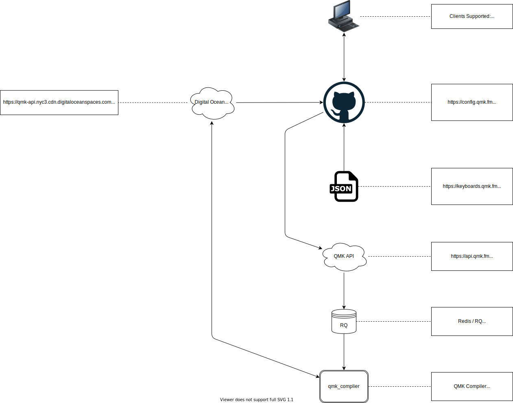

# QMK Configurator Architecture

This page describes the web architecture behind QMK Configurator at a high level. If you are interested in the architecture of the QMK Configurator code itself you should start at the [qmk_configurator](https://github.com/qmk/qmk_configurator) repository.

# Overview

# Detailed Description

QMK Configurator is a [Single Page Application](https://en.wikipedia.org/wiki/Single-page_application) that allows users to create custom keymaps for their QMK-compatible keyboard. They can export JSON representation of their keymaps and compile firmware binaries that can be flashed to their keyboard using a tool like [QMK Toolbox](https://github.com/qmk/qmk_toolbox).

Configurator gets metadata about keyboards from the Keyboard Metadata store and submits compile requests to the QMK API. The results of those compile requests will be made available on [Digital Ocean Spaces](https://www.digitalocean.com/products/spaces/), an S3-compatible data store.

## Configurator Frontend

Address: <https://config.qmk.fm>

The [Configurator Frontend](https://config.qmk.fm) is compiled into a set of static files that are served by Github Pages. This action happens every time a commit is pushed to the [qmk_configurator `master`](https://github.com/qmk/qmk_configurator) branch. You can view the status of these jobs on the [qmk_configurator actions tab](https://github.com/qmk/qmk_configurator/actions/workflows/build.yml).

## Keyboard Metadata

Address: <https://keyboards.qmk.fm>

The Keyboard Metadata is generated every time a keyboard in [qmk_firmware](https://github.com/qmk/qmk_firmware) changes. The resulting JSON files are uploaded to Spaces and used by Configurator to generate UI for each keyboard. You can view the status of this job on the [qmk_firmware actions tab](https://github.com/qmk/qmk_firmware/actions/workflows/api.yml). If you are a QMK Collaborator you can manually run this job using the `workflow_dispatch` event trigger.

## QMK API

Address: <http://api.qmk.fm>

The QMK API accepts `keymap.json` files for compilation. These are the same files you can use directly with `qmk compile` and `qmk flash`. When a `keymap.json` is submitted the browser will poll the status of the job periodically (every 2 seconds or longer, preferably) until the job has completed. The final status JSON will contain pointers to source and binary downloads for the keymap.

QMK API always presents the source and binary downloads side-by-side to comply with the GPL.

There are 3 non-error status responses from the API-

1. Compile Job Queued
2. Compile Job Running
3. Compile Job Finished

### Compile Job Queued

This status indicates that the job has not yet been picked up by a [QMK Compiler](#qmk-compiler) node. Configurator shows this status as "Waiting for an oven".

### Compile Job Running

This status indicates that the job has started compiling. Configurator shows this status as "Baking".

### Compile Job Finished

This status indicates that the job has completed. There will be keys in the status JSON for source and binary downloads.

## Redis/RQ

QMK API uses RQ to distribute jobs to the available [QMK Compiler](#qmk-compiler) nodes. When a `keymap.json` is received it's put into the RQ queue, where a `qmk_compiler` node will pick it up from.

## QMK Compiler

[QMK Compiler](https://github.com/qmk/qmk_compiler) is what actually performs the compilation of the `keymap.json`. It does so by checking out the requested `qmk_firmware` branch, running `qmk compile keymap.json`, and then uploading the resulting source and binary to Digital Ocean Spaces. 

When users download their source/binary, API will redirect them to the authenticated Spaces download URL.
