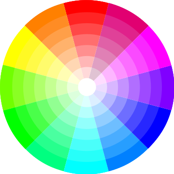

# RGB Lighting

QMK has the ability to control RGB LEDs attached to your keyboard. This is commonly called *underglow*, due to the LEDs often being mounted on the bottom of the keyboard, producing a nice diffused effect when combined with a translucent case.


Some keyboards come with RGB LEDs preinstalled. Others must have them installed after the fact. See the [Hardware Modification](#hardware-modification) section for information on adding RGB lighting to your keyboard.

Currently QMK supports the following addressable LEDs:

 * WS2811, WS2812, WS2812B, WS2812C, etc.
 * SK6812, SK6812MINI, SK6805
 * APA102

These LEDs are called "addressable" because instead of using a wire per color, each LED contains a small microchip that understands a special protocol sent over a single wire. The chip passes on the remaining data to the next LED, allowing them to be chained together. In this way, you can easily control the color of the individual LEDs.

## Usage

On keyboards with onboard RGB LEDs, it is usually enabled by default. If it is not working for you, check that your `rules.mk` includes the following:

```make
RGBLIGHT_ENABLE = yes
```

::: tip
There are additional configuration options for ARM controllers that offer increased performance over the default WS2812 bitbang driver. Please see [WS2812 Driver](../drivers/ws2812) for more information.
:::

For APA102 LEDs, add the following to your `rules.mk`:

```make
RGBLIGHT_ENABLE = yes
RGBLIGHT_DRIVER = apa102
```

At minimum you must define the data pin your LED strip is connected to, and the number of LEDs in the strip, in your `config.h`. For APA102 LEDs, you must also define the clock pin. If your keyboard has onboard RGB LEDs, and you are simply creating a keymap, you usually won't need to modify these.

|Define              |Description                                                              |
|--------------------|-------------------------------------------------------------------------|
|`WS2812_DI_PIN`     |The pin connected to the data pin of the LEDs (WS2812)                   |
|`APA102_DI_PIN`     |The pin connected to the data pin of the LEDs (APA102)                   |
|`APA102_CI_PIN`     |The pin connected to the clock pin of the LEDs (APA102)                  |
|`RGBLIGHT_LED_COUNT`|The number of LEDs connected                                             |
|`RGBLED_SPLIT`      |(Optional) For split keyboards, the number of LEDs connected on each half|

Then you should be able to use the keycodes below to change the RGB lighting to your liking.

### Color Selection

QMK uses [Hue, Saturation, and Value](https://en.wikipedia.org/wiki/HSL_and_HSV) to select colors rather than RGB. The color wheel below demonstrates how this works.



Changing the **Hue** cycles around the circle.<br>
Changing the **Saturation** moves between the inner and outer sections of the wheel, affecting the intensity of the color.<br>
Changing the **Value** sets the overall brightness.<br>


## Keycodes

|Key                           |Aliases   |Description                                                          |
|------------------------------|----------|---------------------------------------------------------------------|
|`QK_UNDERGLOW_TOGGLE`         |`UG_TOGG` |Toggle RGB lighting on or off                                        |
|`QK_UNDERGLOW_MODE_NEXT`      |`UG_NEXT` |Cycle through modes, reverse direction when Shift is held            |
|`QK_UNDERGLOW_MODE_PREVIOUS`  |`UG_PREV` |Cycle through modes in reverse, forward direction when Shift is held |
|`QK_UNDERGLOW_HUE_UP`         |`UG_HUEU` |Increase hue, decrease hue when Shift is held                        |
|`QK_UNDERGLOW_HUE_DOWN`       |`UG_HUED` |Decrease hue, increase hue when Shift is held                        |
|`QK_UNDERGLOW_SATURATION_UP`  |`UG_SATU` |Increase saturation, decrease saturation when Shift is held          |
|`QK_UNDERGLOW_SATURATION_DOWN`|`UG_SATD` |Decrease saturation, increase saturation when Shift is held          |
|`QK_UNDERGLOW_VALUE_UP`       |`UG_VALU` |Increase value (brightness), decrease value when Shift is held       |
|`QK_UNDERGLOW_VALUE_DOWN`     |`UG_VALD` |Decrease value (brightness), increase value when Shift is held       |
|`QK_UNDERGLOW_SPEED_UP`       |`UG_SPDU` |Increase effect speed (brightness), decrease speed when Shift is held|
|`QK_UNDERGLOW_SPEED_DOWN`     |`UG_SPDD` |Decrease effect speed (brightness), increase speed when Shift is held|
|`RGB_MODE_PLAIN`              |`RGB_M_P `|Static (no animation) mode (deprecated)                              |
|`RGB_MODE_BREATHE`            |`RGB_M_B` |Breathing animation mode (deprecated)                                |
|`RGB_MODE_RAINBOW`            |`RGB_M_R` |Rainbow animation mode (deprecated)                                  |
|`RGB_MODE_SWIRL`              |`RGB_M_SW`|Swirl animation mode (deprecated)                                    |
|`RGB_MODE_SNAKE`              |`RGB_M_SN`|Snake animation mode (deprecated)                                    |
|`RGB_MODE_KNIGHT`             |`RGB_M_K` |"Knight Rider" animation mode (deprecated)                           |
|`RGB_MODE_XMAS`               |`RGB_M_X` |Christmas animation mode (deprecated)                                |
|`RGB_MODE_GRADIENT`           |`RGB_M_G` |Static gradient animation mode (deprecated)                          |
|`RGB_MODE_RGBTEST`            |`RGB_M_T` |Red, Green, Blue test animation mode (deprecated)                    |
|`RGB_MODE_TWINKLE`            |`RGB_M_TW`|Twinkle animation mode (deprecated)                                  |

::: tip
These keycodes cannot be used with functions like `tap_code16()` as they are not USB HID keycodes. If you wish to replicate similar behaviour in custom code within your firmware (e.g. inside `encoder_update_user()` or `process_record_user()`), the equivalent [RGB functions](#functions) should be used instead.
:::


::: warning
By default, if you have both the RGB Light and the [RGB Matrix](rgb_matrix) feature enabled, these keycodes will work for both features, at the same time. You can disable the keycode functionality by defining the `*_DISABLE_KEYCODES` option for the specific feature.
:::

## Configuration

Your RGB lighting can be configured by placing these `#define`s in your `config.h`:

|Define                     |Default                     |Description                                                                                                                |
|---------------------------|----------------------------|---------------------------------------------------------------------------------------------------------------------------|
|`RGBLIGHT_HUE_STEP`        |`8`                         |The number of steps to cycle through the hue by                                                                            |
|`RGBLIGHT_SAT_STEP`        |`17`                        |The number of steps to increment the saturation by                                                                         |
|`RGBLIGHT_VAL_STEP`        |`17`                        |The number of steps to increment the brightness by                                                                         |
|`RGBLIGHT_LIMIT_VAL`       |`255`                       |The maximum brightness level                                                                                               |
|`RGBLIGHT_SLEEP`           |*Not defined*               |If defined, the RGB lighting will be switched off when the host goes to sleep                                              |
|`RGBLIGHT_SPLIT`           |*Not defined*               |If defined, synchronization functionality for split keyboards is added                                                     |
|`RGBLIGHT_DISABLE_KEYCODES`|*Not defined*               |If defined, disables the ability to control RGB Light from the keycodes. You must use code functions to control the feature|
|`RGBLIGHT_DEFAULT_MODE`    |`RGBLIGHT_MODE_STATIC_LIGHT`|The default mode to use upon clearing the EEPROM                                                                           |
|`RGBLIGHT_DEFAULT_HUE`     |`0` (red)                   |The default hue to use upon clearing the EEPROM                                                                            |
|`RGBLIGHT_DEFAULT_SAT`     |`UINT8_MAX` (255)           |The default saturation to use upon clearing the EEPROM                                                                     |
|`RGBLIGHT_DEFAULT_VAL`     |`RGBLIGHT_LIMIT_VAL`        |The default value (brightness) to use upon clearing the EEPROM                                                             |
|`RGBLIGHT_DEFAULT_SPD`     |`0`                         |The default speed to use upon clearing the EEPROM                                                                          |
|`RGBLIGHT_DEFAULT_ON`      |`true`                      |Enable RGB lighting upon clearing the EEPROM                                                                               |

## Effects and Animations

Not only can this lighting be whatever color you want,
if `RGBLIGHT_EFFECT_xxxx` is defined, you also have a number of animation modes at your disposal:

|Mode number symbol           |Additional number  |Description                            |
|-----------------------------|-------------------|---------------------------------------|
|`RGBLIGHT_MODE_STATIC_LIGHT` | *None*            |Solid color (this mode is always enabled) |
|`RGBLIGHT_MODE_BREATHING`    | 0,1,2,3           |Solid color breathing                  |
|`RGBLIGHT_MODE_RAINBOW_MOOD` | 0,1,2             |Cycling rainbow                        |
|`RGBLIGHT_MODE_RAINBOW_SWIRL`| 0,1,2,3,4,5       |Swirling rainbow                       |
|`RGBLIGHT_MODE_SNAKE`        | 0,1,2,3,4,5       |Snake                                  |
|`RGBLIGHT_MODE_KNIGHT`       | 0,1,2             |Knight                                 |
|`RGBLIGHT_MODE_CHRISTMAS`    | *None*            |Christmas                              |
|`RGBLIGHT_MODE_STATIC_GRADIENT`| 0,1,..,9        |Static gradient                        |
|`RGBLIGHT_MODE_RGB_TEST`     | *None*            |RGB Test                               |
|`RGBLIGHT_MODE_ALTERNATING`  | *None*            |Alternating                            |
|`RGBLIGHT_MODE_TWINKLE`      | 0,1,2,3,4,5       |Twinkle                                |

Check out [this video](https://youtube.com/watch?v=VKrpPAHlisY) for a demonstration.

Note: For versions older than 0.6.117, The mode numbers were written directly. In `quantum/rgblight/rgblight.h` there is a contrast table between the old mode number and the current symbol.


### Effect and Animation Toggles

Use these defines to add or remove animations from the firmware. When you are running low on flash space, it can be helpful to disable animations you are not using.

|Define                              |Default      |Description                                                              |
|------------------------------------|-------------|-------------------------------------------------------------------------|
|`RGBLIGHT_ANIMATIONS`               |*Not defined*|Enable all additional animation modes.  (deprecated)                     |
|`RGBLIGHT_EFFECT_ALTERNATING`       |*Not defined*|Enable alternating animation mode.                                       |
|`RGBLIGHT_EFFECT_BREATHING`         |*Not defined*|Enable breathing animation mode.                                         |
|`RGBLIGHT_EFFECT_CHRISTMAS`         |*Not defined*|Enable christmas animation mode.                                         |
|`RGBLIGHT_EFFECT_KNIGHT`            |*Not defined*|Enable knight animation mode.                                            |
|`RGBLIGHT_EFFECT_RAINBOW_MOOD`      |*Not defined*|Enable rainbow mood animation mode.                                      |
|`RGBLIGHT_EFFECT_RAINBOW_SWIRL`     |*Not defined*|Enable rainbow swirl animation mode.                                     |
|`RGBLIGHT_EFFECT_RGB_TEST`          |*Not defined*|Enable RGB test animation mode.                                          |
|`RGBLIGHT_EFFECT_SNAKE`             |*Not defined*|Enable snake animation mode.                                             |
|`RGBLIGHT_EFFECT_STATIC_GRADIENT`   |*Not defined*|Enable static gradient mode.                                             |
|`RGBLIGHT_EFFECT_TWINKLE`           |*Not defined*|Enable twinkle animation mode.                                           |

::: warning
`RGBLIGHT_ANIMATIONS` is being deprecated and animation modes should be explicitly defined.
:::

### Effect and Animation Settings

The following options are used to tweak the various animations:

|Define                              |Default             |Description                                                                                    |
|------------------------------------|--------------------|-----------------------------------------------------------------------------------------------|
|`RGBLIGHT_EFFECT_BREATHE_CENTER`    |*Not defined*       |If defined, used to calculate the curve for the breathing animation. Valid values are 1.0 to 2.7 |
|`RGBLIGHT_EFFECT_BREATHE_MAX`       |`255`               |The maximum brightness for the breathing mode. Valid values are 1 to 255                       |
|`RGBLIGHT_EFFECT_CHRISTMAS_INTERVAL`|`40`                |How long (in milliseconds) to wait between animation steps for the "Christmas" animation       |
|`RGBLIGHT_EFFECT_CHRISTMAS_STEP`    |`2`                 |The number of LEDs to group the red/green colors by for the "Christmas" animation              |
|`RGBLIGHT_EFFECT_KNIGHT_LED_NUM`    |`RGBLIGHT_LED_COUNT`|The number of LEDs to have the "Knight" animation travel                                       |
|`RGBLIGHT_EFFECT_KNIGHT_LENGTH`     |`3`                 |The number of LEDs to light up for the "Knight" animation                                      |
|`RGBLIGHT_EFFECT_KNIGHT_OFFSET`     |`0`                 |The number of LEDs to start the "Knight" animation from the start of the strip by              |
|`RGBLIGHT_RAINBOW_SWIRL_RANGE`      |`255`               |Range adjustment for the rainbow swirl effect to get different swirls                          |
|`RGBLIGHT_EFFECT_SNAKE_LENGTH`      |`4`                 |The number of LEDs to light up for the "Snake" animation                                       |
|`RGBLIGHT_EFFECT_TWINKLE_LIFE`      |`200`               |Adjusts how quickly each LED brightens and dims when twinkling (in animation steps)            |
|`RGBLIGHT_EFFECT_TWINKLE_PROBABILITY`|`1/127`            |Adjusts how likely each LED is to twinkle (on each animation step)                             |

### Example Usage to Reduce Memory Footprint
  1. Use `#undef` to selectively disable animations. The following would disable two animations and save about 4KiB:

```diff
 #undef RGBLIGHT_LED_COUNT
+#undef RGBLIGHT_EFFECT_STATIC_GRADIENT
+#undef RGBLIGHT_EFFECT_RAINBOW_SWIRL
 #define RGBLIGHT_LED_COUNT 12
 #define RGBLIGHT_HUE_STEP 8
 #define RGBLIGHT_SAT_STEP 8
```

### Animation Speed

You can also modify the speeds that the different modes animate at:

Here is a quick demo on Youtube (with NPKC KC60) (https://www.youtube.com/watch?v=VKrpPAHlisY).

```c
// How long (in milliseconds) to wait between animation steps for each of the "Solid color breathing" animations
const uint8_t RGBLED_BREATHING_INTERVALS[] PROGMEM = {30, 20, 10, 5};

// How long (in milliseconds) to wait between animation steps for each of the "Cycling rainbow" animations
const uint8_t RGBLED_RAINBOW_MOOD_INTERVALS[] PROGMEM = {120, 60, 30};

// How long (in milliseconds) to wait between animation steps for each of the "Swirling rainbow" animations
const uint8_t RGBLED_RAINBOW_SWIRL_INTERVALS[] PROGMEM = {100, 50, 20};

// How long (in milliseconds) to wait between animation steps for each of the "Snake" animations
const uint8_t RGBLED_SNAKE_INTERVALS[] PROGMEM = {100, 50, 20};

// How long (in milliseconds) to wait between animation steps for each of the "Knight" animations
const uint8_t RGBLED_KNIGHT_INTERVALS[] PROGMEM = {127, 63, 31};

// How long (in milliseconds) to wait between animation steps for each of the "Twinkle" animations
const uint8_t RGBLED_TWINKLE_INTERVALS[] PROGMEM = {50, 25, 10};

// These control which hues are selected for each of the "Static gradient" modes
const uint8_t RGBLED_GRADIENT_RANGES[] PROGMEM = {255, 170, 127, 85, 64};
```

## Lighting Layers

::: tip
**Note:** Lighting Layers is an RGB Light feature, it will not work for RGB Matrix. See [RGB Matrix Indicators](rgb_matrix#indicators) for details on how to do so.
:::

By including `#define RGBLIGHT_LAYERS` in your `config.h` file you can enable lighting layers. These make
it easy to use your underglow LEDs as status indicators to show which keyboard layer is currently active, or the state of caps lock, all without disrupting any animations. [Here's a video](https://youtu.be/uLGE1epbmdY) showing an example of what you can do.

### Defining Lighting Layers {#defining-lighting-layers}

By default, 8 layers are possible. This can be expanded to as many as 32 by overriding the definition of `RGBLIGHT_MAX_LAYERS` in `config.h` (e.g. `#define RGBLIGHT_MAX_LAYERS 32`). Please note, if you use a split keyboard, you will need to flash both sides of the split after changing this. Also, increasing the maximum will increase the firmware size, and will slow sync on split keyboards.

To define a layer, we modify `keymap.c` to list the LED ranges and the colors we want to overlay on them using an array of `rgblight_segment_t` using the `RGBLIGHT_LAYER_SEGMENTS` macro. We can define multiple layers and enable/disable them independently:

```c
// Light LEDs 6 to 9 and 12 to 15 red when caps lock is active. Hard to ignore!
const rgblight_segment_t PROGMEM my_capslock_layer[] = RGBLIGHT_LAYER_SEGMENTS(
    {6, 4, HSV_RED},       // Light 4 LEDs, starting with LED 6
    {12, 4, HSV_RED}       // Light 4 LEDs, starting with LED 12
);
// Light LEDs 9 & 10 in cyan when keyboard layer 1 is active
const rgblight_segment_t PROGMEM my_layer1_layer[] = RGBLIGHT_LAYER_SEGMENTS(
    {9, 2, HSV_CYAN}
);
// Light LEDs 11 & 12 in purple when keyboard layer 2 is active
const rgblight_segment_t PROGMEM my_layer2_layer[] = RGBLIGHT_LAYER_SEGMENTS(
    {11, 2, HSV_PURPLE}
);
// Light LEDs 13 & 14 in green when keyboard layer 3 is active
const rgblight_segment_t PROGMEM my_layer3_layer[] = RGBLIGHT_LAYER_SEGMENTS(
    {13, 2, HSV_GREEN}
);
// etc..
```

We combine these layers into an array using the `RGBLIGHT_LAYERS_LIST` macro, and assign it to the `rgblight_layers` variable during keyboard setup. Note that you can only define up to 8 lighting layers. Any extra layers will be ignored. Since the different lighting layers overlap, the order matters in the array, with later layers taking precedence:

```c
// Now define the array of layers. Later layers take precedence
const rgblight_segment_t* const PROGMEM my_rgb_layers[] = RGBLIGHT_LAYERS_LIST(
    my_capslock_layer,
    my_layer1_layer,    // Overrides caps lock layer
    my_layer2_layer,    // Overrides other layers
    my_layer3_layer     // Overrides other layers
);

void keyboard_post_init_user(void) {
    // Enable the LED layers
    rgblight_layers = my_rgb_layers;
}
```
Note: For split keyboards with two controllers, both sides need to be flashed when updating the contents of rgblight_layers.

### Enabling and disabling lighting layers {#enabling-lighting-layers}

Everything above just configured the definition of each lighting layer.
We can now enable and disable the lighting layers whenever the state of the keyboard changes:

```c
bool led_update_user(led_t led_state) {
    rgblight_set_layer_state(0, led_state.caps_lock);
    return true;
}

layer_state_t default_layer_state_set_user(layer_state_t state) {
    rgblight_set_layer_state(1, layer_state_cmp(state, _DVORAK));
    return state;
}

layer_state_t layer_state_set_user(layer_state_t state) {
    rgblight_set_layer_state(2, layer_state_cmp(state, _FN));
    rgblight_set_layer_state(3, layer_state_cmp(state, _ADJUST));
    return state;
}
```

### Lighting layer blink {#lighting-layer-blink}

By including `#define RGBLIGHT_LAYER_BLINK` in your `config.h` file you can turn a lighting
layer on for a specified duration. Once the specified number of milliseconds has elapsed
the layer will be turned off. This is useful, e.g., if you want to acknowledge some
action (e.g. toggling some setting):

```c
const rgblight_segment_t PROGMEM _yes_layer[] = RGBLIGHT_LAYER_SEGMENTS( {9, 6, HSV_GREEN} );
const rgblight_segment_t PROGMEM _no_layer[] = RGBLIGHT_LAYER_SEGMENTS( {9, 6, HSV_RED} );

const rgblight_segment_t* const PROGMEM _rgb_layers[] =
    RGBLIGHT_LAYERS_LIST( _yes_layer, _no_layer );

void keyboard_post_init_user(void) {
    rgblight_layers = _rgb_layers;
}

// Note we user post_process_record_user because we want the state
// after the flag has been flipped...
void post_process_record_user(uint16_t keycode, keyrecord_t *record) {
    switch (keycode) {
        case QK_DEBUG_TOGGLE:
            rgblight_blink_layer(debug_enable ? 0 : 1, 500);
            break;

        case NK_TOGG:
        case NK_ON:
        case NK_OFF:
            rgblight_blink_layer(keymap_config.nkro ? 0 : 1, 500);
            break;
    }
}
```

You can also use `rgblight_blink_layer_repeat` to specify the amount of times the layer is supposed to blink. Using the layers from above,
```c
void post_process_record_user(uint16_t keycode, keyrecord_t *record) {
    switch (keycode) {
        case QK_DEBUG_TOGGLE:
            rgblight_blink_layer_repeat(debug_enable ? 0 : 1, 200, 3);
            break;
    }
}
```
would turn the layer 0 (or 1) on and off again three times when `DB_TOGG` is pressed.

Blinking accumulates layers so if multiple layers are set blinking at the same time they will all blink for the duration and repeat times of the last layer to be blinked.
To stop these other layers from blinking use `rgblight_unblink_layer` or `rgblight_unblink_all_but_layer`:

```c
rgblight_blink_layer(1, 500);
rgblight_unblink_all_but_layer(1);
```

```c
rgblight_unblink_layer(3);
rgblight_blink_layer(2, 500);
```

::: warning
Lighting layers on split keyboards will require layer state synced to the slave half (e.g. `#define SPLIT_LAYER_STATE_ENABLE`). See [data sync options](split_keyboard#data-sync-options) for more details.
:::

### Overriding RGB Lighting on/off status

Normally lighting layers are not shown when RGB Lighting is disabled (e.g. with `UG_TOGG` keycode). If you would like lighting layers to work even when the RGB Lighting is otherwise off, add `#define RGBLIGHT_LAYERS_OVERRIDE_RGB_OFF` to your `config.h`.

### Retain brightness

Usually lighting layers apply their configured brightness once activated. If you would like lighting layers to retain the currently used brightness (as returned by `rgblight_get_val()`), add `#define RGBLIGHT_LAYERS_RETAIN_VAL` to your `config.h`.

## Functions

If you need to change your RGB lighting in code, for example in a macro to change the color whenever you switch layers, QMK provides a set of functions to assist you. See [`rgblight.h`](https://github.com/qmk/qmk_firmware/blob/master/quantum/rgblight/rgblight.h) for the full list, but the most commonly used functions include:

### Low level Functions
|Function                                    |Description                                |
|--------------------------------------------|-------------------------------------------|
|`rgblight_set()`                            |Flush out led buffers to LEDs              |
|`rgblight_set_clipping_range(pos, num)`     |Set clipping Range. see [Clipping Range](#clipping-range) |

### Effects and Animations Functions
#### effect range setting
|Function                                    |Description       |
|--------------------------------------------|------------------|
|`rgblight_set_effect_range(pos, num)`       |Set Effects Range |

#### direct operation
|Function                                    |Description  |
|--------------------------------------------|-------------|
|`rgblight_setrgb_at(r, g, b, index)`          |Set a single LED to the given RGB value, where `r`/`g`/`b` are between 0 and 255 and `index` is between 0 and `RGBLIGHT_LED_COUNT` (not written to EEPROM) |
|`rgblight_sethsv_at(h, s, v, index)`          |Set a single LED to the given HSV value, where `h`/`s`/`v` are between 0 and 255, and `index` is between 0 and `RGBLIGHT_LED_COUNT` (not written to EEPROM) |
|`rgblight_setrgb_range(r, g, b, start, end)`|Set a continuous range of LEDs to the given RGB value, where `r`/`g`/`b` are between 0 and 255 and `start`(included) and `stop`(excluded) are between 0 and `RGBLIGHT_LED_COUNT` (not written to EEPROM)|
|`rgblight_sethsv_range(h, s, v, start, end)`|Set a continuous range of LEDs to the given HSV value, where `h`/`s`/`v` are between 0 and 255, and `start`(included) and `stop`(excluded) are between 0 and `RGBLIGHT_LED_COUNT` (not written to EEPROM)|
|`rgblight_setrgb(r, g, b)`                  |Set effect range LEDs to the given RGB value where `r`/`g`/`b` are between 0 and 255 (not written to EEPROM) |
|`rgblight_setrgb_master(r, g, b)`           |Set the LEDs on the master side  to the given RGB value, where `r`/`g`/`b` are between 0 and 255 (not written to EEPROM) |
|`rgblight_setrgb_slave(r, g, b)`            |Set the LEDs on the slave side  to the given RGB value, where `r`/`g`/`b` are between 0 and 255 (not written to EEPROM) |
|`rgblight_sethsv_master(h, s, v)`           |Set the LEDs on the master side to the given HSV value, where `h`/`s`/`v` are between 0 and 255 (not written to EEPROM) |
|`rgblight_sethsv_slave(h, s, v)`            |Set the LEDs on the slave side to the given HSV value, where `h`/`s`/`v` are between 0 and 255 (not written to EEPROM) |

Example:
```c
rgblight_sethsv_at(HSV_WHITE, 0); // led 0
rgblight_sethsv_at(HSV_RED,   1); // led 1
rgblight_sethsv_at(HSV_GREEN, 2); // led 2
// The above functions automatically calls rgblight_set(), so there is no need to call it explicitly.
// Note that it is inefficient to call repeatedly.
```

#### effect mode change
|Function                                    |Description  |
|--------------------------------------------|-------------|
|`rgblight_mode(x)`                          |Set the mode, if RGB animations are enabled |
|`rgblight_mode_noeeprom(x)`                 |Set the mode, if RGB animations are enabled (not written to EEPROM) |
|`rgblight_step()`                           |Change the mode to the next RGB animation in the list of enabled RGB animations |
|`rgblight_step_noeeprom()`                  |Change the mode to the next RGB animation in the list of enabled RGB animations (not written to EEPROM) |
|`rgblight_step_reverse()`                   |Change the mode to the previous RGB animation in the list of enabled RGB animations |
|`rgblight_step_reverse_noeeprom()`          |Change the mode to the previous RGB animation in the list of enabled RGB animations (not written to EEPROM) |
|`rgblight_reload_from_eeprom()`             |Reload the effect configuration (enabled, mode and color) from EEPROM |

#### effects mode disable/enable
|Function                                    |Description  |
|--------------------------------------------|-------------|
|`rgblight_toggle()`                         |Toggle effect range LEDs between on and off |
|`rgblight_toggle_noeeprom()`                |Toggle effect range LEDs between on and off (not written to EEPROM) |
|`rgblight_enable()`                         |Turn effect range LEDs on, based on their previous state |
|`rgblight_enable_noeeprom()`                |Turn effect range LEDs on, based on their previous state (not written to EEPROM) |
|`rgblight_disable()`                        |Turn effect range LEDs off |
|`rgblight_disable_noeeprom()`               |Turn effect range LEDs off (not written to EEPROM) |

#### hue, sat, val change
|Function                                    |Description  |
|--------------------------------------------|-------------|
|`rgblight_increase_hue()`                   |Increase the hue for effect range LEDs. This wraps around at maximum hue |
|`rgblight_increase_hue_noeeprom()`          |Increase the hue for effect range LEDs. This wraps around at maximum hue (not written to EEPROM) |
|`rgblight_decrease_hue()`                   |Decrease the hue for effect range LEDs. This wraps around at minimum hue |
|`rgblight_decrease_hue_noeeprom()`          |Decrease the hue for effect range LEDs. This wraps around at minimum hue (not written to EEPROM) |
|`rgblight_increase_sat()`                   |Increase the saturation for effect range LEDs. This stops at maximum saturation |
|`rgblight_increase_sat_noeeprom()`          |Increase the saturation for effect range LEDs. This stops at maximum saturation (not written to EEPROM) |
|`rgblight_decrease_sat()`                   |Decrease the saturation for effect range LEDs. This stops at minimum saturation |
|`rgblight_decrease_sat_noeeprom()`          |Decrease the saturation for effect range LEDs. This stops at minimum saturation (not written to EEPROM) |
|`rgblight_increase_val()`                   |Increase the value for effect range LEDs. This stops at maximum value |
|`rgblight_increase_val_noeeprom()`          |Increase the value for effect range LEDs. This stops at maximum value (not written to EEPROM) |
|`rgblight_decrease_val()`                   |Decrease the value for effect range LEDs. This stops at minimum value |
|`rgblight_decrease_val_noeeprom()`          |Decrease the value for effect range LEDs. This stops at minimum value (not written to EEPROM) |
|`rgblight_sethsv(h, s, v)`                  |Set effect range LEDs to the given HSV value where `h`/`s`/`v` are between 0 and 255 |
|`rgblight_sethsv_noeeprom(h, s, v)`         |Set effect range LEDs to the given HSV value where `h`/`s`/`v` are between 0 and 255 (not written to EEPROM) |

#### Speed functions
|Function                                    |Description  |
|--------------------------------------------|-------------|
|`rgblight_increase_speed()`                 |Increases the animation speed |
|`rgblight_increase_speed_noeeprom()`        |Increases the animation speed (not written to EEPROM) |
|`rgblight_decrease_speed()`                 |Decreases the animation speed |
|`rgblight_decrease_speed_noeeprom()`        |Decreases the animation speed (not written to EEPROM) |
|`rgblight_set_speed()`                      |Sets the speed. Value is between 0 and 255 |
|`rgblight_set_speed_noeeprom()`             |Sets the speed. Value is between 0 and 255 (not written to EEPROM) |


#### layer functions
|Function                                    |Description  |
|--------------------------------------------|-------------|
|`rgblight_get_layer_state(i)`               |Returns `true` if lighting layer `i` is enabled |
|`rgblight_set_layer_state(i, is_on)`        |Enable or disable lighting layer `i` based on value of `bool is_on` |

#### query
|Function               |Description                |
|-----------------------|---------------------------|
|`rgblight_is_enabled()`|Gets current on/off status |
|`rgblight_get_mode()`  |Gets current mode          |
|`rgblight_get_hue()`   |Gets current hue           |
|`rgblight_get_sat()`   |Gets current sat           |
|`rgblight_get_val()`   |Gets current val           |
|`rgblight_get_speed()` |Gets current speed         |

## Colors

These are shorthands to popular colors. The `RGB` ones can be passed to the `setrgb` functions, while the `HSV` ones to the `sethsv` functions.

|RGB                  |HSV                  |
|---------------------|---------------------|
|`RGB_AZURE`          |`HSV_AZURE`          |
|`RGB_BLACK`/`RGB_OFF`|`HSV_BLACK`/`HSV_OFF`|
|`RGB_BLUE`           |`HSV_BLUE`           |
|`RGB_CHARTREUSE`     |`HSV_CHARTREUSE`     |
|`RGB_CORAL`          |`HSV_CORAL`          |
|`RGB_CYAN`           |`HSV_CYAN`           |
|`RGB_GOLD`           |`HSV_GOLD`           |
|`RGB_GOLDENROD`      |`HSV_GOLDENROD`      |
|`RGB_GREEN`          |`HSV_GREEN`          |
|`RGB_MAGENTA`        |`HSV_MAGENTA`        |
|`RGB_ORANGE`         |`HSV_ORANGE`         |
|`RGB_PINK`           |`HSV_PINK`           |
|`RGB_PURPLE`         |`HSV_PURPLE`         |
|`RGB_RED`            |`HSV_RED`            |
|`RGB_SPRINGGREEN`    |`HSV_SPRINGGREEN`    |
|`RGB_TEAL`           |`HSV_TEAL`           |
|`RGB_TURQUOISE`      |`HSV_TURQUOISE`      |
|`RGB_WHITE`          |`HSV_WHITE`          |
|`RGB_YELLOW`         |`HSV_YELLOW`         |

```c
rgblight_setrgb(RGB_ORANGE);
rgblight_sethsv_noeeprom(HSV_GREEN);
rgblight_setrgb_at(RGB_GOLD, 3);
rgblight_sethsv_range(HSV_WHITE, 0, 6);
```

These are defined in [`color.h`](https://github.com/qmk/qmk_firmware/blob/master/quantum/color.h). Feel free to add to this list!


## Changing the order of the LEDs

If you want to make the logical order of LEDs different from the electrical connection order, you can do this by defining the `RGBLIGHT_LED_MAP` macro in your `config.h`.

Normally, the contents of the LED buffer are output to the LEDs in the same order.


By defining `RGBLIGHT_LED_MAP` as in the example below, you can specify the LED with addressing in reverse order of the electrical connection order.

```c
// config.h

#define RGBLIGHT_LED_COUNT 4
#define RGBLIGHT_LED_MAP { 3, 2, 1, 0 }

```


## Clipping Range

Using the `rgblight_set_clipping_range()` function, you can prepare more buffers than the actual number of LEDs, and output some of the buffers to the LEDs. This is useful if you want the split keyboard to treat left and right LEDs as logically contiguous.

You can set the Clipping Range by executing the following code.

```c
// some source
rgblight_set_clipping_range(3, 4);
```


In addition to setting the Clipping Range, you can use `RGBLIGHT_LED_MAP` together.

```c
// config.h
#define RGBLIGHT_LED_COUNT 8
#define RGBLIGHT_LED_MAP { 7, 6, 5, 4, 3, 2, 1, 0 }

// some source
rgblight_set_clipping_range(3, 4);
```


## Hardware Modification

If your keyboard lacks onboard underglow LEDs, you may often be able to solder on an RGB LED strip yourself. You will need to find an unused pin to wire to the data pin of your LED strip. Some keyboards may break out unused pins from the MCU to make soldering easier. The other two pins, VCC and GND, must also be connected to the appropriate power pins.

## Velocikey

Velocikey is a feature that lets you control the speed of lighting effects (like the Rainbow Swirl effect) with the speed of your typing. The faster you type, the faster the lights will go!

### Usage
For Velocikey to take effect, there are two steps. First, when compiling your keyboard, you'll need to set `VELOCIKEY_ENABLE=yes` in `rules.mk`, e.g.:

```
MOUSEKEY_ENABLE = no
STENO_ENABLE = no
EXTRAKEY_ENABLE = yes
VELOCIKEY_ENABLE = yes
```

Then, while using your keyboard, you need to also turn it on with the `VK_TOGG` keycode, which toggles the feature on and off.

The following light effects will all be controlled by Velocikey when it is enabled:
 - RGB Breathing
 - RGB Rainbow Mood
 - RGB Rainbow Swirl
 - RGB Snake
 - RGB Knight

Support for LED breathing effects is planned but not available yet.

 As long as Velocikey is enabled, it will control the speed regardless of any other speed setting that your RGB lights are currently on.

 ### Configuration
 Velocikey doesn't currently support any configuration via keyboard settings. If you want to adjust something like the speed increase or decay rate, you would need to edit `velocikey.c` and adjust the values there to achieve the kinds of speeds that you like.
