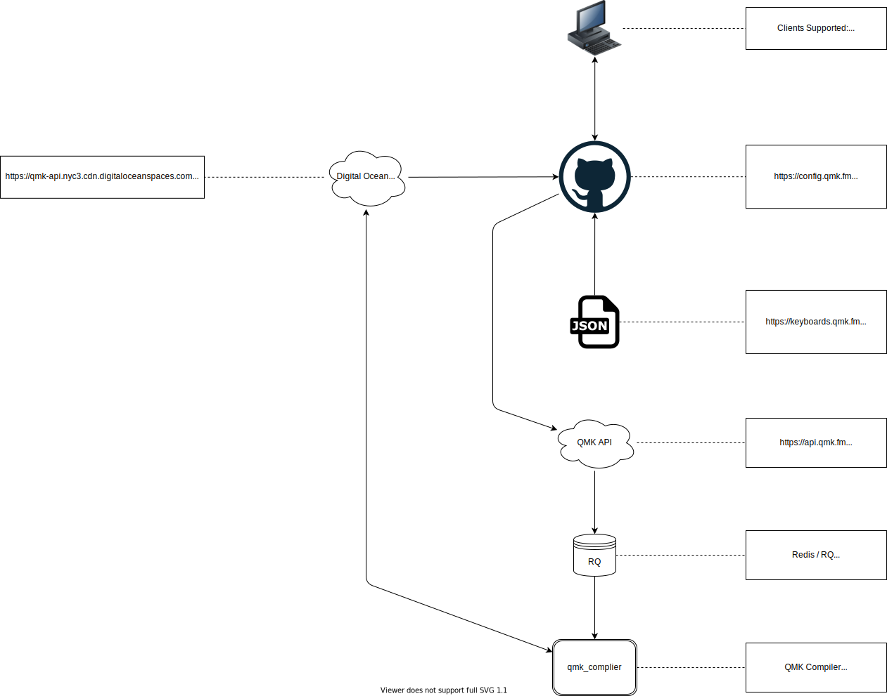

# QMK配置器框架

<!---
  original document: 0.15.12:docs/configurator_architecture.md
  git diff 0.15.12 HEAD -- docs/configurator_architecture.md | cat
-->

本章节提供了QMK配置器前端技术框架信息，若你对QMK配置器前端工程本身感兴趣，可以从[QMK配置器](https://github.com/qmk/qmk_configurator)代码库开始。

# 总览

# 详述

QMK配置器基于[单页面框架](https://en.wikipedia.org/wiki/Single-page_application)实现，供使用者创建兼容QMK键盘的自定义键映射方案。键映射方案可以导出为JSON格式的数据，也可以编译出可通过[QMK工具箱](https://github.com/qmk/qmk_toolbox)刷写到键盘中的固件文件。

配置器从“键盘元数据仓库（Keyboard Metadata store）”获取键盘元数据，编译请求通过QMK API提交，编译产出放在S3兼容的数据仓库[Digital Ocean空间](https://www.digitalocean.com/products/spaces/)中。

## 配置器前端

地址：<https://config.qmk.fm>

[配置器前端](https://config.qmk.fm)会编译并产出一些静态文件并通过Github Pages托管，每当[QMK配置器 `master`](https://github.com/qmk/qmk_configurator)分支收到推送的提交时都会触发。可以通过[QMK配置器 actions页面](https://github.com/qmk/qmk_configurator/actions/workflows/build.yml)查看这些job的状态。

## 键盘元数据

地址：<https://keyboards.qmk.fm>

每当[qmk_firmware](https://github.com/qmk/qmk_firmware)仓库中的键盘定义变化时，会生成JSON格式的键盘元数据，并上传到指定空间用于配置器生成每种键盘的UI展现。可以在[QMK固件 actions页面](https://github.com/qmk/qmk_firmware/actions/workflows/api.yml)查看相关job的状态。如果你是QMK开发团队成员（Collaborator），可以使用 `workflow_dispatch` 事件触发器来手动执行该job。

## QMK API

地址：<http://api.qmk.fm>

QMK API接受 `keymap.json` 文件输入并进行编译，这和你在 `qmk compile` 和 `qmk flash` 中使用的文件一样。当 `keymap.json` 文件被提交后，浏览器中的页面将定时查看job状态（每2秒一次，有时更久一些）直到job完成。最终产出的JSON描述信息里包含了键映射方案的源文件，及编译出的二进制的可下载链接地址。

为遵循GPL协议，QMK API会确保源文件及编译产出总是同时提供的。

API有3种非异常的回应状态-

1. 编译job排队中
2. 编译job执行中
3. 编译job已完成

### 编译job排队中

此状态表明[QMK编译器](#QMK编译器)节点还未选中该job，在配置器页面此时会显示“等待一个可用的烤炉（Waiting for an oven）”。

### 编译job执行中

此状态说明编译job已经在执行中，配置器页面会显示为“烤制中”(Baking)。

### 编译job已完成

此状态说明编译job已经执行完毕，输出的JSON格式的状态信息里有源文件及编译产出的二进制文件的下载链接项。

## Redis/RQ

QMK API通过Redis队列分发job到可用的[QMK编译器](#QMK编译器)节点。接收到的 `keymap.json` 文件先送到RQ队列，而 `qmk_compiler` 节点则从中拉取执行。

## QMK编译器

[QMK编译器](https://github.com/qmk/qmk_compiler)负责执行 `keymap.json` 文件的实际编译工作。它的工作逻辑是先拉取有请求的 `qmk_firmware` 分支代码，执行 `qmk compile keymap.json`，最后上传源文件及二进制产出到Digital Ocean空间中。

当用户需要下载源代码/二进制文件时，API会给出重定向后的已鉴权地址链接。
