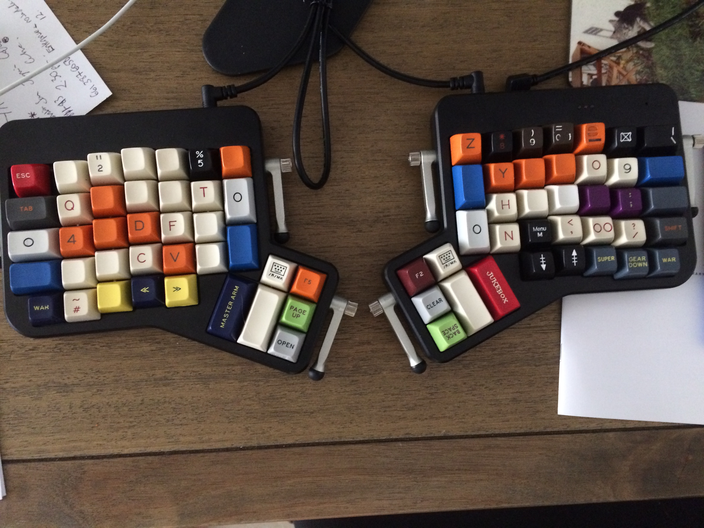

Englishman in New York
===========================

:microphone: :tea:

About
------

After using the massdrop configurator to get the basics, I wanted to add a
little extra to my ergodox. Notably the Hyper hotkey, the press and hold,
and a way to have my beloved £ :pound: symbol available<sup>[1](#unicode)</sup>. Why not switch to a GB
layout? Well the computers I use are US keymap'd and I can't always change
that. Plus I've got used to 2/@ and 3/# and moving to the ergodox was hard
enough. :sweat_smile:

I started from the default and edited from there as I needed. It's somewhat
similar to a regular layout, particularly R1 and shift/controls. I ended up
with a few keys that were blank, so I'm testing out some shortcuts. Alt+F4 for
quitting things in Windows, is one example, but I felt it was better placed on 
the 1st layer - in case of fat fingers.

Layout
-------



### Base Layer

```
,--------------------------------------------------.           ,--------------------------------------------------.
|   ESC  |  1!  |  2@  |  3#  |  4$  |  5%  |  6^  |           |  7&  |  8*  |  9(  |  0)  |  -_  |  +=  |  BkSp  |
|--------+------+------+------+------+-------------|           |------+------+------+------+------+------+--------|
| Tab    |   Q  |   W  |   E  |   R  |   T  |  {   |           |   }  |   Y  |   U  |   I  |   O  |   P  |  |\    |
|--------+------+------+------+------+------|  [   |           |   ]  |------+------+------+------+------+--------|
| Win    |   A  |   S  |   D  |   F  |   G  |------|           |------|   H  |   J  |   K  |   L  |  :;  |  '"    |
|--------+------+------+------+------+------| Home |           | End  |------+------+------+------+------+--------|
| LShift |Z/Alt |   X  |   C  |   V  |   B  |      |           |      |   N  |   M  |   ,  |   .  | Alt  | RShift |
`--------+------+------+------+------+-------------'           `-------------+------+------+------+------+--------'
  |LCtrl | COPY | PASTE| Left | Right|                                       | Down |  Up  |Hyper |  `~  | RCtrl |
  `----------------------------------'                                       `----------------------------------'
                                       ,-------------.       ,-------------.
  Hyper = Ctrl+Super+Alt+Shift         | ~L3  |  F5  |       |  F2  | ~L2  |
                                ,------|------|------|       |------+------+------.
                                |      |      | PgUp |       | Ins  |      |      |
                                | Enter| BkSp |------|       |------| ~L1  |Space |
                                |      |      | PgDn |       | Del  |      |      |
                                `--------------------'       `--------------------'
``` 

### Symbol Layer

```
,--------------------------------------------------.           ,--------------------------------------------------.
|        |  F1  |  F2  |  F3  |  F4  |  F5  |  F6  |           |  F7  |  F8  |  F9  |  F10 |  F11 |  F12 |PrintScr|
|--------+------+------+------+------+-------------|           |------+------+------+------+------+------+--------|
|        |   !  |   @  |   {  |   }  |   |  |      |           |      |   Up |   7  |   8  |   9  |   *  |        |
|--------+------+------+------+------+------|      |           |      |------+------+------+------+------+--------|
|        |   #  |   $  |   (  |   )  |   `  |------|           |------| Down |   4  |   5  |   6  |   +  |        |
|--------+------+------+------+------+------|      |           |      |------+------+------+------+------+--------|
|        |   %  |   ^  |   [  |   ]  |   ~  |      |           |      |   &  |   1  |   2  |   3  |   \  |        |
`--------+------+------+------+------+-------------'           `-------------+------+------+------+------+--------'
  |      |   £  |      |      |      |                                       |      |    . |   0  |   =  |Alt+F4|
  `----------------------------------'                                       `----------------------------------'
             ↑                         ,-------------.       ,-------------.
          THERE!                       |      |      |       |      |      |
                                ,------|------|------|       |------+------+------.
   CAD = Ctrl + Alt + Delete    |      |      |      |       |      |      |      |
                                |      |      |------|       |------|      |      |
                                |      |      |      |       | CAD  |      |      |
                                `--------------------'       `--------------------'
```
### Media Layer

Not touched this, not used either.

```
,--------------------------------------------------.           ,--------------------------------------------------.
| TEENSY |      |      |      |      |      |      |           |      |      |      |      |      |      |        |
|--------+------+------+------+------+-------------|           |------+------+------+------+------+------+--------|
|        |      |      | MsUp |      |      |      |           |      |      |      |      |      |      |        |
|--------+------+------+------+------+------|      |           |      |------+------+------+------+------+--------|
|        |      |MsLeft|MsDown|MsRght|      |------|           |------|      |      |      |      |      |  Play  |
|--------+------+------+------+------+------|      |           |      |------+------+------+------+------+--------|
|        |      |      |      |      |      |      |           |      |      |      | Prev | Next |      |        |
`--------+------+------+------+------+-------------'           `-------------+------+------+------+------+--------'
  |      |      |      | Lclk | Rclk |                                       |VolDn |VolUp | Mute |      |      |
  `----------------------------------'                                       `----------------------------------'
                                       ,-------------.       ,-------------.
                                       |      |      |       |      |      |
                                ,------|------|------|       |------+------+------.
                                |      |      |      |       |      |      |Brwser|
                                |      |      |------|       |------|      |Back  |
                                |      |      |      |       |      |      |      |
                                `--------------------'       `--------------------'
```
### Unicode Layer

Used to enter/test unicode input on Windows. All numbers are numpad keys.

```
,--------------------------------------------------.           ,--------------------------------------------------.
|  Alt   |  1   |   2  |  3   |  4   |   5  |  6   |           |   7  |  8   |   9  |  0   |  +   |  +   |        |
|--------+------+------+------+------+-------------|           |------+------+------+------+------+------+--------|
|  Alt   |      |      |   E  |      |      |      |           |      |      |   7  |   8  |  9   |  +   |        |
|--------+------+------+------+------+------|      |           |      |------+------+------+------+------+--------|
|  Alt   |   A  |      |   D  |   F  |      |------|           |------|      |   4  |   5  |  6   |  +   |        |
|--------+------+------+------+------+------|      |           |      |------+------+------+------+------+--------|
|  Alt   |      |      |   C  |      |   B  |      |           |      |      |   1  |   2  |  3   |  +   |        |
`--------+------+------+------+------+-------------'           `-------------+------+------+------+------+--------'
  | Alt  |  Alt | Alt  |      |      |                                       |   0  |   0  |  0   |  +   |       |
  `----------------------------------'                                       `----------------------------------'
                                       ,-------------.       ,-------------.
     WINDOWS ONLY SETUP!!              | ~L3  |      |       |      |      |
                                ,------|------|------|       |------+------+------.
                                |      |      |      |       |      |      |      |
                                |  Alt |  Alt |------|       |------|  Alt | Alt  |
                                |      |      |      |       |      |      |      |
                                `--------------------'       `--------------------'
```


Usage
------

~L1 / L2 / L3 will momentarily switch to a layer if held and another key is pressed.
If pressed and released will remain on layer until pressed again.

### Unicode

This layout is for Windows only. To enter a character Press and Hold Alt, type + and hex code then release Alt.

Changelog
-----------

### [0.2.1] - 2016-04-05

* Changed £ to alt code in Windows. Windows sucks at unicode.

### [0.2.0] - 2016-03-27

* Added unicode layer
* Moved Copy/Paste to left hand side
* Switched Enter and Space (again)
* Added L3 (unicode layer) toggle
* Removed Press and Hold for Alt on right hand size (/)
* Swapped Volume Up/Down to match arrows
* Tried fixing £ macro
* Removed * in the matrix function things (upstream change)

### [0.1.1] - 2016-03-23

* Changed £ input to a macro


### [0.1.0] - 2016-03-22

After actually using the keyboard, I've made some changes:

* Swapped Enter and Space
* Moved backspace to thumb keys (top right still remains)
* Added Ctrl+Alt+Delete
* Added Teensy Reset on 2nd layer
* Switched Up and Down
* Changed copy/paste to be Ctrl+c and Ctrl+v as KC_COPY/PASTE didn't work (in Windows)
* Moved ~L2 to replace +L1 after learning how the function works (notes above)
* Hopefully fixed GBP symbol (unicode enabled in MakeFile)

### [0.0.1] - 2016-03-21

First version


Issues
-------

Space for feedback and notes for future improvements

----
<sup><a name="unicode">1</a></sup>: For Windows only, and you have to edit the [registry](https://en.wikipedia.org/wiki/Unicode_input#Hexadecimal_code_input).
