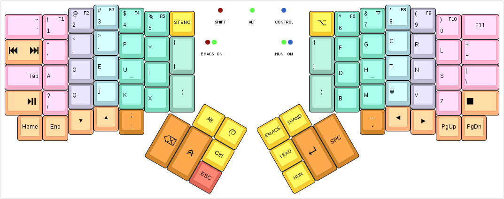
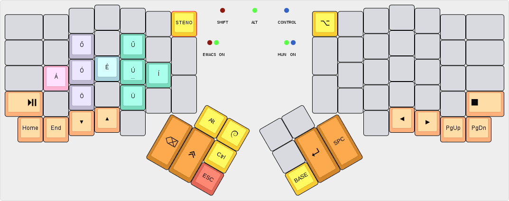
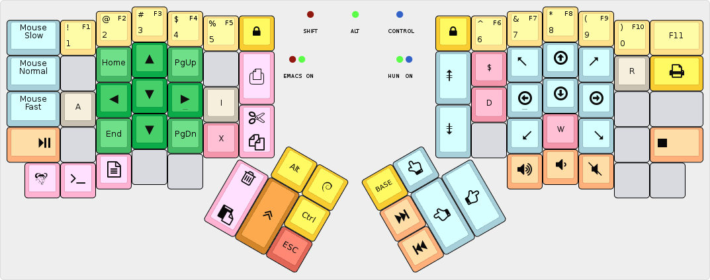

algernon's layout
=======================

This is an unconventional layout for the ErgoDox EZ. For more details about the
history of the layout, see my
[blog posts about my ErgoDox journey][blog-ergodox].

 [blog-ergodox]: https://asylum.madhouse-project.org/blog/tags/ergodox/

Some of the things in the layout only work when one uses Spacemacs and GNOME
under Linux. Your mileage may vary.

## Base layer

[](http://www.keyboard-layout-editor.com/#/gists/28f7eb305fdbff943613e1dc7aa9e82b)

At its core, this is a Dvorak layout, with some minor changes (for example, `-`
being on the left half, and on the innermost key of the bottom row on the
right). The more interesting parts are how certain keys behave:

* The keys on the number row double as function keys, when held for a bit longer
  than an usual tap. This allows me to use the function keys without having to
  switch layers.
* The `Shift`, `Alt`, and `Control` modifiers are one-shot. When tapped, they
  are considered active for the next key press only. When double tapped, they
  toggle on, until a third, single tap sometime later. When held, they act as
  expected. My usual pattern is that I use these for the next keypress only, so
  this behaviour is perfect. If I need them held, I'll just double-tap.
* The `GUI` key is special, because when I double-tap it, it sends `GUI + w`,
  which pops up an application selector. It also switches to a one-shot layer,
  where the number row on the left half turns into app selector macros, for the
  most common things I usually want to switch to. Otherwise it behaves as on a
  normal layout.
* The `ESC` key also doubles as a one-shot cancel key: if tapped while any of
  the one-shot modifiers are in-flight (as in, single-tapped, and not expired
  yet), it cancels all one-shot modifiers. Otherwise it sends the usual keycode.
* The **Emacs** and **Hun** layer keys are one-shot, the **1Hand** is a toggle.
* The **Lead** key allows me to type in a sequence of keys, and trigger some
  actions:
    - `LEAD u` enters unicode input mode, by sending the GTK+ key sequence that
      does this.
    - `LEAD l` uses the unicode input method to enter a `λ`.
    - `LEAD s` does a lot of magic to type in a shruggie: `¯\_(ツ)_/¯`
    - `LEAD w m` maximises the currently focused window.

## Hungarian layer

[](http://www.keyboard-layout-editor.com/#/gists/b160f6ec90d58c127c114c89f66e9dc9)

On this layer, the accented characters are at the same position as their base
variant. For some, which can have other diatribes, the long one is on top,
short's on bottom. Tapping any of the accented characters takes us back to the
base layer.

## Emacs layer

[](http://www.keyboard-layout-editor.com/#/gists/c59c453f9fe1a3238ba1494e7e5c6892)

This layer is primarily for navigating text - and for some mousing and other
things, because there was space. Most of the keys should be pretty
self-explanatory, except for a few:

* There are three keys on the bottom row of the left side, that change how some
  of the other keys - explained just below - work. The keys are for *Emacs
  mode* (the default), *Terminal mode*, and *Traditional mode*, respectively.
* The *Visual mode* key (the top big key on the left side) sends the `v` key in
  *Emacs mode*, to enter Visual mode in Spacemacs. In all other modes, it is a
  no-op.
* The *Copy/Cut* key (the bottom big key on the left side) sends the copy
  command on tap, the cut one when held for longer than a normal tap. The **copy
  command** is `y` in *Emacs mode*, `Ctrl-Shift-c` in *Terminal mode*, and
  `Ctrl-c` in *Traditional mode*. The **cut command** is `x` in *Emacs mode*,
  `Ctrl-Shift-x` in *Terminal Mode* and `Ctrl-x` in *Traditional mode*.
* The *Paste/Delete* key (the leftmost key on the left thumb cluster) sends the
  paste command on tap, the delete one when held longer than a normal tap. The
  **paste command** is `p` in *Emacs mode*, `Ctrl-Shift-v` in *Terminal mode*,
  and `Ctrl-v` in *Traditional mode*. The **delete command** is `d` in *Emacs
  mode*, and `DEL` in the other two.
* The `A`, `I` and `R` keys will - after sending themselves - clear the layer
  back to the base layer. This allows a quick escape from the layer.

## One-handed layer

[](http://www.keyboard-layout-editor.com/#/gists/edff2495135955b8963198dace7f7ece)

The one-handed layer is used in situations where the right hand is occupied, by
mousing around, for example. Tapping the `OTHER` key switches which side is
active. For the most part, keys remain in their usual position. When the right
half is active, keys are mirrored to the left half.

The differences are as follows:

* The `ESC` key has been moved to the bottom row, so the `OTHER` key is easier
  to tap.
* Most keys on the thumb cluster now have dual uses, and these do not change
  when switching sides:
    - The `Space`/`Backspace` key sends `Space` on tap, `Backspace` when held
      for longer than a normal tap.
    - The `Enter`/`Shift` key sends `Enter` on short-tap, `Shift` on long-tap.
* The `Apps`/`BASE` key can be used to go back to the base layer, by
  long-tapping it. A short-tap will send the `App` key, as usual.

# Building

To make my workflow easier, this layout is maintained in
[its own repository][algernon:ez-layout]. To build it, you will need the
[QMK][qmk] firmware checked out, and this repo either checked out, or symlinked
to `keyboard/ergodox_ez/algernon`. One way to achieve that is this:

 [algernon:ez-layout]: https://github.com/algernon/ergodox-layout
 [qmk]: https://github.com/jackhumbert/qmk_firmware

```
$ git clone https://github.com/jackhumbert/qmk_firmware.git
$ cd qmk_firmware/keyboard/ergodox_ez
$ git clone https://github.com/algernon/ergodox-layout.git keymaps/algernon
$ make KEYMAP=algernon
```

From time to time, updates may be submitted back to the QMK repository. If you
are reading it there, you can build the firmware like any other firmware
included with it (assuming you are in the root directory of the firmware):

```
$ cd keyboard/ergodox_ez
$ make KEYMAP=algernon
```

# License

The layout, being a derivative of the original TMK firmware which is under the
GPL-2+, this layout is under the GPL as well, but GPL-3+, rather than the older
version.
