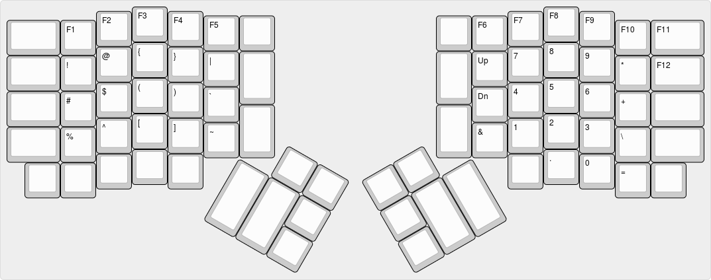

# German Layout for the ErgoDox

This layout is inspired by the "kinesis-qwerty-mod" from benblazak's
ergodox-firmware, as well as by the "german" layout from the qkm_firmware.
The goal was to have a layout that is pretty close to an ordinary German
keyboard, so I don't have to make adjustments on the operating system level
and I keep some of the muscle memory to use a regular keyboard.

Modifications I made with regard to the aforementioned layouts:

* The key layout is pretty close to the layout of a German Kinesis Ergo Elan.
  The only exception I made is that I reversed the "up" and "down" cursor keys,
  since that feels more natural to me.

* All layer changes are "momentary", i.e. they only last as long as the respective key is pressed.

* I sacrificed the Hyper and Meh keys, which I don't use, and put layer change keys in their place.

## Default Layer

## Code Layer

