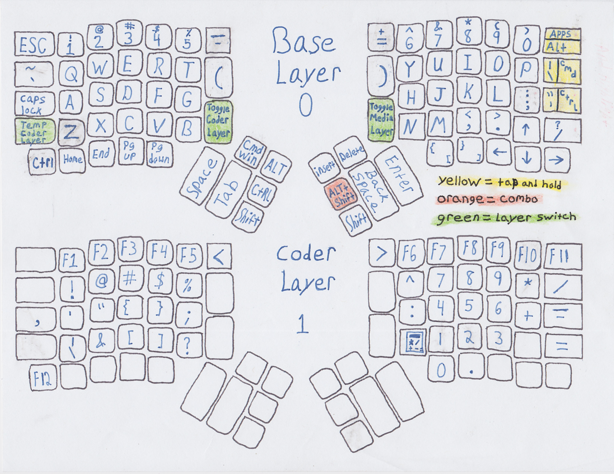
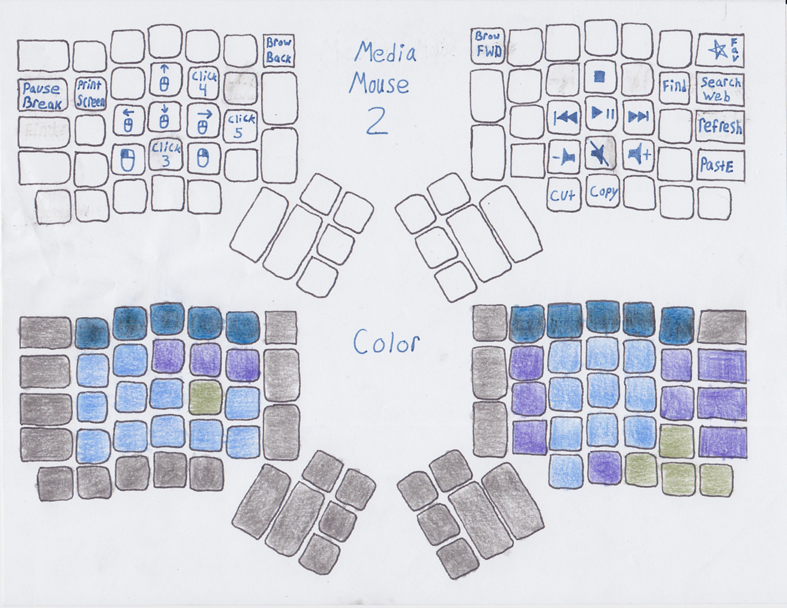

# karrow configuration

* What I did differently:
  * Brought back traditional inverted-T arrow keys.
  * Thumb shift
  * Shift ctrl alt cmd/win easy to hit all at once. ctrl + shift(I do that a lot)
  * zzzHome, xEnd, cPgUp, vPoints down
  * Less than & zoom out & -;  greater than & zoom in & +. kinda goes together. 
  * Calculator layout in code layer(this is why f12 is in bottom left corner)
  * !@#$%^ in code layer, like 123456
  * Added characters in all layers(see images below) gotta have insert.

Those printable png files are great. Useful if you just want a hard copy or to help design your own layout. Rotate once before printing. I suggest using a Pilot Frixion Erasable pen. These pens erase clean and write bold if you write slowly. You can then scan the finish product with a photo scanner (I used my printer's) and share with friend or for all to see! Last, place in sheet protector so you can look where the characters are at while keeping it safe and organized. 

