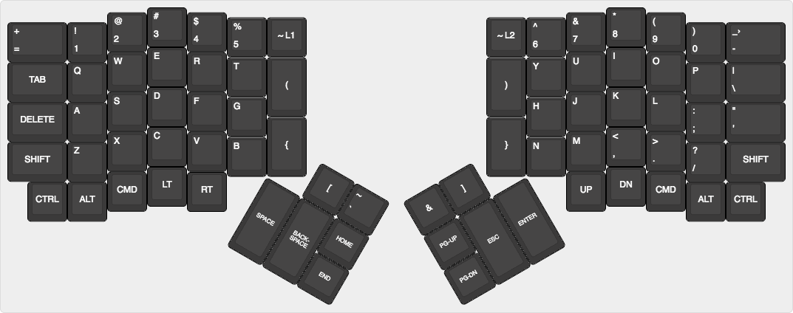
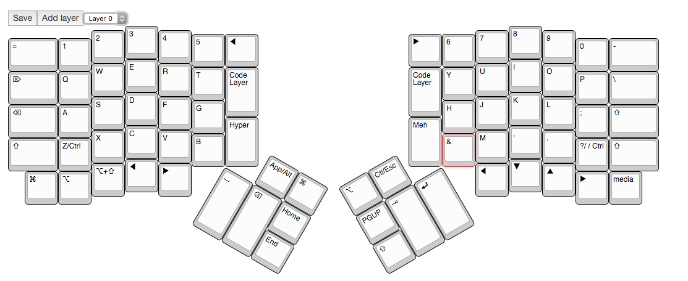
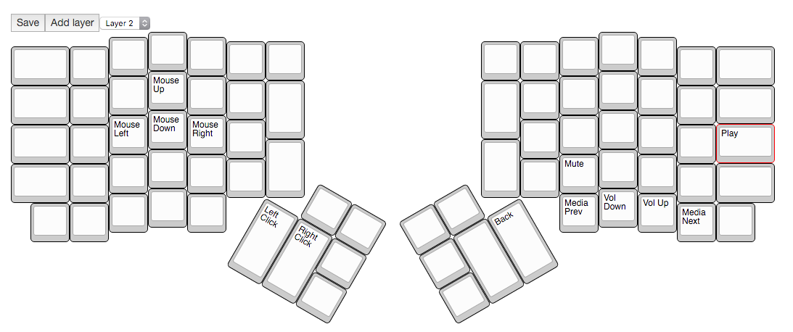

# MSC Configuration

### Based mostly on the ErgoDox EZ default layout with optimizations for coding on osx.

#### Expecting the user to rely on Coder Layer this keymap removes some of the duplicate symbol keys in the lower portions of the board and replaces them with arrow keys and modifiers. The Media Layer is also updated to match the change in the arrow keys and the left and right click buttons are moved under the thumb position. The Media layer is now reached with toggle button in the lower right.

### Main Layer

### Code Layer

### Media Layer

## Changelog

Version 1.0

- Changed the temp code layer key in the bottom right to toggle media layer
- Changed the temp media key to only be ";"
- Changed right hand bottom row to match vim home row nav directions
- Changed media keys to match arrow key changes
- Changed media left and right click to spacebar and backspace locations
- Changed bottom left to Cmd
- Changed single quote on left bottom row to alt

#### Coming Soon:
- A new layer for Blender editing with a focus on left hand shortcut and a righthand num pad to control the view in Blender.
