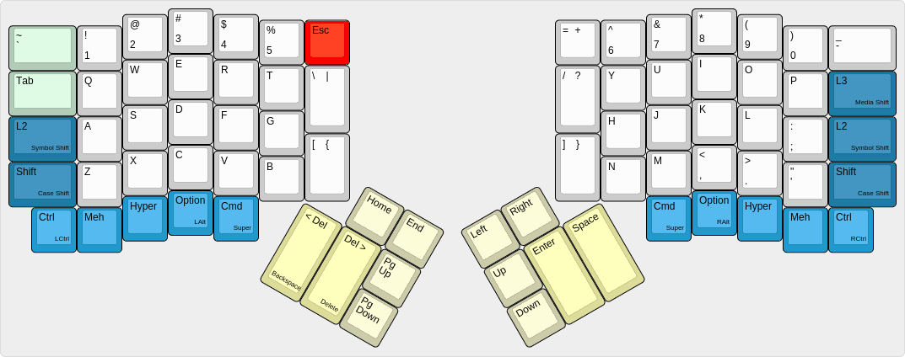

# The Ordinary Layout. for  users of common keyboards

You can read more about the reasoning behind this layout over at [Nicholas's blog](http://nicholas.rinard.us/2016/03/ergodox-ez-layout.html). The idea is to make a layout that's as familiar as possible for users of "regular" keyboards.

