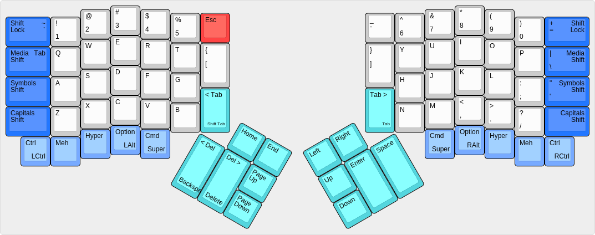
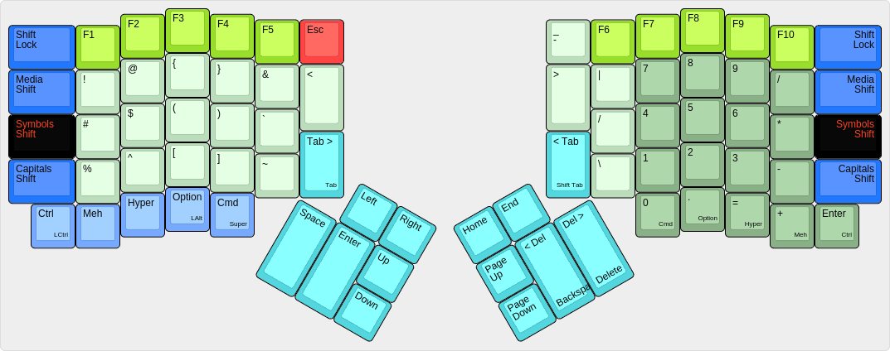
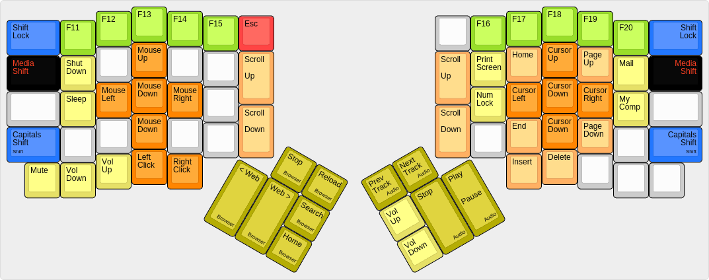
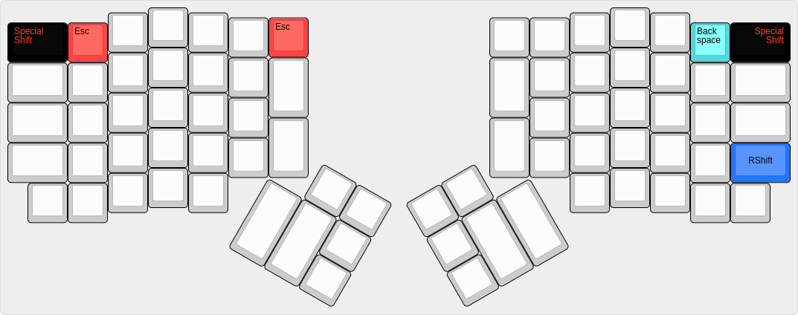

# The Ordinary Layout, a familiar and powerful layout #

The Ordinary Layout is intended to be unremarkably mundane and remarkably useful. This layout maintains most key positions from common QWERTY keyboards, and it features enhanced Symbol and Media layers compared to the default Ergodox EZ layout.

The Ordinary Layout is supposed to look mostly like a normal keyboard, except in the ways that the Ergodox key arrangement is unique. The thumbs are responsible for space, enter, plus both forward and backward delete; with only a couple exceptions, all other keys are in the same place they are found on traditional keyboards.

Nicholas Keene
ordinarylayout@nicholaskeene.com
no rights reserved, use for any purposes, credit me if you are a nice person

## The Base Layout ##

* The light blue keys are modifiers: traditional Control, Option, and Command keys, plus Hyper and Meh
* The dark blue keys are Shift keys: Capitals Shift (traditional shift), Symbol Shift, and Media Shift; plus a Shift Lock key
* Several dark blue keys double for entry of characters which would typically be in those locations
* The turquoise keys are text navigation and manipulation
* The red keys is Escape and it is always found in that location no matter what

This layout puts the modifier keys along the bottom of the keyboard where they are on most keyboards. They are in the regular order, with the addition of Hyper and Meh keys. The modifier keys are all in the same place on all layers, although some layers also assign symbols on those buttons. On the outside edges are the Shift keys. The traditional shift key is called Capitals Shift and it is in the normal location. Above that are Symbols Shift and Media Shift. Each Shift key momentarily switches the layout to that layer, and if you use the Shift Lock button you can lock the layout to that layer.

Touch typists will also find tilde, tab, equals/plus, slash/pipe, and quote/double-quote sharing space on those Shift keys where they would probably be on a common keyboard. Other than the turquoise keys the only buttons which move to new locations are the Brackets and Dash and Escape. Most touch typists dont touch-type brackets or dash anyway so only Escape really requires retraining of muscle memory, and see below for the Special Escape Sequence.

The four big turquoise keys are arranged differently than in the default Ergodox EZ layout. The Ordinary Layout here copies the design of the old Fingerworks TouchStream keyboard, but also reflects the natural presumptions of the author -- me! I type the space character with my right hand, and to me it makes sense for the two delete keys to be next to one another.

The Forward Tab and Backward Tab keys are in their locations mostly because I ended up with two extra buttons and needed something to do with them. My muscle memory from using the Truly Ergonomic Keyboard makes me look for the Tab key with my right index finger, so it is handy to have this redundant Tab, and the idea with the Backward Tab key is that it becomes easy to navigate text fields in forms, or to indent/unindent code.

## The Symbols Layer ##

* The light green keys are the eponymous symbols
* The bright green keys are F-Keys
* The dark green keys constitute a number pad
* The turquoise keys are the *reverse* of the turquoise keys on the base layer

The Ergodox EZ ships with the "Coder Layer" which I like to call the Symbols layer. There are some significant improvements in The Ordinary Layout over the default layout.

The symbol keys are mostly the same as on the default layout, which did a good job in this regard, but with a few enhancements:

* Angle brackets on this layer mean that curly, square, and angle brackets are all available on different layers of the same two buttons. Also, they mean that all kinds of brackets, including parentheses, are available on both the Base and Symbols layers.
* The slash, backslash, and pipe characters are grouped together as a memory aid.
* The & and | symbols are juxtaposed as a memory aid

The number pad area here, in green, includes all four arithmetic operations in the same order found on most number pads and features an Enter key. The keycodes emitted here are normal numeric keycodes, not the number-pad specific keycodes emitted by most number pads, because this layout does not use a Num Lock key to switch the buttons between numeric keycodes and navigational keycodes. See the explanation in The Media Layout section about navigation using these same buttons.

Finally, consider the turquoise text-nav keys. Here in the Symbols layer, these are *reversed* from the base layer, with the keys either mirrored or shifted. This is powerful! Often I find myself using the mouse with my right hand, and the left hand needs to press Enter. Instead of reaching the left hand over to the right side of the keyboard, now I simply tap Symbols to reverse the turquoise keys, and Enter is right where it should be.

## The Media Layer ##

* The dark orange keys on the left move the mouse cursor
* The dark orange keys on the right move the text cursor
* The light orange keys are for scrolling and paging
* The bright green keys are more F-keys
* The dark yellow keys signal Web and Audio applications
* The light yellow keys signal the operating system
* The dark gray keys do nothing in case you bump them by accident

This layer was inspired by the Media layer on the Ergodox EZ but takes it farther. The Fingerworks TouchStream keyboard had a very useful feature for controlling the text cursor easily and this layer does something similar. The left hand can move the mouse, the right hand moves the text cursor, in all four directions, in small or large increments. This greatly enhances navigation in text documents.

Moreover, the orange keys on the right overlay the numberpad from the Symbols Layer, such that in the Media Layer the same keys can be used as if they were a number pad in navigational mode (Num Lock off). For instance, in traditional number pads the '3' key became 'Page Down', and so it is here. This means a user can do text navigation without moving either hand.

Alas, the yellow keys have at best spotty success with common software. Good luck with those but don't expect too much.

## Switching Between Layers ##

In addition to Symbols and Media there is the Capitals layer which is exactly the same as pressing the shift key. Each layer is accessed by a shift key on each edge of the keyboard and corresponds to one of the three LEDs on the keyboard: Capitals (red), Symbols (green), Media (blue). The color of a layer illuminates when the layer is active.

Shift buttons work in the expected way: press them and all of the keys switch to that layer; release them and the keys switch back to the base layer. If you press both of a pair of shift keys, the layer will lock on until you press both shift keys again. For instance, the widely and rightly loathed Caps Lock is engaged by pressing both Capitals Shift buttons. All the Shift keys work this way.

Multiple layers can be turned on at once. The Capitals layer will affect characters on other layers to capitalize. Other layers, however, don't 'mix': Symbols blankets the base layout; Media blankets Symbols.

## Special Sequences ##

### Escape ###

The One True Location for the Escape key is segregated way up on the top left of the keyboard. The Ergodox does not have a physical button in such a location and the nearest one is home to the tilde (er, grave) which is commonly found there. In the Ordinary layout the Escape key is found on all layers in the prominent location in the corner next to the 5, whnich is easy to remember, and yet it isn't natural for those of us with muscle memory flicking our wrists up and to the left looking for Escape.

The Ordinary layout offers as a consolation prize a Special sequence for Escape: Special Shift + 1. This is natural so you can tap the top left button, then the button next to it and get Escape. This gesture works in all layers.

### Backspace ###

At the top right corner of the Ergodox EZ you can a gesture similar to the special Escape sequence, using the 0 key, to produce a Backspace. Users of this keyboard and this layout are well advised to learn to use their thumbs for deleting text, but sometimes you are doing other computery things and just want to flick your digits up to the right and press backspace a bunch times.

### RShift ###

The Ordinary Layout locks layers by pressing both of a pair of shift keys. This interferes with the QMK firmware magic sequence, which is LShift+RShift. To work around this, both of the Capitals Shift keys produce a *Left Shift* keystroke. If for some reason a person needs *Right Shift* they can find it by pressing a Special Shift key, then the Capitals Shift key on the right side of the keyboard.

****

The Ordinary Layout for the Ergodox EZ keyboard, v4

Modifications from default by Nicholas Keene ergodoxez@nicholaskeene.com

No rights reserved. This software is in the public domain. Credit me if you are friendly but if you're a jerk don't bother.

Details: readme.md
         https://github.com/nrrkeene/qmk_firmware/tree/master/keyboard/ergodox_ez/keymaps/ordinary
