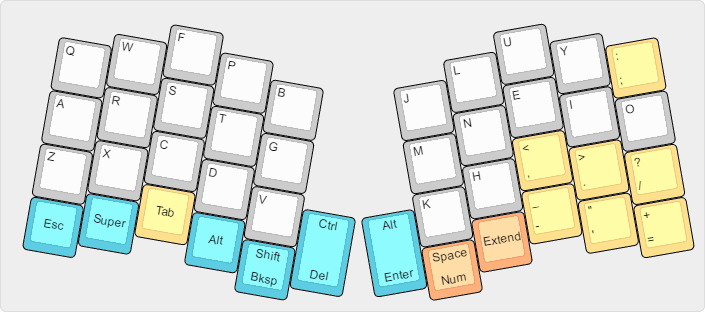
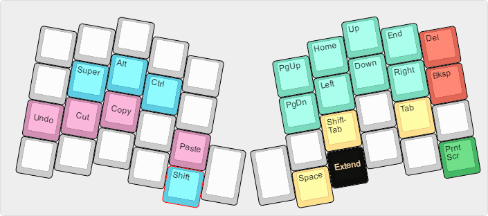
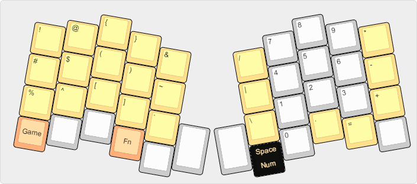
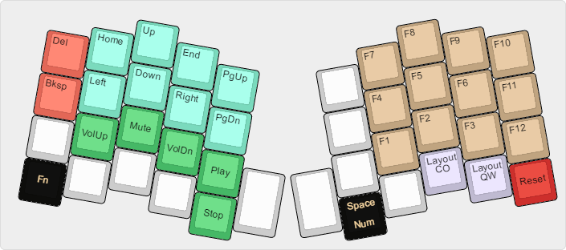
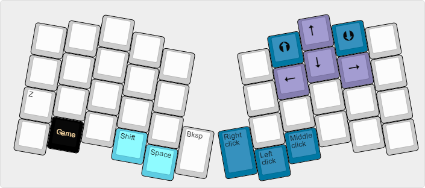

# replicaJunction - Atreus Layout #

This layout is designed to make the absolute most out of the Atreus 40% keyboard.

I was enchanted with the idea of the Atreus keyboard after using my Ergodox for several months. I wanted something of a similar form factor that was easily portable, so I could bring and transport a keyboard to my workplace without much hassle. After building the Atreus keyboard, though, I realized very quickly that the 40% form factor requires a lot more creativity than a full-size keyboard (even one as strangely-shaped as the Ergodox).

The default Atreus keyboard layout provides all the necessary keys in order to function with the keyboard, but as a programmer, I needed quicker access to just about everything. I noticed that the default layer didn't include any dual-role keys, and so I started on my journey to build my perfect layout for the Atreus.

I won't claim that this layout is perfect for everyone. It does make several significant changes from the "normal" Atreus layout. In my own use, though, I've found this keyboard turbocharges my Atreus, and gives it the power of a full-size keyboard without the size.

## Base Layer ##

The letters on this layout are arranged in the [Colemak Mod-DH layout](https://colemakmods.github.io/mod-dh/).

Note that there are four dual-purpose keys: Shift (Backspace), Ctrl (Delete), Alt (Enter), and Space (Number layer). In QMK, these dual-role keys can be made to hold their primary key by double-tapping the key and holding on the second tap. For example, if I wanted to insert a long string of Spaces, I would tap the Space key, then tap it again and hold. A single press and hold would trigger the secondary function of the key instead.

The secondary Alt on the left bottom row exists to provide a single-hand Alt+Tab shortcut, which would take two rows otherwise.

## Extend Layer ##

This layout is designed primarily for keyboard navigation. Arrow keys are easily accessible under the right hand (a welcome change from the original Atreus layout, which places them under the left hand), along with Home/End and PgUp/PgDn.

Modifiers are also placed under the home row of the left hand. One of the single keyboard actions I use most is Shift+Ctrl+Left/Right to select a whole word; this layer makes those keypresses simple by adding the Ctrl key in an easy-to-reach location.

For the common Ctrl shortcuts, I also added some hotkeys to this layer over the letter keys they are associated with. This gives the Extend key some extra utility by letting it "feel" like a Ctrl key in some cases.

The Space key exists to prevent going from this layer directly into the Number layer. Similarly, the Shift key on the left pinky helps make sure that the normal letter (Z) doesn't fire.

## Number and Symbol Layer ##

This layer provides the only way of accessing number keys on this keyboard, since it's too small for its own number row. Note that even though they are laid out in the number pad fashion, they send the "regular" number keystrokes. Games and programs that specifically use NumPad keys are not supported in this layout at the moment.

This layer also provides plenty of symbol shortcuts. Most of these can be accessed through other means (like Shift+8 for the asterisk), but having shortcut keys to them makes for one less keypress, which adds up quickly when using these symbols on a regular basis. I've been through many revisions of this concept on my Ergodox as well as the Atreus, and I've finally arrived at this layout as the one that provides the symbols I need most frequently in places I can think to expect them. The Ordinary layout from the Ergodox-EZ keyboard in this repository was a large influence in this design.

## Function Layer ##

Function keys (F1-F12) are on this layer, as well as some more generic "functions" such as media keys. I've also set up a mirror image of the arrows from the Extend layer in case I need to use these with my left hand, but I don't do this very often.

The reset key is on this layer, as well as a toggle from Colemak to QWERTY and back. The QWERTY layer is not currently documented, but it is functionally identical to the base layer except for letter positions.

## Gaming Layer ##

This is a small layer developed to allow some simple gameplay without a mouse. This layer is a toggle (from the Number layer), so it is designed to stay on while in use.

The keys on the left hand bring Space into the left thumb's reach, as well as overriding the dual-role Shift with its standard function (Z in both QWERTY and in Colemak). This allows easy Shift presses without blocking the Z key, commonly used in games.

I would probably not consider this a hard-core gaming keyboard, and this layout does have the huge problem of blocking access to the number keys, but for more casual games, it plays quite well. I've used it quite a bit on Minecraft, for example, and I'm quite pleased with it.