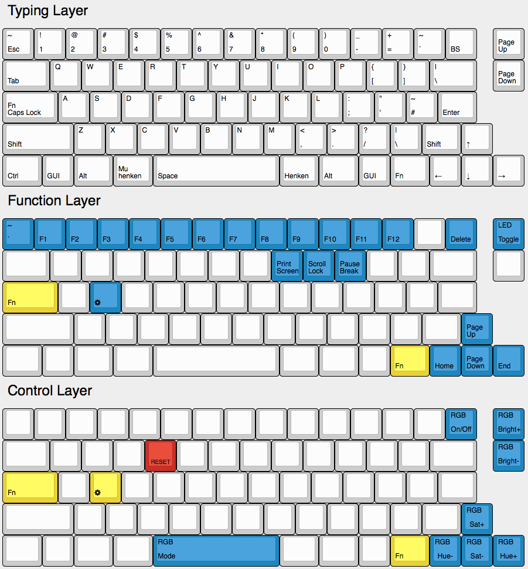

```
 ___     _____ _            _                         _     __    __ _   __
|__ \   / ____| |          | |                       | |   / /   / /(_) / /
 ||) | | |    | |_   _  ___| |__   ___   __ _ _ __ __| |  / /_  / /_   / /
 |/ /  | |    | | | | |/ _ \ '_ \ / _ \ / _` | '__/ _` | | '_ \| '_ \ / /
 |_|   | |____| | |_| |  __/ |_) | (_) | (_| | | | (_| | | (_) | (_) / / _
 (_)    \_____|_|\__,_|\___|_.__/ \___/ \__,_|_|  \__,_|  \___/ \___/_/ (_)
```



# Caps Fn Layout

This is the default layout except that Caps Lock acts like Caps Lock when
tapped but Fn when held.
