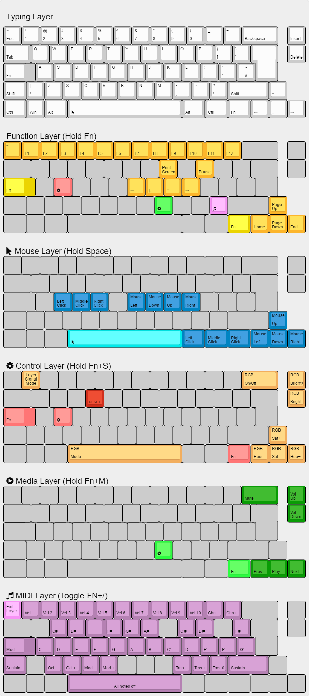

```
 ___     _____ _            _                         _     __    __ _   __
|__ \   / ____| |          | |                       | |   / /   / /(_) / /
 ||) | | |    | |_   _  ___| |__   ___   __ _ _ __ __| |  / /_  / /_   / /
 |/ /  | |    | | | | |/ _ \ '_ \ / _ \ / _` | '__/ _` | | '_ \| '_ \ / /
 |_|   | |____| | |_| |  __/ |_) | (_) | (_| | | | (_| | | (_) | (_) / / _
 (_)    \_____|_|\__,_|\___|_.__/ \___/ \__,_|_|  \__,_|  \___/ \___/_/ (_)
```



# MouseKeys Layout

This layout is a combination of the `mouse_keys` and the `win_optimized` layouts.
This layout is optimized for an ISO layout.

It adds a mouse layer. When you hold down the spacebar the arrow keys
will move your mouse cursor. You can click using the 3 mods to the left of the
arrow keys, or the 3 keys under your primary fingers on the home row.
The Left, Down, Up and Right for the mouse movement are also VIM-Like on the HJKL keys

The CapsLock is disabled and works as Function key.

There is also a separate media layer with Volume/Play controls

The different layers are signalled throug setting of the underlight:

- Base layer: White
- Function layer: Yellow
- Media layer: Green
- Mouse layer: Blue
- Control layer: Red
