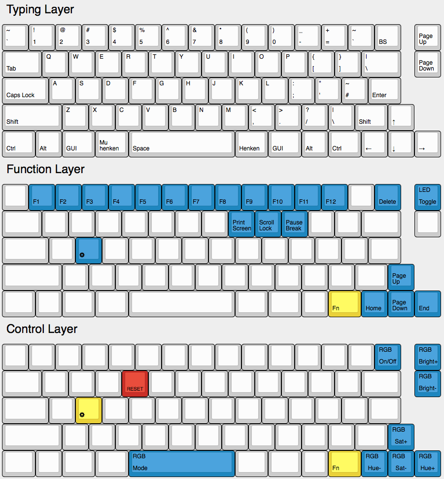

```
 ___     _____ _            _                         _     __    __ _   __
|__ \   / ____| |          | |                       | |   / /   / /(_) / /
 ||) | | |    | |_   _  ___| |__   ___   __ _ _ __ __| |  / /_  / /_   / /
 |/ /  | |    | | | | |/ _ \ '_ \ / _ \ / _` | '__/ _` | | '_ \| '_ \ / /
 |_|   | |____| | |_| |  __/ |_) | (_) | (_| | | | (_| | | (_) | (_) / / _
 (_)    \_____|_|\__,_|\___|_.__/ \___/ \__,_|_|  \__,_|  \___/ \___/_/ (_)
```



# Maximised Clueboard Layout

This layout is intended for a board with one or both shifts split. The outside key on the split shift is an Fn, while the inside is shift. The bottom row has all the mods on both sides, optimised for a Mac.
