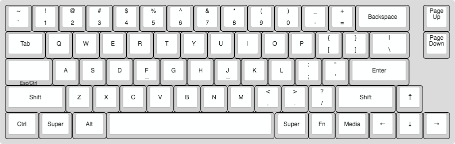
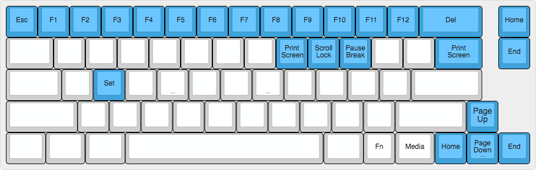

```
 ___     _____ _            _                         _     __    __ _   __
|__ \   / ____| |          | |                       | |   / /   / /(_) / /
 ||) | | |    | |_   _  ___| |__   ___   __ _ _ __ __| |  / /_  / /_   / /
 |/ /  | |    | | | | |/ _ \ '_ \ / _ \ / _` | '__/ _` | | '_ \| '_ \ / /
 |_|   | |____| | |_| |  __/ |_) | (_) | (_| | | | (_| | | (_) | (_) / / _
 (_)    \_____|_|\__,_|\___|_.__/ \___/ \__,_|_|  \__,_|  \___/ \___/_/ (_)
```

# Serubin's Clueboard Layout

This is the layout based on the clueboard default, modified for development on Mac, PC, and Windows. This layout also handles media and volume keys on all the previously listed platforms. Most importantly, Capslock has been replaced by a dual function Esc/Ctrl key. This is particularly handy for use in Vim. 

#### Base Layer


#### Fn Layer


#### Media Layer


