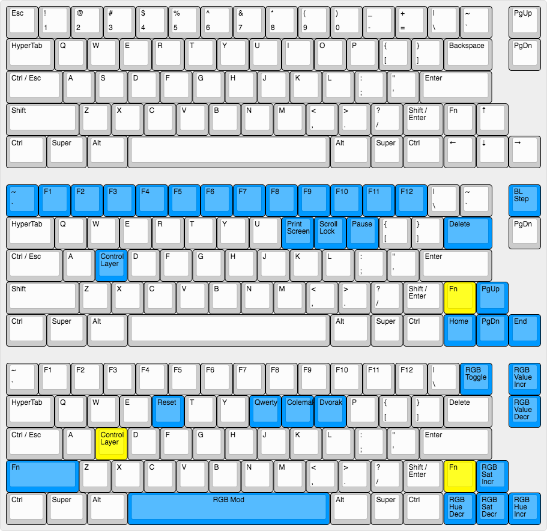

```
 ___     _____ _            _                         _     __    __ _   __
|__ \   / ____| |          | |                       | |   / /   / /(_) / /
 ||) | | |    | |_   _  ___| |__   ___   __ _ _ __ __| |  / /_  / /_   / /
 |/ /  | |    | | | | |/ _ \ '_ \ / _ \ / _` | '__/ _` | | '_ \| '_ \ / /
 |_|   | |____| | |_| |  __/ |_) | (_) | (_| | | | (_| | | (_) | (_) / / _
 (_)    \_____|_|\__,_|\___|_.__/ \___/ \__,_|_|  \__,_|  \___/ \___/_/ (_)
```

# smt Clueboard Layout (HHKB variant)



This is smt's HHKB variant layout, based on the default layout that comes
flashed on every Clueboard. The primary differences from the default are:

- The Backspace key is moved down into the traditional `\` position
- `\` and `` ` `` are assigned to the "split-backspace" positions
- The right Shift is split to allow for a Fn key to its right
- The modifiers on the right side now mirror the left side (`Alt`/`Super`/`Ctrl`)

For the most part, it's a straightforward and easy to follow layout. There
are a few special keys:

- The Esc key sends `Esc` when tapped, `` ` `` when `Alt`/`Super`/`Ctrl`/`Fn` is held, or `~` when `Shift` is held
- The Tab key sends `Tab` when tapped, or `Super+Ctrl+Alt+Shift` (a.k.a. [Hyper]) when held
- The key traditionally in the Caps-Lock position has been re-mapped to send `Esc` when tapped, or `Ctrl` when held
- The left Shift key sends `Enter` when tapped, or `Shift` when held

[Hyper]: http://brettterpstra.com/2012/12/08/a-useful-caps-lock-key/
