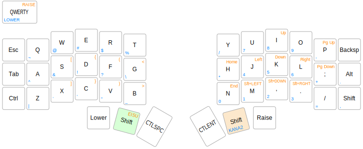

# crkbd用 薙刀式日本語入力キーマップ

薙刀式のかな入力をQMKで実現します。薙刀式v12究極版に準拠しています。
Windows用の編集モードも実装しています。編集モードの記号入力を使用するには以下の設定をしてください。

1. Windowsのキーボード設定を106キーボードにする。
2. [WinCompose](http://wincompose.info/)をインストールする。

MacOSで使うためにはconfig.hで`NAGINATA_EDIT_WIN`をコメントアウトし、`#define NAGINATA_EDIT_MODE_MAC`を有効にしてください。
MacOSでの編集モードはカーソル移動など一部に対応しますが、記号入力にはUnicode Hex Inputへマウスを使って切り替えが必要で実用的ではないため、記号入力を無効にしています。

標準では本家の通り縦書きのためのカーソル移動方向になっていますが、横書き用にするにはconfig.hの`NAGINATA_TATEGAKI`をコメントアウトし、`NAGINATA_YOKOGAKI`を有効にしてください。

### 薙刀式とは

【カタナ式ファミリー】カナ配列「薙刀式」
http://oookaworks.seesaa.net/article/456099128.html

### キーマップ

