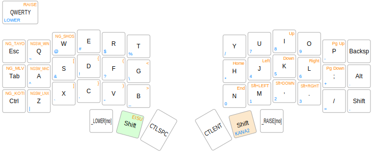

# crkbd用 薙刀式カナ配列キーマップ

薙刀式カナ配列による入力をQMKで実現します。薙刀式v13完成版に準拠しています。
編集モードも実装していますが、
編集モードでの記号入力方式がOSによって異なるので、
使用するOS(Windows、MacOS、Linux)によって切り替える必要があります。
これまでのリリースではファームウェアのコンパイル時に使用するOSを決定していましたが、
本リリース(V13u)は、OSを動的に切り替えられるようになりました。
縦書き横書きも動的に切り替えられます。

## OSの設定

1. OSのキーボード設定を日本語106キーボードにする。
2. Windowsの場合は[WinCompose](http://wincompose.info/)をインストールする。
3. MacOSの場合は、ユーザー辞書にnaginata_dictionary.plistを登録する。

## QMKファームウェアの設定

独自拡張として、標準のシフト&スペースに加えて、シフト&エンターキーを追加しました。
NG_SHFT2をキーマップに配置すると、単押しならエンター、
同時押しで薙刀式のシフトキーとして機能します。

OLEDが有効な場合には左側のOLEDには、
日本語入力モードに応じて「かな」または「ABC」と表紙されます。
右側のOLEDには薙刀式のロゴが表示されます。薙刀式のロゴは大岡俊彦氏に帰属します。

ファームウェアのコンパイル、書き込みは以下のコマンドです。

```make crkbd/rev1/common:naginata_v13:flash```

## キーボードの切り替え操作

| 設定項目 | 設定 | キー | キーコード | 
|---|---|---|---|
| OS切り替え                      | Windows  | Raise + Q  | NGSW_WIN  | 
|                                 | MacOS    | Raise + A  | NGSW_MAC  | 
|                                 | Linux    | Raise + Z  | NGSW_LNX  | 
| MacOSのライブ変換対応の切り替え | ON/OFFトグル   | Raise + Tab  | NG_MLV   | 
| 縦書き、横書きの切り替え        | ON/OFFトグル   | Raise + Control  | NG_TAYO    | 
| 後置シフトの切り替え            | ON/OFFトグル   | Raise + Escape  | NG_KOTI  | 
| 現在設定の出力                  |   | Raise + W  | NG_SHOS   | 

## 薙刀式とは

【薙刀式】v13完成版、発表。
http://oookaworks.seesaa.net/article/479173898.html

## キーマップ



