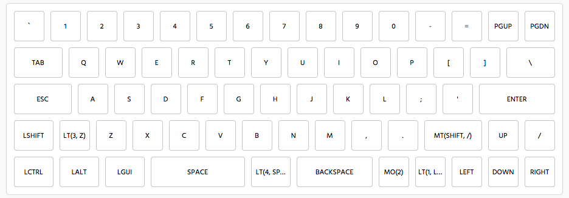
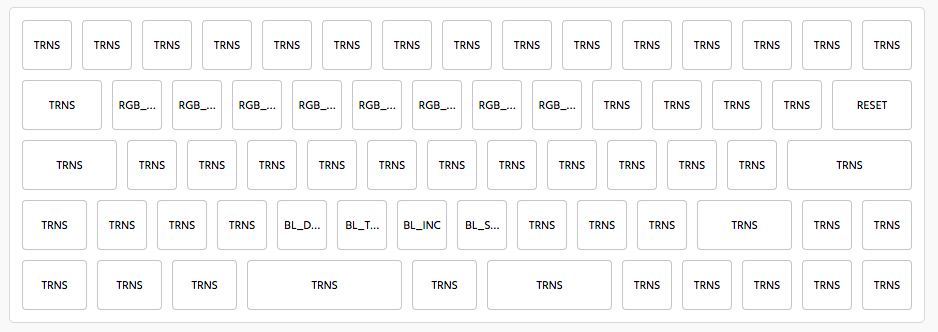
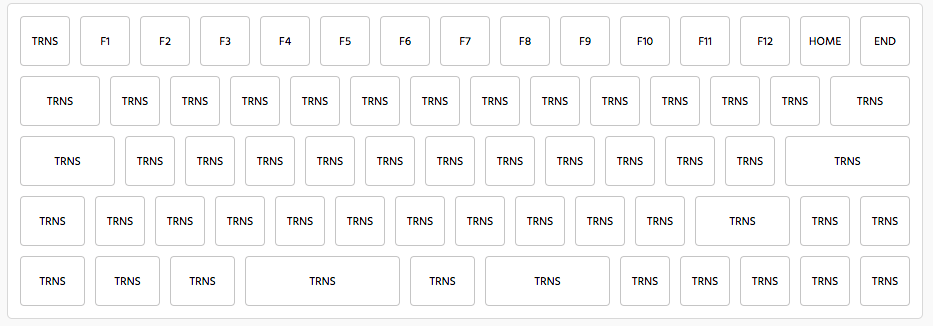

# Yan-Fa Li's Keymap for KBDFans DZ60 PCB

## 4 Layers

### Layer 0

Conventional ANSI layout. Backspace has been replaced with 2 keys, PGUP and PGDN.
Left shift is 1.25U with 1U key for layer 3, Bottom right shift is 1.75U. Has arrow cluster. Tap right shift for / and dedicated
/ key is to far right.
Bottom row, split space bar 2.75U (Space), 1.25U (mouse key + WASD), 2.25U (backspace). 1U layer 2, 1U layer 1, arrows.

### Layer 1

RGB underglow and backlight controls, Reset

### Layer 2

F1-F12, PGUP -> HOME, PGDN -> END

### Layer 3

Unused

### Layer 4

 * WASD - Mouse controls
 * Q - Btn 1
 * E - Btn 2

