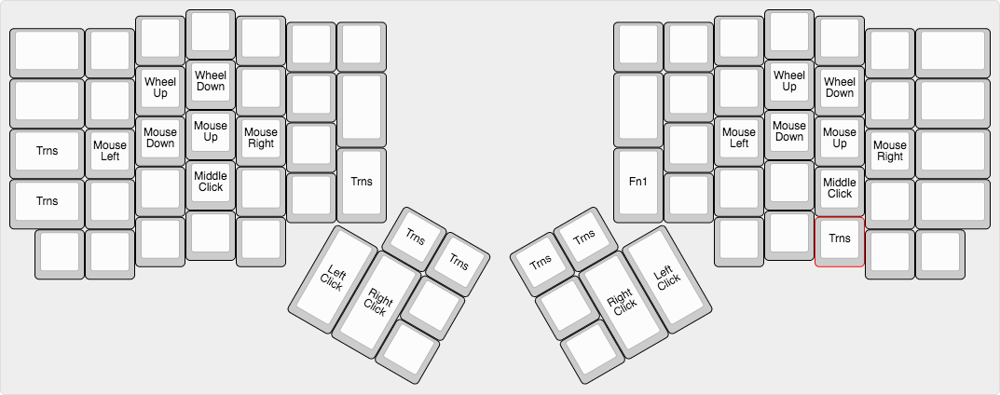
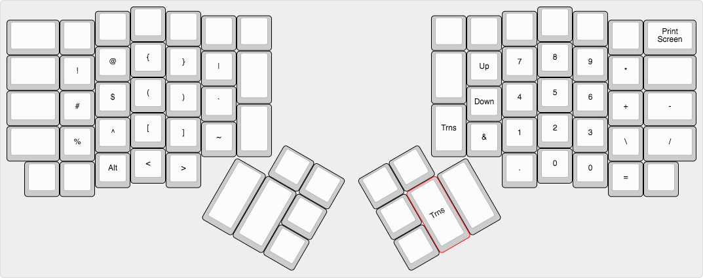
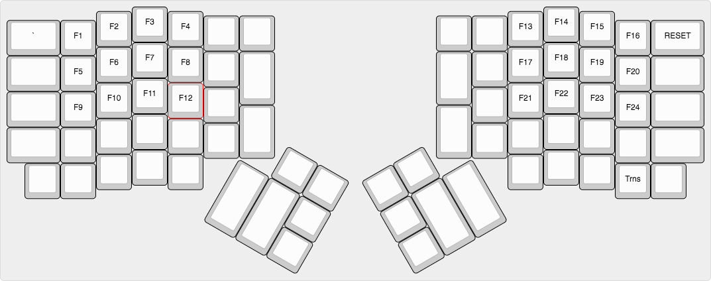

# Norman Plus for Ergodox-EZ (By James Downs)
This keyboard is a perpetual work in progress to make a very efficient keyboard for my personal needs. It utilizes the Norman keyboard layout for minimum effort typing with some of the benefits of the QMK Firmware to make typical actions require far fewer key strokes.

#### Pros
* Norman prioritizes the home row on the row above while ignoring the middle column.
* All common actions are easy to perform without much effort.
* Space Cadet parenthesis make sense logically to open and close
* Brackets are moved to the middle keys for definite access, with tap dancing for carrot brackets.
* Tap dancing on on Undo/Redo makes the actions more usable.
* The enter key is moved to the inside thumb key to avoid embarrassingly sending messages.
* A full layer for all 24 function keys recognized by Windows to remap with AutoHotKey.
* Numpad is still present, albeit without numpad codes.
* Able to move mouse with keyboard (bad for RSI though)
* Unix-style Control key layout with an ergonomic position on the cluster too.
* Control and Alt on a single key on the cluster.
* Copy and Paste on their own keys for definite access.
* “Legacy” access to the Tab key.
* All definitions and variable initialization happens in “keymap.h” to keep the C file cleaner.

#### Cons
* Not using QWERTY ruins your life in the rest of the world.
* Print Screen is off the main layer making it annoying. (Use Snagit, honestly)
* I never adopted the “correct” way to place the number keys so it may be awkward for those that use those with the right hands.
* You probably will hate it until you learn why I did all of it.
* The mouse layer could be better. It uses one hand which stresses one hand too much. If you have RSI, like me, swap it to use two hands.
* I redefined the LEADER_TIMEOUT and for some reason it requires two builds to build correct now (bug?)

#### Notes
* Please, if you use this or a variation reach out to me. I love learning ways people made a layout better, since I am not very good at utilizing the firmware the best I can.
* This was based off of the Beginner’s Keymap for Ergodox EZ and modified along the way.
* I did not create Norman. Check it out here: https://normanlayout.info/
:
