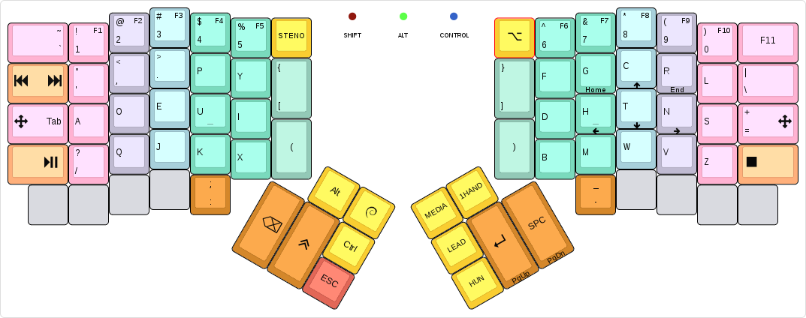
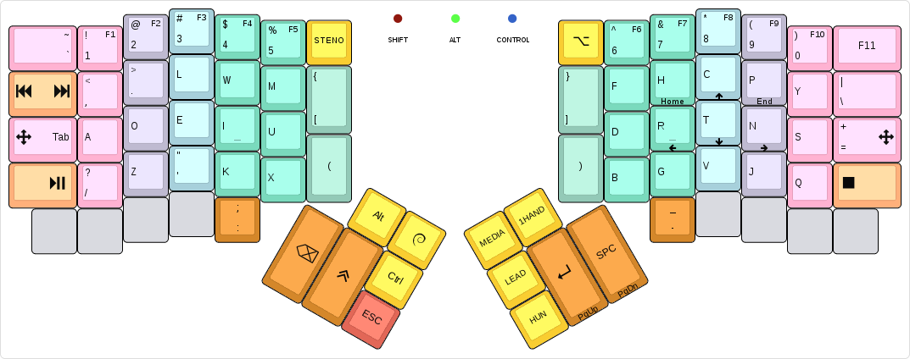
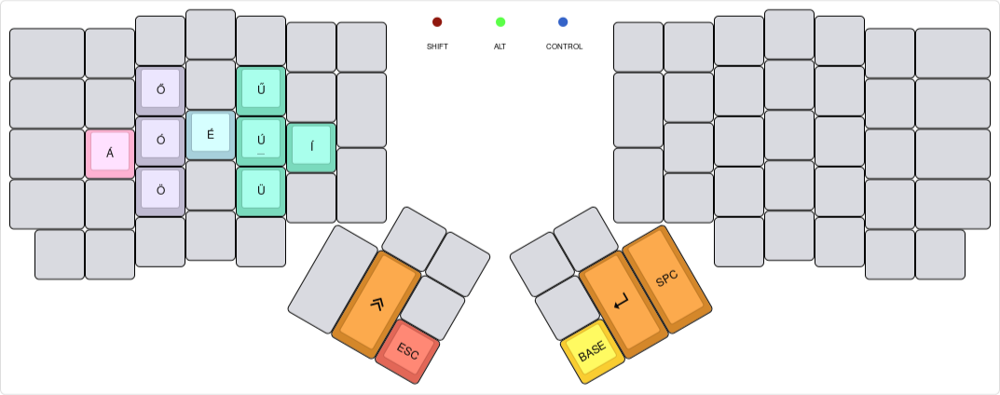
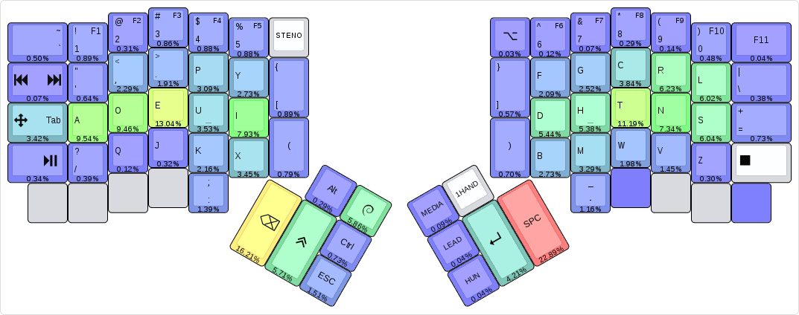

<!-- -*- mode: markdown; fill-column: 8192 -*- -->

algernon's layout
=======================

This is an unconventional layout for the [ErgoDox EZ][ez]. For more details about the history of the layout, see my [blog posts about my ErgoDox journey][blog-ergodox].

 [ez]: https://ergodox-ez.com/
 [blog-ergodox]: https://asylum.madhouse-project.org/blog/tags/ergodox/

Some of the things in the layout only work when one uses [Spacemacs][spacemacs] and [GNOME][gnome] under Linux. Your mileage may vary.

 [spacemacs]: http://spacemacs.org/
 [gnome]: https://www.gnome.org/

## Table of Contents

* [Layouts](#layouts)
    - [Base layer](#base-layer)
    - [ADORE layer](#adore-layer)
    - [Hungarian layer](#hungarian-layer)
    - [Navigation and media layer](#navigation-and-media-layer)
    - [Steno layer](#steno-layer)
    - [LED states](#led-states)
* [Tools](#tools)
    - [Heatmap](#heatmap)
* [Special features](#special-features)
    - [Unicode Symbol Input](#unicode-symbol-input)
* [Building](#building)
    - [Using on Windows](#using-on-windows)
* [Changelog](#changelog)
* [License](#license)

# Layouts

## Base layer

[](http://www.keyboard-layout-editor.com/#/gists/28f7eb305fdbff943613e1dc7aa9e82b)

At its core, this is a Dvorak layout, with some minor changes. The more interesting parts are how certain keys behave:

* The keys on the number row double as function keys, when held for a bit longer than an usual tap. This allows me to use the function keys without having to switch layers.
* The `Shift`, `Alt`, and `Control` modifiers are one-shot. When tapped, they are considered active for the next key press only. When double tapped, they toggle on, until a third, single tap sometime later. When held, they act as expected. My usual pattern is that I use these for the next keypress only, so this behaviour is perfect. If I need them held, I'll just double-tap.
* The `GUI` key is special, because when I double-tap it, it sends `GUI + w`, which pops up an application selector. It also switches to a one-shot layer, where the number row on the left half turns into app selector macros, for the most common things I usually want to switch to. Otherwise it behaves as on a normal layout.
* The `ESC` key also doubles as a one-shot cancel key: if tapped while any of the one-shot modifiers are in-flight (as in, single-tapped, and not expired yet), it cancels all one-shot modifiers. It also cancels the **Hun** layer, if active. Otherwise it sends the usual keycode.
* The **Media** and **Hun** layer keys are one-shot, the **STENO** key is a toggle.
* When holding the `Tab`/**Arrow** key, the arrow layer activates while the key is held. Tapping the key produces the normal, `Tab` key. Double-tapping it toggles the **Arrow** layer on until a third tap.
* Tapping the `:` key once yields `:`, tapping it twice yields `;`.
* Tapping the `[{(`/`)}]` keys once yields `[` (or `{` when shifted), tapping them twice yields `(`.
* The **Lead** key allows me to type in a sequence of keys, and trigger some actions:
    - `LEAD l` uses the unicode input method to enter a `λ`.
    - `LEAD s` does a lot of magic to type in a shruggie: `¯\_(ツ)_/¯`
    - `LEAD y` types `\o/`.
    - `LEAD w m` maximises the currently focused window.
    - `LEAD a` makes the [ADORE layer](#adore-layer) the default.
    - `LEAD v` prints the firmware version, the keyboard and the keymap.
    - `LEAD d` toggles logging keypress positions to the HID console.
    - `LEAD t` toggles time travel. Figuring out the current `date` is left as an exercise to the reader.
    - `LEAD u` enters the [Unicode symbol input](#unicode-symbol-input) mode.

## ADORE layer

[](http://www.keyboard-layout-editor.com/#/gists/45681a17453d235925b6028dd83bf12a)

While using the standard Dvorak layout, I encountered a number of inconveniences, and on this layer, I am playing with ideas to make the layout feel better. Initially, it was based on [Capewell-Dvorak][cpd], but that too, had shortcomings I was not happy with. So now this is something inbetween, with own observations thrown in. How it works out in the long run remains to be seen.

 [cpd]: http://www.michaelcapewell.com/projects/keyboard/layout_capewell-dvorak.htm
 
Based on a week and a half of typing, the keys were rearranged, and the home row neatly spelled out **ADORE**, that gave the layout its name.

## Hungarian layer

[](http://www.keyboard-layout-editor.com/#/gists/b160f6ec90d58c127c114c89f66e9dc9)

On this layer, the accented characters are at the same position as their base variant. For some, which can have other diatribes, the long one is on top, short's on bottom. Tapping any of the accented characters takes us back to the base layer.

## Navigation and media layer

[](http://www.keyboard-layout-editor.com/#/gists/c59c453f9fe1a3238ba1494e7e5c6892)

This layer is primarily for navigating with the cursor or the mouse, and some media things.

## Steno layer

[](http://www.keyboard-layout-editor.com/#/gists/401ef9a84369e47c57f9aedcf0a0d667)

This is to be used with [Plover](http://www.openstenoproject.org/plover/), nothing really fancy here. The **STENO** key toggles the layer on and off, and sends the toggle command to Plover too.

## LED states

The primary purpose of the LEDs is to show the modifier status, a secondary, to show which layer is active. Each modifier, `Shift`, `Alt` and `Control` each have their designated LEDs: the *red*, *green* and *blue*, respectively. When a modifier is in a one-shot state, the respective LED will turn on with a dimmer light. If the modifier is toggled on, the brightness of the LED turns full.

For the layers, the following rules apply:

* When the [ADORE layer](#adore-layer) is toggled on, LEDs will light up from left to right in a sequence, then turn off. When the layer is toggled off, the LEDs light up and turn off in the other direction. No LEDs are on while the layer is active.
* When the [Hungarian layer](#hungarian-layer) is active, the *green* and *blue* LEDs are on.
* When the [Navigation and media layer](#navigation-and-media-layer) is active, the *red* and *green* ones are on.
* When the **ARROW** layer is active, the *red* and *blue* ones are on.
* For the [Steno layer](#steno-layer), all LEDs will be turned on.

Unless noted otherwise, the layers use a dim light for the LEDs, while modifiers use a stronger one, and modifiers override any layer preferences. For example, when on the one-handed layer, with the left side active (*red* light blinking), if `Shift` is on, the *red* light will be constantly on.

# Special features

## Unicode Symbol Input

Once in the Unicode Symbol Input mode, one is able to type in symbol names, press `Enter` or `Space`, and get the Unicode symbol itself back. When in the mode, a capital `U` is printed first. Once the sequence is finished, all of it is erased by sending enough `Backspace` taps, and the firmware starts the OS-specific unicode input sequence. Then, it looks up the symbol name, and enters the associated code. If it is not found, it will just replay the pressed keycodes.

The currently supported symbols are:

- `snowman`: ☃
- `kiss`: 😙
- `rofl`: 🤣
- `poop`: 💩

This is an experimental feature, and may or may not work reliably.

# Tools

## Heatmap

When the keypress logging functionality is enabled (by `LEAD d`), the keyboard will output a line every time a key is pressed, containing the position of the key in the matrix. This allows one to collect this information, and build analytics over it, such as a heat map, including dead keys too.

Included with the firmware is a small tool that can parse these logs, and create a heatmap that one can import into [KLE][kle]. To use it, either pipe the output of `hid_listen` into it, or pipe it an already saved log, and it will save the results into files in an output directory (given on the command-line). See the output of `tools/log-to-heatmap.py --help` for more information.

 [kle]: http://www.keyboard-layout-editor.com/

The generated heatmap looks somewhat like this:

 

# Building

To make my workflow easier, this layout is maintained in [its own repository][algernon:ez-layout]. To build it, you will need the [QMK][qmk] firmware checked out, and this repo either checked out to something like `keyboards/ergodox_ez/algernon-master`. One way to achieve that is this:

 [algernon:ez-layout]: https://github.com/algernon/ergodox-layout
 [qmk]: https://github.com/jackhumbert/qmk_firmware

```
$ git clone https://github.com/jackhumbert/qmk_firmware.git
$ cd qmk_firmware
$ git clone https://github.com/algernon/ergodox-layout.git \
            keyboards/ergodox/keymaps/algernon-master
$ make keyboard=ergodox keymap=algernon-master
```

From time to time, updates may be submitted back to the QMK repository. If you are reading it there, you can build the firmware like any other firmware included with it (assuming you are in the root directory of the firmware):

```
$ make keyboard=ergodox keymap=algernon
```

## Using on Windows

The keymap default to forcing NKRO, which seems to upset Windows, and except the modifiers, none of them work. If you experience this problem, recompile the firmware with `FORCE_NKRO=no` added to the `make` command line.

# Changelog

## v1.6

*2016-08-24*

### Base layer changes

* The parentheses & bracket keys have been merged: tapping them results in `[` or `{` (if it was shifted), double tapping leads to `(`.
* The `:;` and `-_` keys are now available on the base layer, on their [ADORE](#adore-layer) location, too, just below `[{(`/`]})`.
* The `Apps` key has been replaced by `F12`.
* The `-`/`_` is no longer a tap-dance key.

### ADORE layer changes

* Adjustments were made to the [ADORE](#adore-layer) layer, to separate some inconvenient combinations.

### Miscellaneous changes

* `LEAD u` now starts the symbolic unicode input system, instead of the OS-one.
* The mouse acceleration keys on the [Navigation and Media](#navigation-and-media-layer) layer have been turned into toggles: tap them once to turn them on, until tapped again. Tapping an accelerator button will turn all the others off.
* When the **ARROW** layer is on, the *red* and *blue* LEDs light up now.

### Heatmap

* The built-in keylogger has been greatly enhanced, it now outputs the pressed state, and the layer (Dvorak or ADORE). As such, the `ADORE_AUTOLOG` option has been removed, instead there is `AUTOLOG_ENABLE` now, which when enabled, makes the keylogger start when the keyboard boots. It defaults to off.
* The heatmap generator received a lot of updates.

## v1.5

*2016-08-12*

* The **1HAND** layer has been removed.
* A `Delete` key is now available on the right thumb cluster.
* The [ADORE](#adore-layer) layer received a major update, see the layout image above.
* It is now possible to enable automatic logging for the [ADORE](#adore-layer) layer, by setting the `ADORE_AUTOLOG` makefile variable to `yes` when compiling the keymap. It is off by default.
* The `~` key and the `Media Next/Prev` key have been swapped on the [base layer](#base-layer).
* On the **ARROW** layer, `Backspace` has been replaced by `Enter`.
* There is some experimental support for entering Unicode symbols.

## v1.4

*2016-07-29*

* When toggling the key logging on or off, the LEDs will do a little dance.
* The keylogger is now optional, but enabled by default. Use `KEYLOGGER_ENABLE=no` on the `make` command line to disable it.
* The `TAB`/`ARRW` key was turned into a tap-dance key, allowing one to toggle the **ARROW** layer on by double-tapping, and as such, avoid the need to hold the key.
* The `-`/`_` key was turned into a tap-dance key too.
* There is now a way to travel time with the keyboard, toggle the feature on by hitting `LEAD t`.

## v1.3

*2016-07-06*

* Added support for logging keys, by pressing `LEAD d`. Also included is a tool to generate a [heatmap](#heatmap) out of the logs.
* The arrow and navigation keys were rearranged again, and now require an additional key being held to activate. See the [base layer](#base-layer) for an image that shows where arrows are.
* The **experimental** layer has been redone, and is now called [ADORE](#adore-layer), and as such, can be enabled by `LEAD a` now.
* Switching between Dvorak and ADORE is now persisted into EEPROM, and survives a reboot.

## v1.2

*2016-06-22*

* The forced NKRO mode can be easily toggled off at compile-time, to make the firmware compatible with [certain operating systems](#using-on-windows).
* The `:;` key has changed behaviour: to access the `;` symbol, the key needs to be double-tapped, instead of shifted.
* The `=` and `\` keys were swapped, `=` moved to the home row, on both the [base](#base-layer) and the **experimental** layers.
* The arrow and navigation keys were redone, they are now more accessible, but the navigation keys require an extra tap to access.
* The **Emacs** layer is gone, replaced by a simplified [navigation and media](#navigation-and-media-layer) layer.
* `LEAD v` types the firmware version, and the keymap version.
* On the **experimental** layer, the `L` and `Q`, and the `K` and `G` keys were swapped.
* The [Steno](#steno-layer) layer gained a few more `#` and `*` keys, to make it easier on my fingers.

## v1.1

*2016-06-14*

* The keyboard starts in NKRO mode, bootmagic and other things are disabled.
* A [Steno](#steno-layer) layer was added, to be used with Plover.
* An **experimental** layer was added, something halfway between Dvorak and Capewell-Dvorak. A work in progress.
* `LEAD y` types `\o/`.
* Some keys on the [Base](#base-layer) layer have been moved around:
    - `?` moved to the left pinky, left of `Q`.
    - `=` shifted one row down, but `F11` stayed where it was.
    - `-` on the left half was replaced by `Tab`.
    - `Tab`'s original position is taken by a `Media Next`/`Media Prev` key.
    - `:` now inputs `;` when shifted.
* `ESC` cancels the [Hungarian](#hungarian-layer) layer too, not just modifiers.

## v1.0

*2016-05-26*

Initial version.

# License

The layout, being a derivative of the original TMK firmware which is under the GPL-2+, this layout is under the GPL as well, but GPL-3+, rather than the older version.
