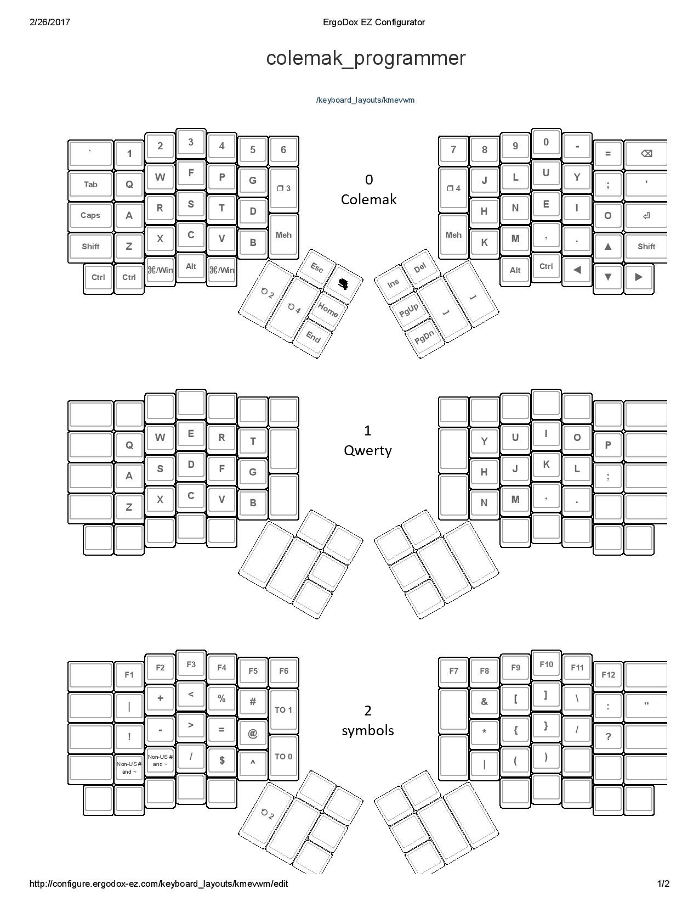
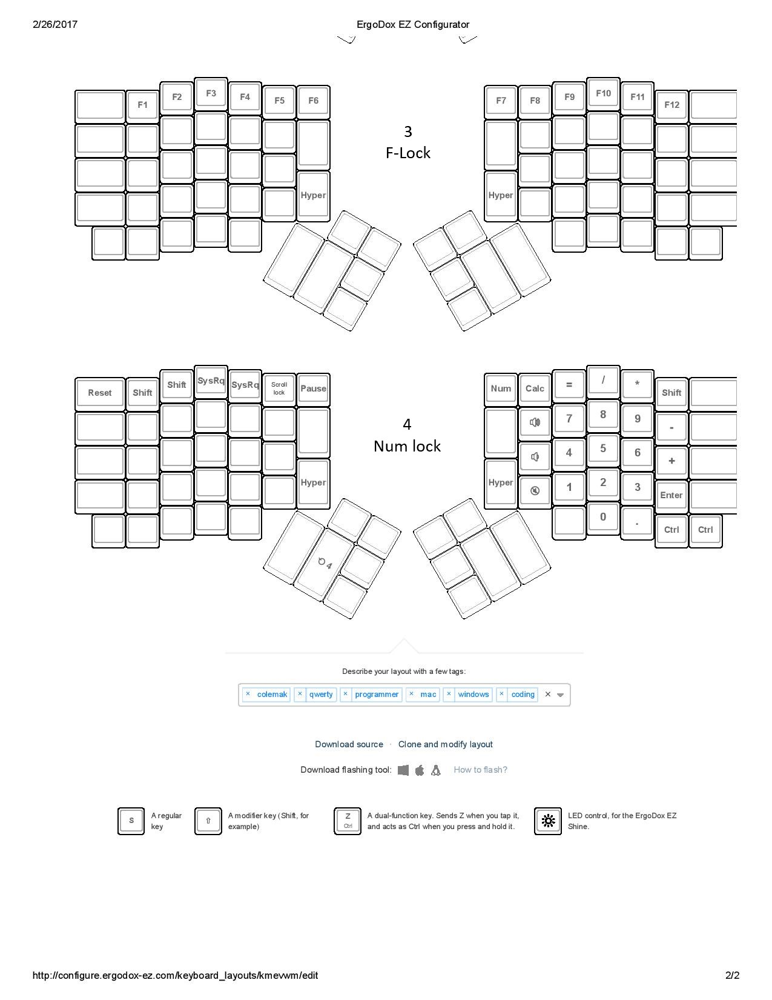

# ErgoDox EZ colemak_programmer

## Features

* Qwerty and colemak 2 in 1
  * Use DF() macro to swap the bottom layer so it behaves literally as collemak or qwerty
  * Graphical creator did not allow this so I had to use TO(0) and TO(1) on the picture
* Symbol layer programmers friendly
  * Not only symbols are easy to access but common combination are easy too: ->, =>, !=, etc.
* Windows and Mac
  * The extra repeated Win key is very handy on Mac
* Numlock

I came to this layout after several iterations. It is not the ultimate best ergonomic layout but it is the best if you switch back and forth between ergodox and laptops.

## Notes
* The Quote and Enter can be swapped
* If you use sculpted key caps try turning the bottom key 180 degrees so it became very comfortable to type with thumb.

Alternatively view the [graphical creator version](http://configure.ergodox-ez.com/keyboard_layouts/kmevwm/edit) but beware it is not the same due to the creator limitations.

