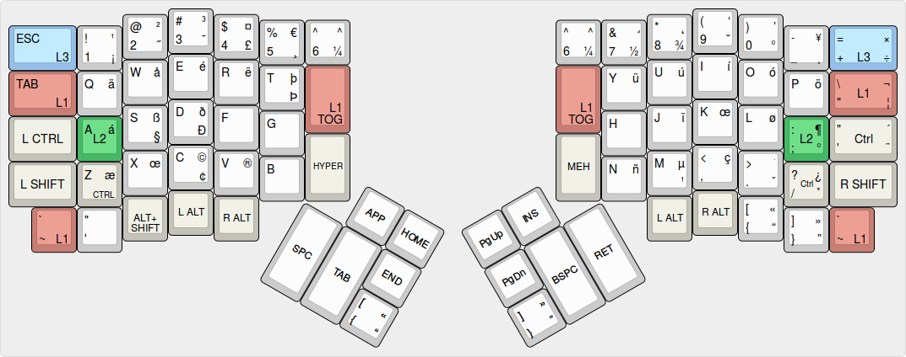
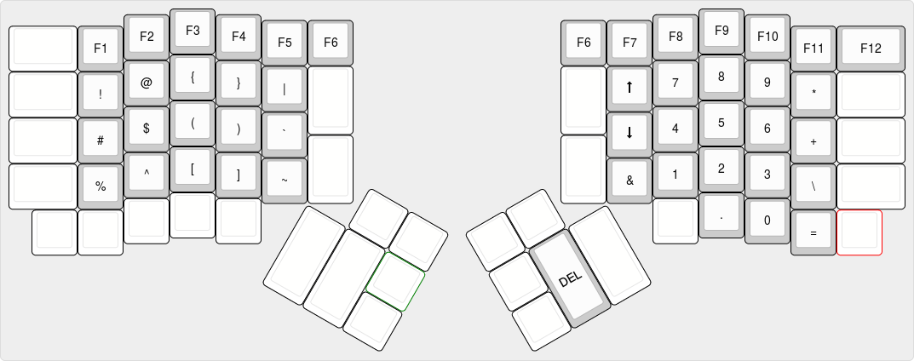
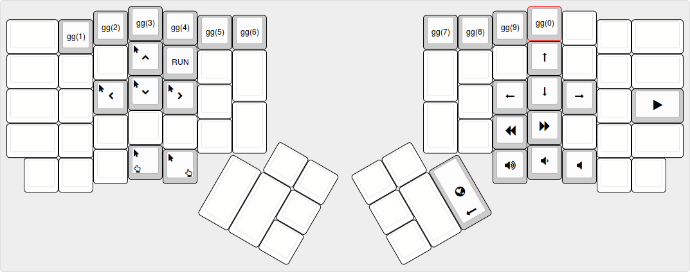
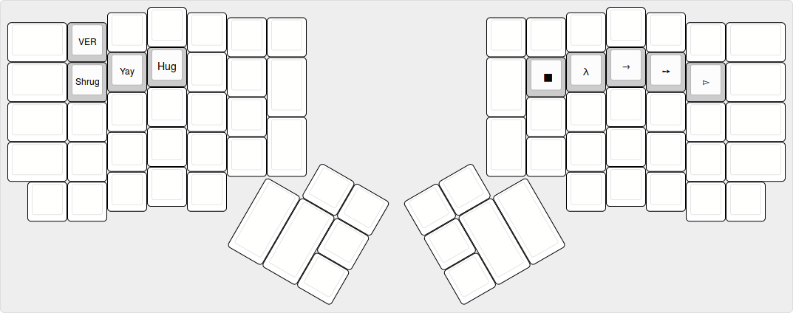

# ErgoDox EZ 1337 configuration

Custom layout based on the default layout. Intended for interational
users of us intl-altgr layout. Note that some common keys might be
missing, as this layout is intented to be used on *nix systems by
users familiar with their system. The layout is geared towards
avoiding using the rat (mouse for those of you who are unfamiliar with
tiling window managers) as much as possibly.

# Layouts

All layer images created using [keyboard-layout-editor](http://www.keyboard-layout-editor.com/)

## Base layer

The base layer here is marked with the us international alt-gr layout,
including characters bound to what on an iso keyboard would be alt-gr
and on an ansi keyboard right alt.

Regular (and irregular) modifier keys are marked with a yellowish
gray. Layer moderators are marked with blue, red and green, which are
the same colors each layer displays on the LEDs when active.

All of the layer switch keys, except for the two center keys marked L1
TOG, are dual purpose. Hence for example the top left key produces ESC
if tapped, and temporarilly toggles L3 when hold down. The two center
L1 TOG keys toggle L1 on and off for more permanent layer toggling.

The UNI keys enter the linux ibus unicode composer mode
(ie. Ctrl+Shift+u). Use this to enter unicode characters. Hit the key,
type in the unicode hex value, and hit enter.

## Layer 1 - Symbols and RGB

The Symbols and RGB layer contains function keys, commonly used
symbols, a numpad and if you have the new Ergodox Ez shine keys for
controlling various RGB-led functions. In addition, it provides an up
and a down key for easy scrolling. RGB controller keys are yellow.

## Layer 2 - Media, Mouse and Navigation

The Media, Mouse and unicode layer contains special keys for moving
the mouse and clicking on it with the keyboard. In addition it
provides standard media control keys, and default arrow keys.

## Layer 3 - Unicode

The unicode layer provides keys for directly typing unicode (utf-8)

# Changelog

- 02.01.2017 Added delete key on second layer
- 10.01.2017 Added layer images to readme
- 24.01.2017 Added support for Ergodox Shine. Added secondary L2 switch key on left hand
- 24.01.2017 Added unicode keys. Added shrug hug and yay. Moved Navigation to layer 2
- 25.01.2017 Added lots of new emojis and some unicode keys
- 27.01.2017 Added new unicode keys and shortcut for ibus unicode composer key (CTRL+SHIFT+U)

# TODO

- Add macros for lots of stuff. (Lastpass cli, pushbullet cli, other push service cli, linode cli, more?)
- Make macros for gnu screen and i3wm
- Look into the app launch macros in algernon keymap

