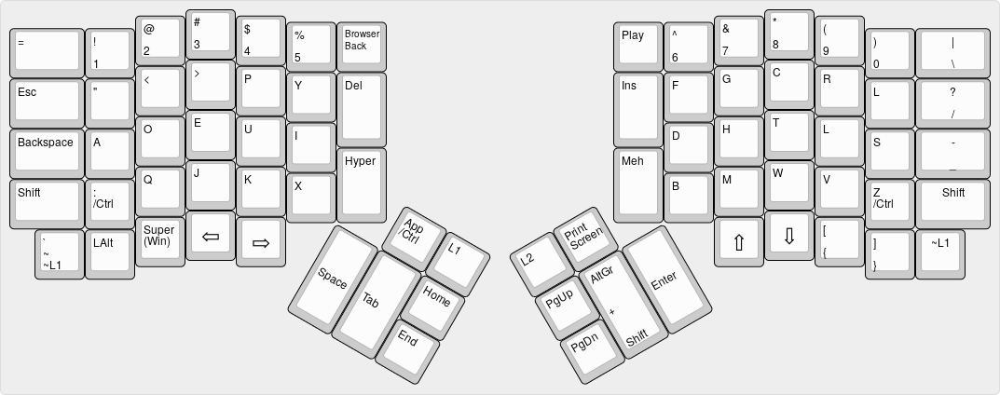

# ErgoDox EZ Dvorak International Squisher

Dvorak layout adjusted with several (linux) applications in mind:

* Easier Escape for VIM
* Windows/Super key for awesome WM
* Alt+Shift for international characters
* PrintScreen for sys-rq
* Insert for the X11 clip-board

Major layer changes:

* Common multimedia keys are integrated into layer 0, less common into layer 1
* No mouse keys
* Layer 2 is qwerty (for easier gaming & less fortunate keyboard users)

Known issues:

* Alt+Shift does not work reliably (depends on the X11 kb layout? Not
  entirely clear...)

## Changelog

* 2016-03-29
  * Initial release
