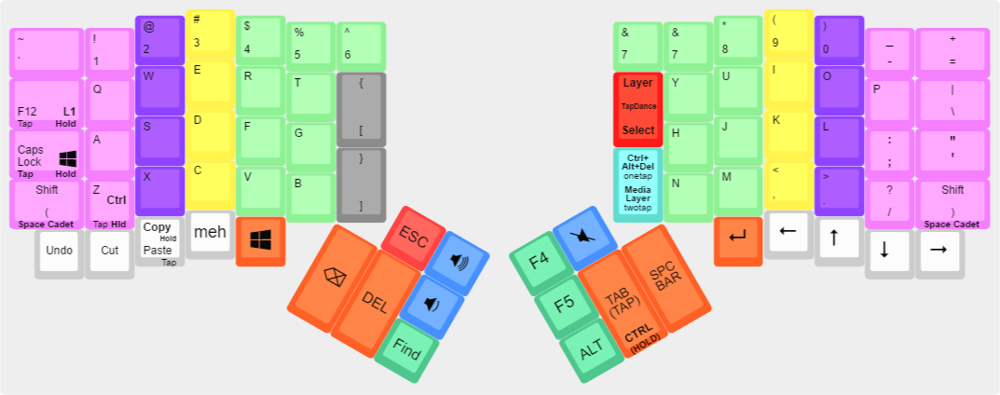

<!-- -*- mode: markdown; fill-column: 8192 -*- -->

Win10 Writer's Block ErgoDox - v1.0

=======================

This is a QWERTY layout for QMK. It's designed to work well in MS Office-like environments. It's tested on Windows 7 and 10.

Professional writers may find this layout useful -- copywriters, technical writers, novelists, etc.  

I use my ErgoDox with this keymap as a daily driver at my office.

A gaming layer is unobtrusively built into this layout. I use that layer to play RimWorld. 

Feel free to modify the gaming layer to your personal taste.

## Table of Contents

* [Layouts](#layouts)
    - [Base layer](#base-layer)
    - [Symbol layer](#symbol-layer)
    - [Gaming layer](#rimworld-layer)
    - [Media layer](#media-layer)
* [Tools](#tools)
    - [Layer notification](#layer-notification)
* [Building](#building)
    - [Using on Windows](#using-on-windows)
* [License](#license)
* [Special Thanks](#special-thanks)

# Layouts

* TapDance will teleport you to the layer you want: 
* One Tap for the Base layer
* Two Taps for the Symbol layer
* Three Taps for the Rimworld/Gaming layer

* Where the "Meh" key is located on the Ergodox EZ default layout, I've changed it to another tap dance key:
* One Tap for CTRL-ALT-DEL
* Two Taps for the Media/Mouse layer

## Base layer

[](http://www.keyboard-layout-editor.com/#/gists/8fd9bbdd3a23bbb5a8779de3624a3be1)

This is a QWERTY layout with some quirks. 

* Enter is located on a key that won't cause as much thumb fatigue.  
* Copy and Paste work from the same key. Just hold the key to copy and tap the key to paste!
* Undo, Find and Cut are also one-touch keys. 
* F12 is where you would normally find TAB on standard layouts. Quickly save in Word, safely.
* You'll find bracket keys below the "6" key.

* The Meh Key is a single-button CTRL+ALT+SHIFT modifier.

* Space Cadet Shift: Tap L Shift for "(" and R Shift for ")" -- holding either shift works like a normal shift.
* Tap "Z" or Tab to use either normally. Hold them for CTRL. 
* Tap Caps Lock to use it normally. Hold it for Win key combinations (Win+D to minimize all programs, etc).

## Symbol layer

[](http://www.keyboard-layout-editor.com/#/gists/04eb6458b8b17882e472f64d482f12b4)

Your standard Ergodox EZ symbol + numpad layout, minus the Version and EEPROM keys.

* From the base layer, hold the F12 Key to temporarily access this layer (use for quick access to numpad)
* Release F12 to return to the base layer.

## Rimworld layer

[](http://www.keyboard-layout-editor.com/#/gists/d53af8391e6e443ed0a98ccfbdb4eace)

This layer was made to play RimWorld, a Sci-Fi Colony Survival Game by Tynan Sylvester and Ludeon Studios, available on Steam. 

* Have fun!

## Media layer

[](http://www.keyboard-layout-editor.com/#/gists/3209d09ed4bd997e4f49f28c6ada2ab3)

This is the standard Ergodox EZ media layout with more options for mouseclick buttons. 

* In this layer, your "space" key changes into a back button for your browser.

## LED states

Your LEDs will change to indicate your layer. You'll know you are in the base layer if all LEDs are off.

# Building

To build, you will need the [QMK][qmk] firmware checked out. from there, dive into `keyboards/ergodox/keymaps/win10_writers-block/`

[qmk]: https://github.com/qmk/qmk_firmware

```
$ make keyboard=ergodox keymap=win10_writers-block
```

## Using on Windows

This layout is tested in Windows 7 Pro and Windows 10 Home environments. 

# License

GPL 3+

# Special Thanks

* To algernon for his coding help. I'm a novice but I still made this work (and figured out tap dance) with his help.

* To /r/MechanicalKeyboards for being an all-around great community.

* To /u/profet23 for his amazing custom Ergodox boards.