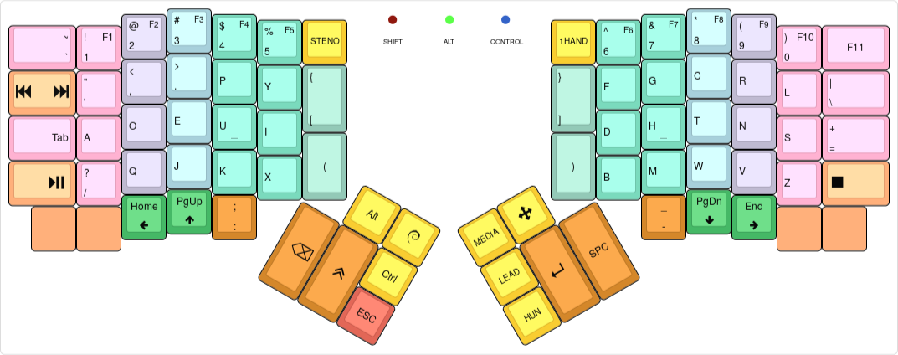
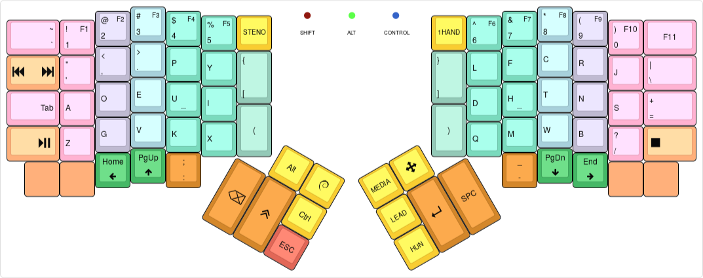
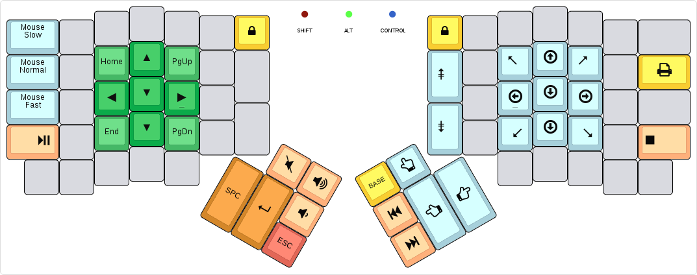
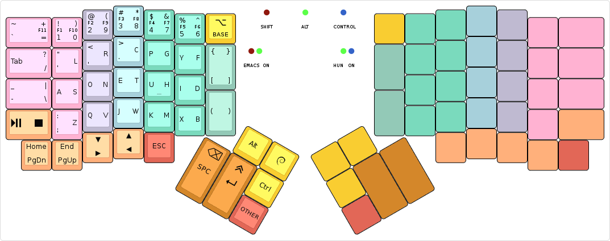
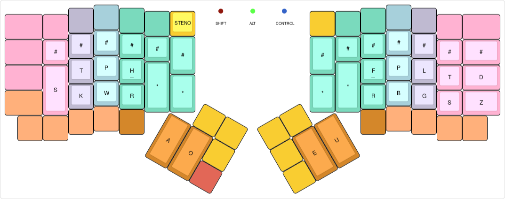

algernon's layout
=======================

This is an unconventional layout for the ErgoDox EZ. For more details about the
history of the layout, see my
[blog posts about my ErgoDox journey][blog-ergodox].

 [blog-ergodox]: https://asylum.madhouse-project.org/blog/tags/ergodox/

Some of the things in the layout only work when one uses Spacemacs and GNOME
under Linux. Your mileage may vary.

## Table of Contents

* [Layouts](#layouts)
  - [Base layer](#base-layer)
  - [Experimental layer](#experimental-layer)
  - [Hungarian layer](#hungarian-layer)
  - [Navigation and media layer](#navigation-and-media-layer)
  - [One-handed layer](#one-handed-layer)
  - [Steno layer](#steno-layer)
  - [LED states](#led-states)
* [Building](#building)
  - [Using on Windows](#using-on-windows)
* [Changelog](#changelog)
* [License](#license)

# Layouts

## Base layer

[](http://www.keyboard-layout-editor.com/#/gists/28f7eb305fdbff943613e1dc7aa9e82b)

At its core, this is a Dvorak layout, with some minor changes. The more
interesting parts are how certain keys behave:

* The keys on the number row double as function keys, when held for a bit longer
  than an usual tap. This allows me to use the function keys without having to
  switch layers.
* The `Shift`, `Alt`, and `Control` modifiers are one-shot. When tapped, they
  are considered active for the next key press only. When double tapped, they
  toggle on, until a third, single tap sometime later. When held, they act as
  expected. My usual pattern is that I use these for the next keypress only, so
  this behaviour is perfect. If I need them held, I'll just double-tap.
* The `GUI` key is special, because when I double-tap it, it sends `GUI + w`,
  which pops up an application selector. It also switches to a one-shot layer,
  where the number row on the left half turns into app selector macros, for the
  most common things I usually want to switch to. Otherwise it behaves as on a
  normal layout.
* The `ESC` key also doubles as a one-shot cancel key: if tapped while any of
  the one-shot modifiers are in-flight (as in, single-tapped, and not expired
  yet), it cancels all one-shot modifiers. It also cancels the **Hun** layer, if
  active. Otherwise it sends the usual keycode.
* The **Media**, **Arrow**, and **Hun** layer keys are one-shot, the **1Hand**
  and **STENO** keys are toggles.
* Toggling the **Arrow** layer toggles between the cursor arrows and the paging
  keys on the bottom row.
* Tapping the `:` key once yields `:`, tapping it twice yields `;`.
* The **Lead** key allows me to type in a sequence of keys, and trigger some
  actions:
    - `LEAD u` enters unicode input mode, by sending the GTK+ key sequence that
      does this.
    - `LEAD l` uses the unicode input method to enter a `λ`.
    - `LEAD s` does a lot of magic to type in a shruggie: `¯\_(ツ)_/¯`
    - `LEAD y` types `\o/`.
    - `LEAD w m` maximises the currently focused window.
    - `LEAD e` makes the [experimental layer](#experimental-layer) the default.
    - `LEAD v` prints the firmware version, the keyboard and the keymap.

## Experimental layer

[](http://www.keyboard-layout-editor.com/#/gists/6ff50bf71248e05aab5b3fec4fae3d08)

While using the standard Dvorak layout, I encountered a number of
inconveniences, and on this layer, I am playing with ideas to make the layout
feel better. Initially, it was based on [Capewell-Dvorak][cpd], but that too,
had shortcomings I was not happy with. So now this is something inbetween, with
own observations thrown in. How it works out in the long run remains to be seen.

 [cpd]: http://www.michaelcapewell.com/projects/keyboard/layout_capewell-dvorak.htm

## Hungarian layer

[](http://www.keyboard-layout-editor.com/#/gists/b160f6ec90d58c127c114c89f66e9dc9)

On this layer, the accented characters are at the same position as their base
variant. For some, which can have other diatribes, the long one is on top,
short's on bottom. Tapping any of the accented characters takes us back to the
base layer.

## Navigation and media layer

[](http://www.keyboard-layout-editor.com/#/gists/c59c453f9fe1a3238ba1494e7e5c6892)

This layer is primarily for navigating with the cursor or the mouse, and some
media things.

## One-handed layer

[](http://www.keyboard-layout-editor.com/#/gists/edff2495135955b8963198dace7f7ece)

The one-handed layer is used in situations where the right hand is occupied, by
mousing around, for example. Tapping the `OTHER` key switches which side is
active. For the most part, keys remain in their usual position. When the right
half is active, keys are mirrored to the left half.

The differences are as follows:

* The `ESC` key has been moved to the bottom row, so the `OTHER` key is easier
  to tap.
* Most keys on the thumb cluster now have dual uses, and these do not change
  when switching sides:
    - The `Space`/`Backspace` key sends `Space` on tap, `Backspace` when held
      for longer than a normal tap.
    - The `Enter`/`Shift` key sends `Enter` on short-tap, `Shift` on long-tap.
* The `Apps`/`BASE` key can be used to go back to the base layer, by
  long-tapping it. A short-tap will send the `App` key, as usual.

## Steno layer

[](http://www.keyboard-layout-editor.com/#/gists/401ef9a84369e47c57f9aedcf0a0d667)

This is to be used with [Plover](http://www.openstenoproject.org/plover/),
nothing really fancy here. The **STENO** key toggles the layer on and off, and
sends the toggle command to Plover too.

## LED states

The primary purpose of the LEDs is to show the modifier status, a secondary, to
show which layer is active. Each modifier, `Shift`, `Alt` and `Control` each
have their designated LEDs: the *red*, *green* and *blue*, respectively. When a
modifier is in a one-shot state, the respective LED will turn on with a dimmer
light. If the modifier is toggled on, the brightness of the LED turns full.

For the layers, the following rules apply:

* When the [Experimental layer](#experimental-layer) is toggled on, LEDs will
  light up from left to right in a sequence, then turn off. When the layer is
  toggled off, the LEDs light up and turn off in the other direction. No LEDs
  are on while the layer is active.
* When the [Hungarian layer](#hungarian-layer) is active, the *green* and *blue*
  LEDs are on.
* When the [Navigation and media layer](#navigation-and-media-layer) is active,
  the *red* and *green* ones are on.
* When the [One-handed layer](#one-handed-layer) is active, the *green* LED is
  on and bright, and either the *red* or the *blue* one is going to slowly
  blink, depending on the currently active side.
* For the [Steno layer](#steno-layer), all LEDs will be turned on.

Unless noted otherwise, the layers use a dim light for the LEDs, while modifiers
use a stronger one, and modifiers override any layer preferences. For example,
when on the one-handed layer, with the left side active (*red* light blinking),
if `Shift` is on, the *red* light will be constantly on.

# Building

To make my workflow easier, this layout is maintained in
[its own repository][algernon:ez-layout]. To build it, you will need the
[QMK][qmk] firmware checked out, and this repo either checked out to something
like `keyboards/ergodox_ez/algernon-master`. One way to achieve that is this:

 [algernon:ez-layout]: https://github.com/algernon/ergodox-layout
 [qmk]: https://github.com/jackhumbert/qmk_firmware

```
$ git clone https://github.com/jackhumbert/qmk_firmware.git
$ cd qmk_firmware
$ git clone https://github.com/algernon/ergodox-layout.git \
            keyboards/ergodox_ez/keymaps/algernon-master
$ make KEYBOARD=ergodox_ez KEYMAP=algernon-master
```

From time to time, updates may be submitted back to the QMK repository. If you
are reading it there, you can build the firmware like any other firmware
included with it (assuming you are in the root directory of the firmware):

```
$ make KEYBOARD=ergodox_ez KEYMAP=algernon
```

## Using on Windows

The keymap default to forcing NKRO, which seems to upset Windows, and except the
modifiers, none of them work. If you experience this problem, recompile the
firmware with `FORCE_NKRO=no` added to the `make` command line.

# Changelog

## v1.2 - 2016-06-22

* The forced NKRO mode can be easily toggled off at compile-time, to make the
  firmware compatible with [certain operating systems](#using-on-windows).
* The `:;` key has changed behaviour: to access the `;` symbol, the key needs to
  be double-tapped, instead of shifted.
* The `=` and `\` keys were swapped, `=` moved to the home row, on both the
  [base](#base-layer) and the [experimental](#experimental-layer) layers.
* The arrow and navigation keys were redone, they are now more accessible, but
  the navigation keys require an extra tap to access.
* The **Emacs** layer is gone, replaced by a simplified
  [navigation and media](#navigation-and-media-layer) layer.
* `LEAD v` types the firmware version, and the keymap version.
* On the [experimental](#experimental-layer) layer, the `L` and `Q`, and the `K`
  and `G` keys were swapped.
* The [Steno](#steno-layer) layer gained a few more `#` and `*` keys, to make it
  easier on my fingers.

## v1.1 - 2016-06-14

* The keyboard starts in NKRO mode, bootmagic and other things are disabled.
* A [Steno](#steno-layer) layer was added, to be used with Plover.
* An [experimental](#experimental-layer) layer was added, something halfway
  between Dvorak and Capewell-Dvorak. A work in progress.
* `LEAD y` types `\o/`.
* Some keys on the [Base](#base-layer) layer have been moved around:
  - `?` moved to the left pinky, left of `Q`.
  - `=` shifted one row down, but `F11` stayed where it was.
  - `-` on the left half was replaced by `Tab`.
  - `Tab`'s original position is taken by a `Media Next`/`Media Prev` key.
  - `:` now inputs `;` when shifted.
* `ESC` cancels the [Hungarian](#hungarian-layer) layer too, not just modifiers.

## v1.0 - 2016-05-26

Initial version.

# License

The layout, being a derivative of the original TMK firmware which is under the
GPL-2+, this layout is under the GPL as well, but GPL-3+, rather than the older
version.
