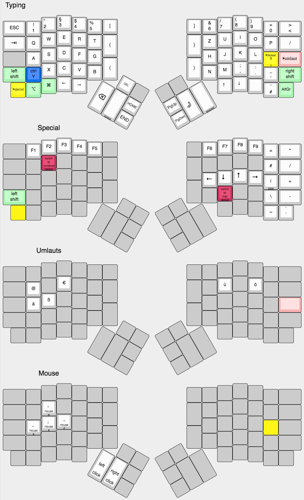
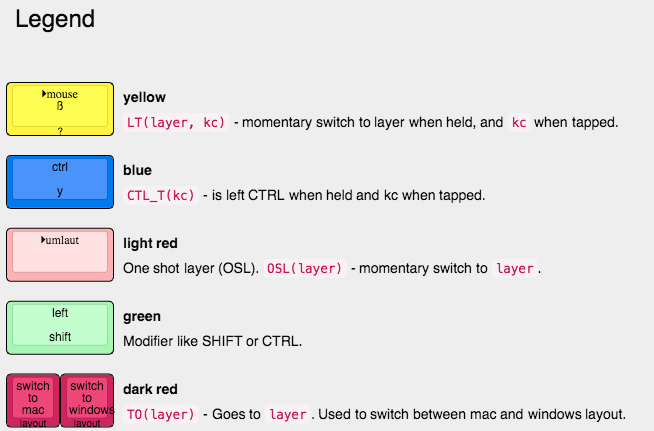

# Ergodox-ez german keymap for mac and windows (programmer friendly)

* german layout
* mac & windows support

# layout

layout.json can be opened in http://www.keyboard-layout-editor.com/

# Building

In the root directory of qmk call `make ergodox_ez:mac_win_german_programmer:teensy`
