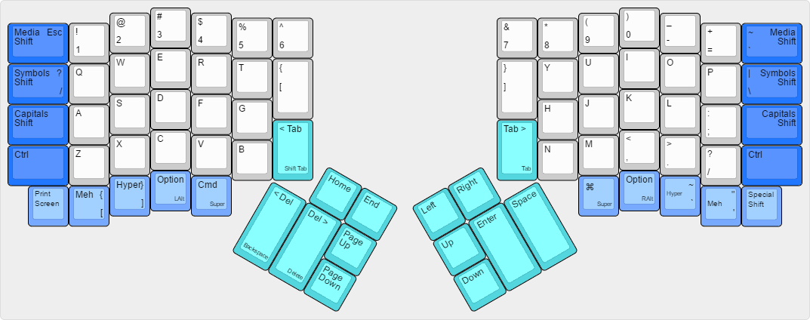
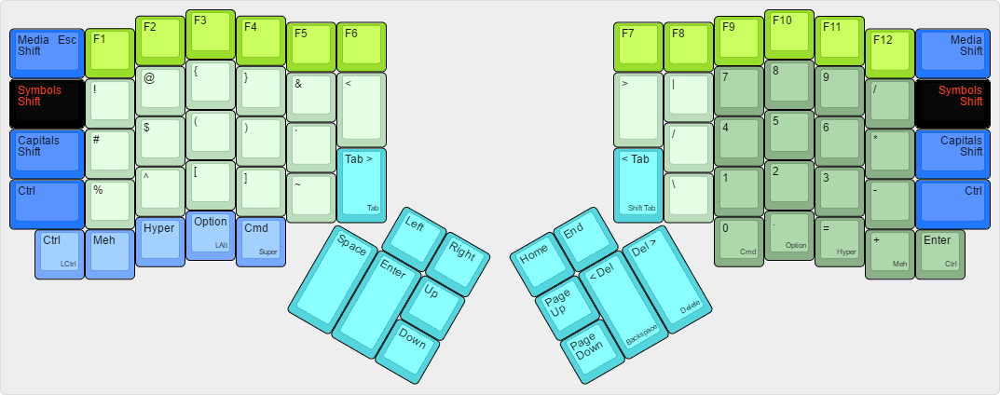

# teckinesis Layout # 

*A blend of TECK and Kinesis layouts, based on ["The Ordinary Layout" by Nicholas Keene](http://qmk.fm/keyboards/ergodox_ez/keymaps/ordinary/#the-ordinary-layout-a-familiar-and-powerful-layout)*

## The Base Layout ##

## The Symbols Layer ##

## The Media Layer ##

(placeholder)

