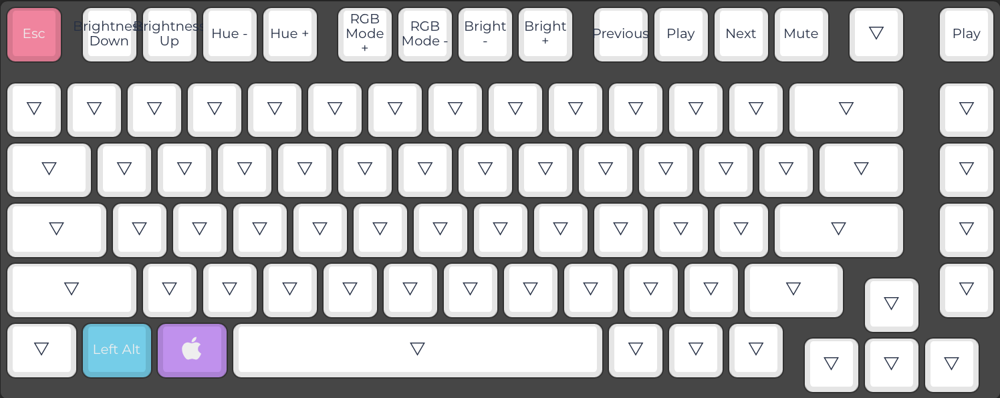
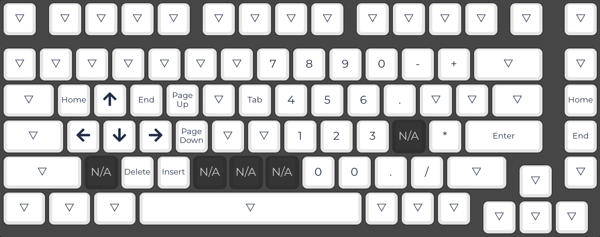

QMK layout for gmmk/pro
=======================

## Introduction

This keymap focuses on color-coded layers for: Windows/Linux, macOS, and a pseudo-numpad. The inspiration for this keymap, vs using mike1808's (which this is built on) is to provide a first-class macOS experience. That is my daily driver OS and none of the extant keymaps at this time (Late Summer 2021) provide support for Apple device functions such as brightness or media playback control. If you are familiar with using an Apple keyboard, those keys are now all roughly where you'd expect them, with some slight positioning changes to account for the row 1 splits. Additionally, with Mute mapped to F12, pushing in the rotary encoder now serves as the play/pause button. These have also been tested to work on iPhone and iPad devices.

## Screenshots and Explanations

### Windows and Linux


This is the base layout, with normal function keys and everything working like you'd expect it. Nothing fancy. Holding `FN` brings you into the Function layer, described below.

### Apple


The whole reason this exists. 

* `Command` and `Option` are where you'd expect
* `F1-F2` are monitor brightness down/up
* `F3-F4` are keyboard brightness down/up
* `F5-F6` are keyboard RGB hue back/forward
* `F7-F8` are keyboard RGB mode back/forward
* `F9-F12` are Previous Track, Play/Pause, Next Track, Mute
* `Rotary Encoder Press` is also Play/Pause

### Numpad


I use a numpad frequently, and cribbed jonavin's layout (mostly) for this. It's not as nice as having dedicated hardware, but it's a nice layout.

### Function


This layer provides navigation to the Windows/Linux, Number Pad, and Apple layouts. It also provides a Reset key, a greater array of controls for the RGB settings on the GMMK pro, and access to the secrets functionality.

* `\` is RESET
* `1` is Windows/Linux mode
* `2` is Number Pad mode
* `3` is Apple mode
* `Z-V` control RGB Hue, Saturation, Value, and Effect respectively. To enact, hold down the key and dial the rotary encoder.
* `B-N` enable RGB Plain and Breathing modes
* `Spacebar` enables/disables RGB altogether

## Thanks
The core of this keymap is HUGELY inspired by [mike1808's](../mike1808/), to the point where there are unused portion of their code still in here. The size of the .bin isn't an issue so it's not pressing, but eventually I will clean up the unused portions.

Additional keymap, config, and rules inspiration comes from [jonavin](../jonavin/), [andrebreat](../andrebrait/), [stickandgum](../stickandgum). A sincere thank you to these individuals for sharing and documenting their keymaps.

# Legacy mike1808 documentation

## Secrets
The format is the same as [drashna's](../../../../users/drashna/readme_secrets.md) secrets implementation. Create a `secret.h` and define your secrets like this:

```c
static const char* secrets[] = {"secret1", "secret2", "secret3", "secret4", "secret5"};
```

## Rotary encoder knob
You can hookup your encoder functions by defining new encoder states in [encoder.h](./encoder.h), then in [encoder.c](./encoder.c) assign static variable `state` your new state depending on your desired condition and add callbacks to `encoder_mapping` array. 

## RGB Matrix Ledmaps
RGB Matrix ledmaps is the future allowing you assign colors to individual keys on every keymap layer. 

You can see some examples of my usage in the bottom of [keymap.c](./keymap.c).

Color defines are just HSV colors wrapped in curly braces, like `#define RED { HSV_RED }`.
