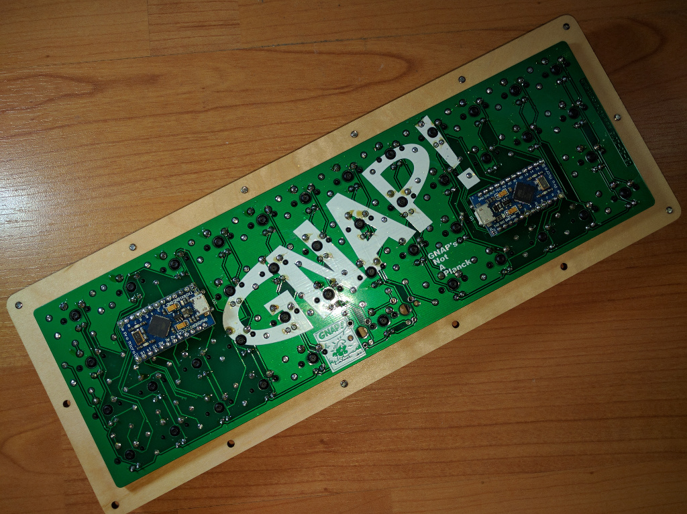
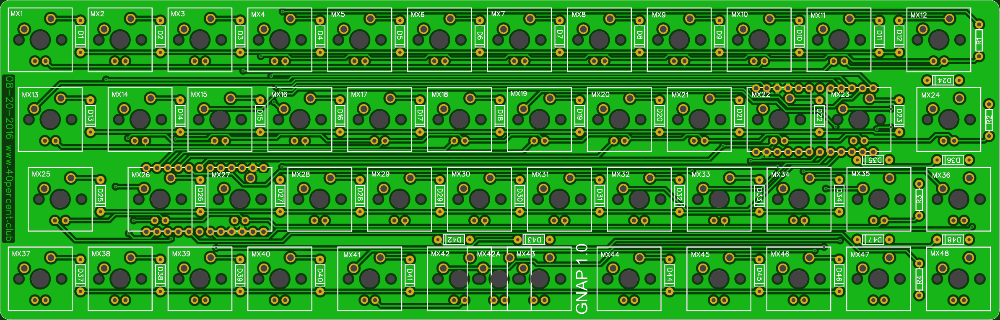
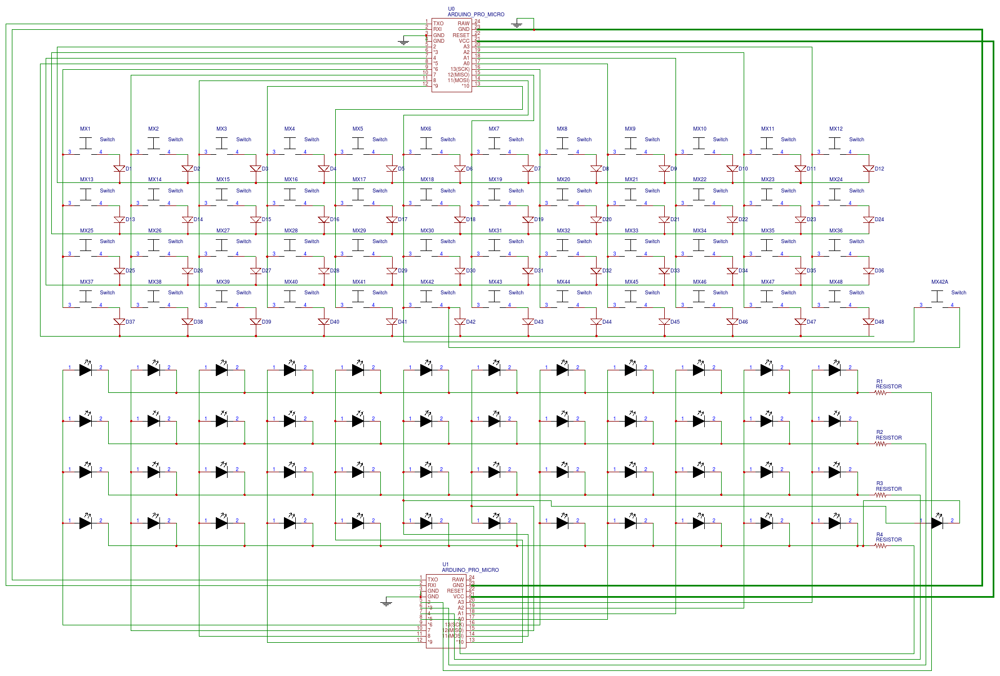

## GNAP! keyboard firmware

======================
GNAP! dual matrix, dual controller. Per key LED control, reactive lighting.



Dual Pro Micro's. One running QMK, the other running an Arduino sketch driving the LEDs. Pro Micro's are connected to each other via hardware serial UART.

QMK pinout

	Rows D1, D0, D4, C6 
	Cols D7, E6, B4, B5, B6, B2, B3, B1, F7, F6, F5, F4
	
gnap.c contains functions to send bytes to the LED controller. The Arduino code interprets these to change modes or brightness.

	//GNAP keymap functions
	void gnaplight_step(void) {
		serial_send(101);
	}
	
	void gnaplight_toggle(void) {
		serial_send(100);
	}

\tmk_core\common\keyboard.c was modified to send the row/column of the key being pressed encoded as as single byte over the serial link to the LED controller.

	#ifdef GNAP_ENABLE
					//send single byte with value of row column
                    serial_send((r*16)+c);
	#endif

The example Arduino sketch [LED_FastGPIO.ino](LED_FastGPIO.ino) uses the fastGPIO and TimerOne libraries. These can be installed with the Library manager.

[FastGPIO](https://github.com/pololu/fastgpio-arduino)
[TimerOne](https://www.pjrc.com/teensy/td_libs_TimerOne.html)


## Quantum MK Firmware

For the full Quantum feature list, see [the parent readme.md](/doc/readme.md).

## Building

Download or clone the whole firmware and navigate to the keyboards/tv44 folder. Once your dev env is setup, you'll be able to type `make` to generate your .hex - you can then use the Teensy Loader to program your .hex file. 

Depending on which keymap you would like to use, you will have to compile slightly differently.

### Default

To build with the default keymap, simply run `make default`.

### Other Keymaps

Several version of keymap are available in advance but you are recommended to define your favorite layout yourself. To define your own keymap create a folder with the name of your keymap in the keymaps folder, and see keymap documentation (you can find in top readme.md) and existant keymap files.

To build the firmware binary hex file with a keymap just do `make` with a keymap like this:

```
$ make [default|jack|<name>]
```

Keymaps follow the format **__keymap.c__** and are stored in folders in the `keymaps` folder, eg `keymaps/my_keymap/`