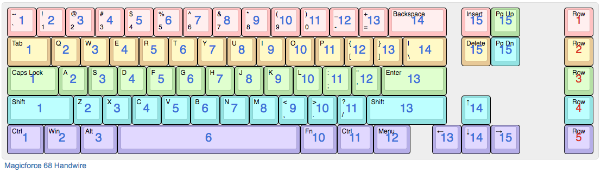

Magicforce 68 Handwired
=======================

This firmware is for a Magicforce 68 that's had its PCB removed and is handwired with an Arduino Micro. NOTE: The Arduino Micro is different than the Arduino *Pro* Micro.

## Wiring Layout

## Pinout

The following pins are used:
- Columns 1-15: B2, B0, D3, D2, D1, D0, D4, C6, D7, E6, B4, B5, B6, B7, D6
- Rows 1-5: F0, F1, F4, F5, F6

## Compiling and loading the firmware

To build the firmware, run `make`.

To flash the firemware onto the microcontroller, run `make avrdude`, and press the reset button.
