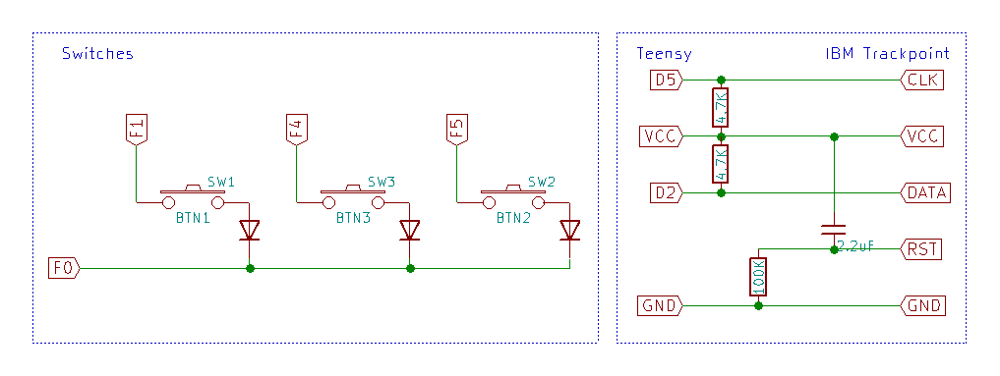

# IBM Trackpoint demonstration

This is just a simple demo to show how to integrate IBM Trackpoint in QMK.

Wiring used in the demonstration:

Some documentation:
* [How to wire IBM Trackpoint](https://github.com/alonswartz/trackpoint)
* [QMK documentation](https://docs.qmk.fm/)
