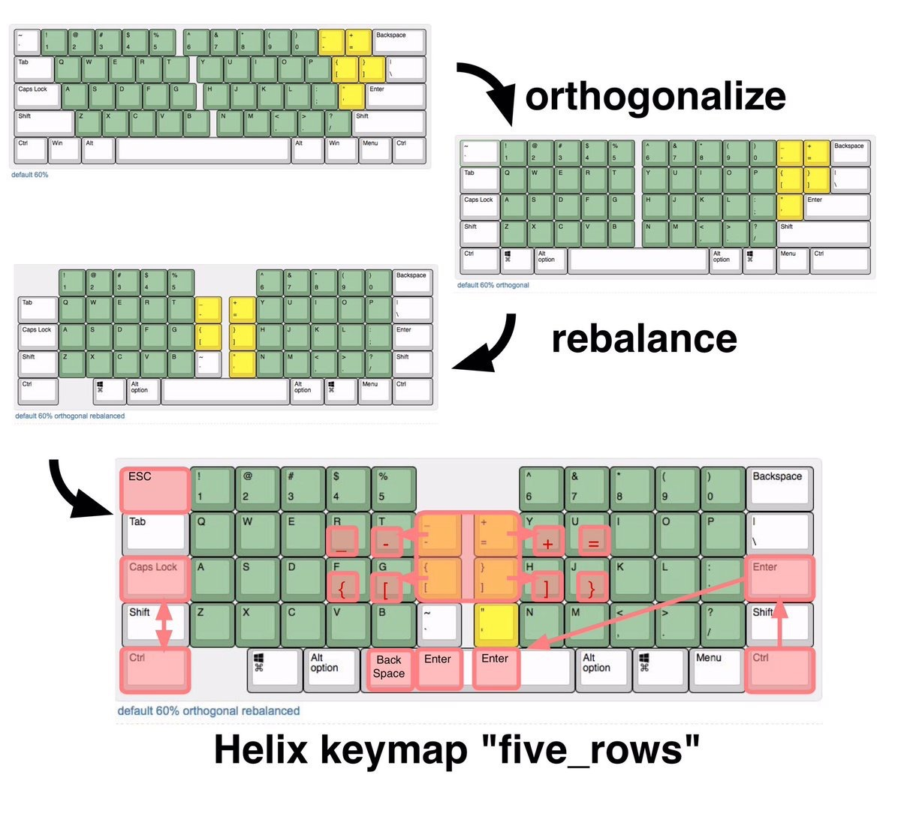

# Helix keymap "five_rows"

本キーマップは、Helix キーボードの5行版専用のキーマップです。

普通のキーボード使用者が、Helix キーボードを使うときになるべく違いが少なく戸惑いが少なくなるように意図したキーマップです。（意図通り成功しているかどうかは使用する人の判断で、、、)

## キー配置
以下に、Qwerty配列時の、文字配列の図を示します。

## レイヤー

|優先順位|番号|名称|内容|
| ---- | ---- | --- | --- |
|高い|16|Adjust|機能キー（紫）|
||4|Extra char|記号類（赤）|
||3|Function|ファンクションキー類（青）|
||2|Dvorak|Dvorak配列|
||1|Colemak|Colemak配列|
|低い|0|Qwerty|QWERTY配列（ベース）|

Qwerty/Colemak/Dvorak の各レイヤーは、後述する、Ajuest キーによる選択で、いずれか一つだけが有効になり、標準のキーマップとなります。

Adjust レイヤーは、Adjust キーを押している間だけ有効になり、標準のキーマップの上にかぶさるように一部のキーが置き換わります。

Function レイヤーは、Fn キーを押している間だけ有効になり、標準のキーマップの上にかぶさるように一部のキーが置き換わります。

Extra レイヤーは、Enter キーを一定時間(0.1秒)以上押していると押している間だけ有効になり、標準のキーマップの上にかぶさるように一部のキーが置き換わります。
このため、Enterキーで Enter を入力するには、Enterキーを押して短時間ですぐ離してください。

### Adjust レイヤー
Ajust レイヤーは、Helix の標準キーマップ "default" と全く同じです。
LEDコントロール、Mac/Win モードの切り替え、Qwerty配列, Colemak配列, Dvorak配列の切り替えが行えます。

### MacモードとWinモード
キーボードには、Mac モードと、Win モードの二つのモードがあります。

現在のモードはOLEDにアイコンとして表示されます。
(以下の指定キーは、Qwerty配列時の文字を使ってキーを表示しています）

|コマンド|指定キー|コード|
| ---- | ---- | --- |
|Macモード|Adjust + g|AG_NORM|
|Winモード|Adjust + h|AG_SWAP|

Mac モードと Win モードでは、AltキーとWin(GUI)キーが入れ替わります。

Mac モードでは、上の配列図の「英数キー」と「かなキー」で英語モードと日本語モードの切り替えができます。。

Winモードでは、該当のキーはどちらも共に Alt + `（日本語IMEの切り替え）として入力されます。  

### LEDコントロール

バックライトやUnderglowをコントロールするにはAdjustレイヤーにある機能キーを使います。
(以下の指定キーは、Qwerty配列時の文字を使ってキーを表示しています）

|コマンド|指定キー|コード|
| ---- | ---- | --- |
|オン／オフ|Adjust + ,|RGB_TOG|
|モード切り替え|Adjust + option |RGB_SMOD|
|色相 +|Adjust + .|RGB_HUI|
|色相 -|Adjust + menu|RGB_HUD|
|彩度 +|Adjust + /|RGB_SAI|
|彩度 -|Adjust + 右手Fnの左側|RGB_SAD|
|明度 +|Adjust + Shift|RGB_VAI|
|明度 -|Adjust + 右手Fnの右側|RGB_VAD|
|リセット|Adjust + w|RGBRST|

### 文字配列選択
Qwerty, Colemak, Dvorak それぞれの文字配列の選択は以下のキーを使います。

|選択配列|指定キー|
| ---- | ---- |
|Qwerty| Adjust + 右手人差し指ホームポジション |
|Calemak| Adjust + 右手中指ホームポジション |
|Dvorak| Adjust + 右手薬指ホームポジション |

## 備考
本キーマップは、通常のキーボードの主要部分のホームポジション周辺をなるべくそのまま踏襲する方針で作成しました。
変更点は以下の通りです。

 * 右手小指により多く割り当たっていた5つの記号と左上の1つの記号を中央に集め人差し指の担当とする。
 * Enter キーを親指担当として中央手前に移動。
 * Control キーを左右共にホームポジションの行に移動。
 * 左手親指に BackSpace キーを割り当てる。
 

 