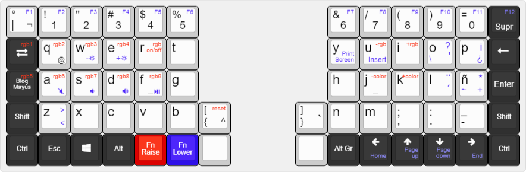

## Layers

The Helix obviously does not have enough keys compared to a typical keyboard.  
The keymap has multiple layers, moving extra keys to different layers.

|Priority|Layer ID|Layer Name|Contents|
| ---- | ---- | --- | --- |
||2|Raise|Underglow RGB config(Red)|
||1|Lower|Symbols and media(Blue)|
||0|Qwerty|Qwerty layout (Base)|

### The image and link are not up to date.
Keymap : http://www.keyboard-layout-editor.com/#/gists/4cd7b4ccda1de5cf9edc56d29b64da30
 
 
 
 <!--- -->
 

