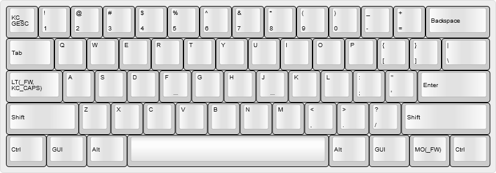
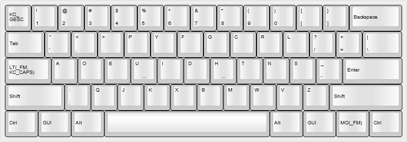

# @noroadsleft's KC60 keymap

- [Table of Contents](./readme.md)
  1. **Base Layers**
  2. [Overlays](./readme_ch2.md)
  3. [Function Layers](./readme_ch3.md)
  4. [Other Layers](./readme_ch4.md)

### Last updated: July 20, 2018, 3:48 PM UTC-0700

----

## Layer 0: QWERTY - `_QW`

Standard QWERTY layout, with three QMK features:

- The `Menu` key has been replaced by `MO(_FW)`, which moves to my Windows Fn layer when held.
- The `Caps Lock` key has been replaced with a dual function `LT()` key, which opens the Windows Fn layer when held, and is `Caps Lock` when tapped
- The `Escape` key has been replaced with a `KC_GESC` `` ` ~ `` key when used with a `Fn` key or a `Shift` key

###### For the rest of this readme, the physical location of keys will be referred to by their function in a US QWERTY layout.

Keycode(s) Sent     | Notes
:------------------ | :----
[`KC_GESC`](#)      | `Esc` when tapped alone, `` ` ~ `` when used with a `Shift` or `GUI` key.
`LT(_FW, KC_CAPS)`  | Opens the Windows Fn layer when held; toggles Caps Lock when tapped.
`MO(_FW)`           | Opens the Windows Fn layer when held.

----

## Layer 1: Hardware Dvorak - `_DV`

### Accessed by holding either `Fn` and tapping `/?` key, then tapping `2@`.

A hardware-based Dvorak Simplified layout. At my weekend job, I use a shared computer that runs MacOS Sierra, in US QWERTY layout. In this layer, I can leave the system in QWERTY, plug my keyboard in, and still type in Dvorak.

Keycode(s) Sent     | Notes
:------------------ | :----
[`KC_GESC`](#)      | `Esc` when tapped alone, `` ` ~ `` when used with a `Shift` or `GUI` key.
`LT(_FM, KC_CAPS)`  | Opens the MacOS-oriented function layer when held; toggles Caps Lock when tapped.
`MO(_FM)`           | Opens the MacOS-oriented function layer when held.

----

Next Chapter: [Overlays](./readme_ch2.md)
