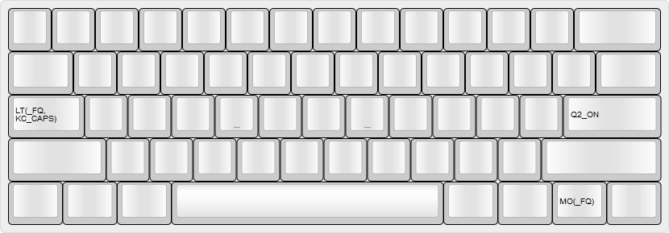
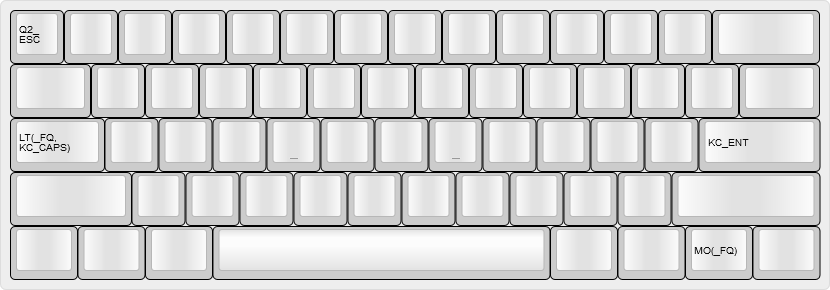

# @noroadsleft's KC60 keymap

- [Table of Contents](./readme.md)
  1. [Base Layers](./readme_ch1.md)
  2. **Overlays**
  3. [Function Layers](./readme_ch3.md)
  4. [Other Layers](./readme_ch4.md)

### Last updated: July 20, 2018, 3:48 PM UTC-0700

----

## Layers 2, 3 and 4: Quake 2 `_Q2`, Quake 2 Dvorak `_QD`, and Quake 2 Console `_QC`

### Accessed by holding either `Fn` key and tapping the `/?` key, then tapping `3#`

These layers were born out of the confusion I have had trying to use the in-game chat and the console in [Quake 2](https://en.wikipedia.org/wiki/Quake_II). When Quake 2 came out, alternate keyboard layouts weren't really a thing. As a result, all in-game text input is hard-locked to US QWERTY, regardless of what the operating system is using for its input method.

I'm attempting to solve this by some creative use of QMK's macro feature. The keycode in the System layer that enables these layers, [`GO_Q2`](./keymap.c#L263), is a [macro](./keymap.c#L111-L116) that sets the default layer to the QWERTY layer, then turns the Quake 2 layer `_Q2` on. The result is a partially-overwritten QWERTY layer, that has some keycodes with some creative layer switching.

When I hit the `Enter` key (bound in-game to text chat), the [macro keycode](./keymap.c#L117-L121) I've created sends the keycode for `Enter`, then follows with enabling the Hardware Dvorak layer and its corresponding overlay. Now the game is in text chat mode, and my keyboard is in Dvorak. When I hit `Enter` again, another `Enter` [keycode macro](./keymap.c#L122-L126) is sent, which sends the message, then the macro brings me back to the standard QWERTY+Quake 2 setup. Hitting `Escape` instead runs a [macro](./keymap.c#L127-L131) that cancels the sending of the message, and undoes the layers.

I have not fully tested this configuration yet. Reports will come.

### Layer 2: Quake 2

### Layer 3: Quake 2 Dvorak

### Layer 4: Quake 2 Console

----

Next Chapter: [Function Layers](./readme_ch3.md)
