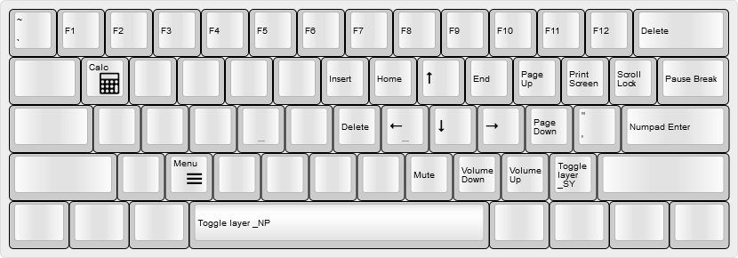
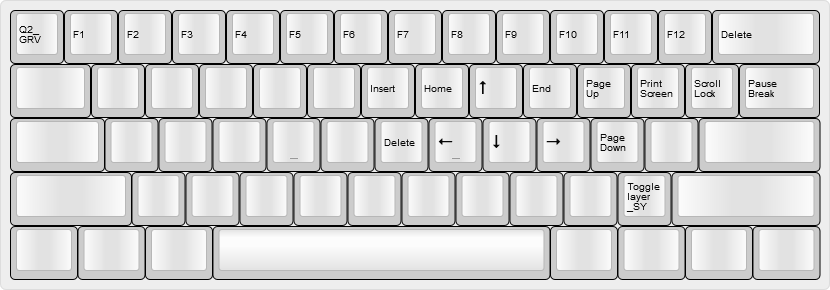

# @noroadsleft's KC60 keymap

- [Table of Contents](./readme.md)
  1. [Base Layers](./readme_ch1.md)
  2. [Overlays](./readme_ch2.md)
  3. **Function Layers**
  4. [Other Layers](./readme_ch4.md)

### Last updated: July 20, 2018, 3:48 PM UTC-0700

----

## Layer 5: Windows Fn layer - `_FW`

### Accessed by holding either `Fn` key in Layer 0

Arrows, Navigation keys (Insert, Home, Page Up, etc.), and Function keys are here. Also has keys for Volume Control.

----

## Layer 6: MacOS-oriented Fn layer - `_FM`

### Accessed by holding either `Fn` key in Layer 1

Based on Layer 2, but swaps a few functions for a MacOS environment. Arrow, Navigation, and Function keys are basically unchanged from Layer 2. This layer enables using the Caps-as-Fn key as a sort of simulated `Command` key, which I find easier to reach and use.

Function      | Keycode(s) Sent          | Notes
:-----------: | :----------------------- | :------------------------------
Print Screen  | `Command`+`Shift`+`3`    | Saves a screen capture as a PNG image on the Desktop.
Home          | `Command`+`Left Arrow`   | Moves to the beginning of a line.
End           | `Command`+`Right Arrow`  | Moves to the end of a line.
Select All    | `Command`+`A`            |
Undo          | `Command`+`Z`            |
Cut           | `Command`+`X`            |
Copy          | `Command`+`C`            |
Paste         | `Command`+`V`            |

----

## Layer 7: Quake 2 Fn layer - `_FQ`

### Accessed by holding either `Fn` key while either Quake 2 overlay is active.

Based on the Windows function layer, but removes some functions that are pointless to have while in the game.

----

Next Chapter: [Other Layers](./readme_ch4.md)
