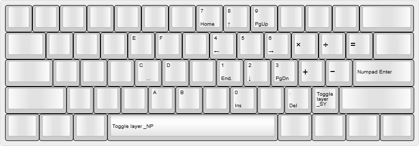
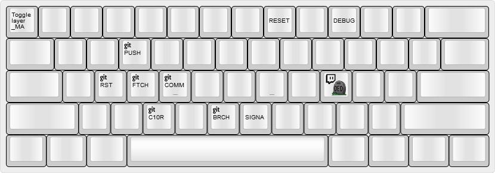
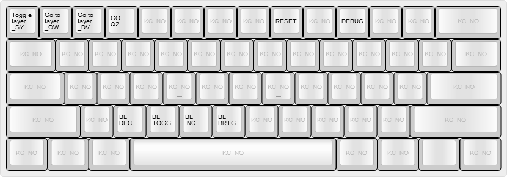

# @noroadsleft's KC60 keymap

- [Table of Contents](./readme.md)
  1. [Base Layers](./readme_ch1.md)
  2. [Overlays](./readme_ch2.md)
  3. [Function Layers](./readme_ch3.md)
  4. **Other Layers**

### Last updated: July 20, 2018, 3:48 PM UTC-0700

----

## Layer 8: Numpad layer - `_NP`

### Accessed by holding either `Fn` key and tapping `Space`, from either of the Base Layers

Puts a Numpad on the right-hand side of the keyboard. A through F included for hexadecimal input. Tapping `Space` returns to the previous Base Layer.

----

## Layer 9: Macro layer - `_MA`

### Accessed by holding the `Fn` key and tapping the right-side `Win` key

Has some macros that I use in Git, and some frequently-typed strings.

Tapping `Esc` exits the Macro layer, if the macro used doesn't do it automatically.

### Macros

  
Inputs: `lavak3DED `  
Twitch emote for [a streamer I watch a lot](https://www.twitch.tv/lavak3_).

[G_PUSH](./keymap.c#L85-L87)  
Inputs: `git push origin`  
Everything from here down is related to Git or GitHub.

[G_FTCH](./keymap.c#L88-L90)  
Inputs: `git fetch upstream`

[G_COMM](./keymap.c#L91-L94)  
Inputs: `git commit -m ""` `[Left]`  
Readies a `git commit` command, moves the cursor between the quotation marks, then disables the Macro layer.

[G_RST](./keymap.c#L95-L98)  
Inputs: `git reset --soft `  
Runs a git alias that shows my last ten commits, then readies a `git reset --soft`. For when I commit something too soon. Disables the Macro layer when complete.

[G_C10R](./keymap.c#L99-L102)  
Inputs: `cf/`  
A branch prefix I use for my current work in QMK. Disables the Macro layer when finished.

[G_BRCH](./keymap.c#L103-L106)  
Inputs: `$(git branch-name)`  
A [git alias](./readme_git.md) that returns the name of the current branch. Disables the Macro layer when finished.

[SIGNA](./keymap.c#L107-L110)  
Inputs: `\- @noroadsleft` `[Enter]`  
Sometimes on GitHub, I sign my comments. Types my GitHub name in Markdown syntax, and then taps the `Enter` key. Disables the Macro layer when finished.

----

### Layer 10: System layer - `_SY`

#### Accessed by holding either `Fn` key and tapping the `/?` key

This is where I change my keyboard function. Base layer select on `1` through `3`, Backlight controls on `C` through `N`, Reset on `8`.

----

[Back to the index.](./)
