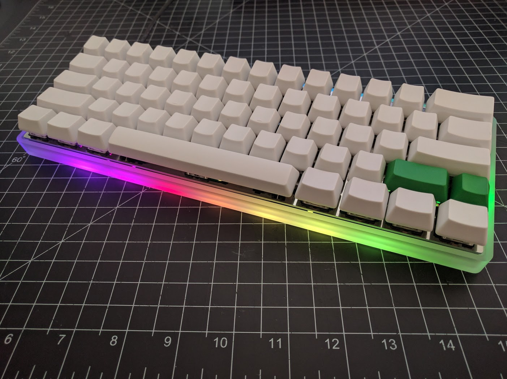
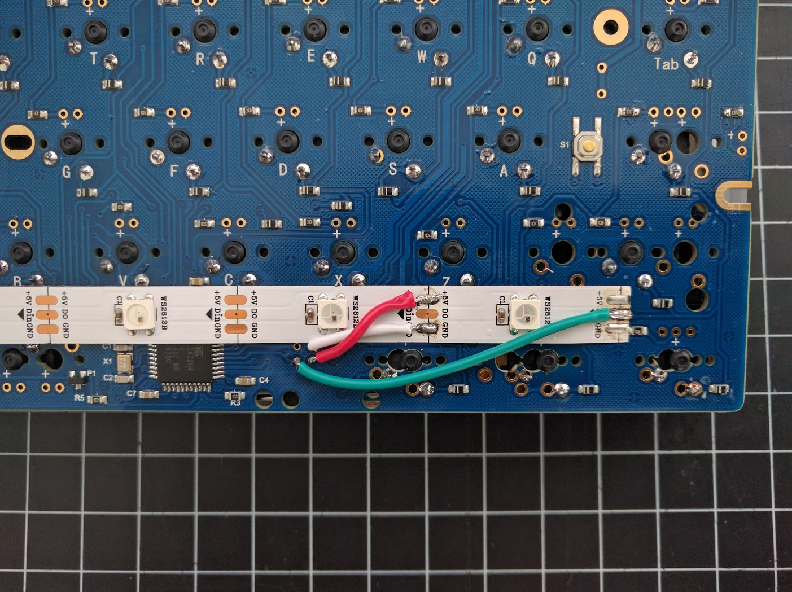
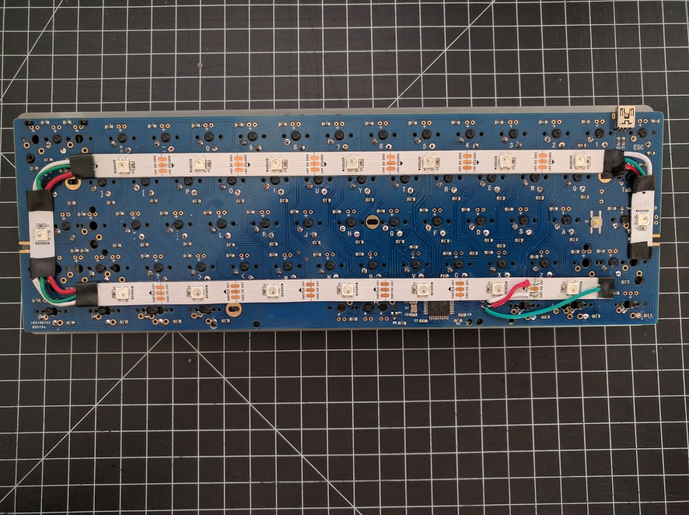

KC60 with WS2812 RGB Underglow
======================

## Quantum MK Firmware
For the full Quantum feature list, see [the parent readme.md](/readme.md).

## WS2812 Support
By default, it is now setup for 16 LEDs on the PF5 breakout pin. See [included image](ws2812_wiring.jpg) for wiring reference.

### Build
To build this keymap with WS2812 enabled, simply run `make KEYMAP=ws2812`.

### Reference Images

### Additional Credits
Keymap based on work by [TerryMatthews](https://github.com/TerryMathews) for GH60 Satan.
