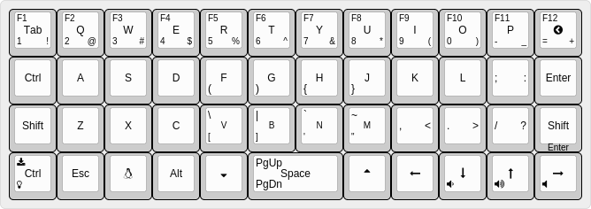
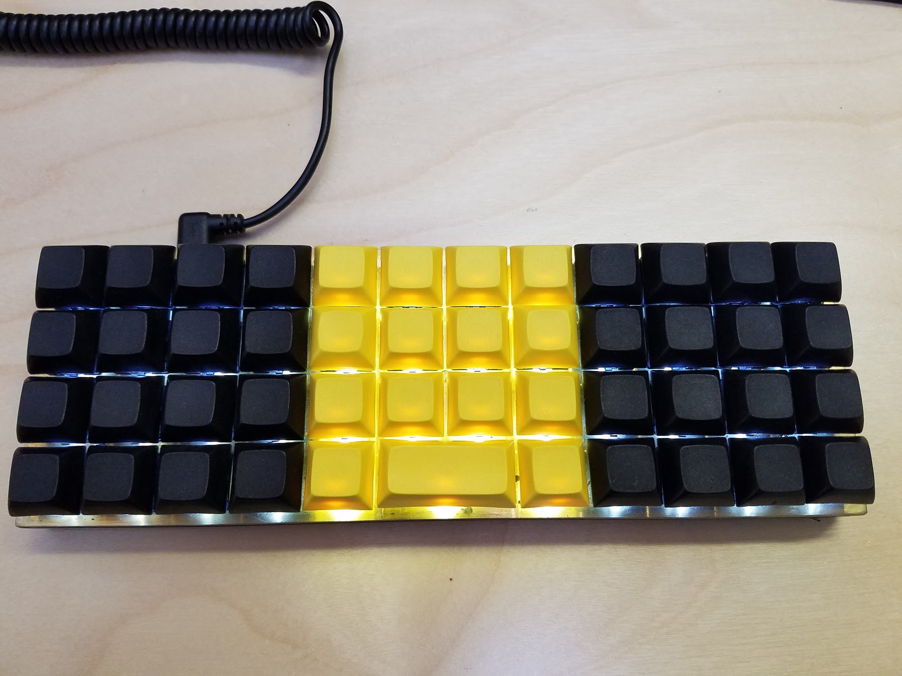

# Practical keymap for Planck Ortholinear 40% Mechanical Keyboard
A practical keymap that emulates standard QWERTY keyboard for Planck. Once you get comfortable with this keymap, you may fork and customize it for your own needs. 




* Online keyboard layout editor: http://goo.gl/mlLAFZ

# Programming Instructions:
Enter into programming mode and run the following command.
```
$ sudo KEYMAP=ab make dfu
```
# Notes
* Simultaneous RAISE+LOWER enters CUSTOM layer. You may add your own macros and custom keys here.
* RAISE and LOWER also acts as PgUp and PgDn when tapped.
* [CapsLock] also acts as [Ctrl] key when you press and hold. It is convenient for GNU Emacs users.
* Bracket keys are placed in the center of the keyboard for programmer's convenience.
