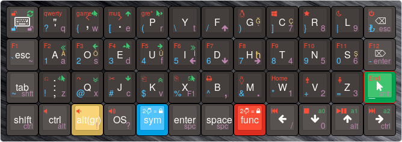

# Planck Layout

Built this planck layout to use DVORAK with turkish compatibility.
The layout has the following functionality

* **QWERTY** can be toggled on/off from **Function** layer.
* **Game** layout can be toggled on/off from **Function** layer,
and turned off from its own layer
* **Mouse** layer allows manipulation of the mouse
* Music layer allows playing some nice songs

# Using Turkish letters

Double tapping ALT key will activate turkish conversion.
The keycodes should transmit the correct unicode characters combined with shift.
Symbol layer also has the symbol for Turkish Lira.

# Top left key

I set this up for seldom use, since I will put an artisan there.

* On **DVORAK** and **QWERTY**, this key cycles backlight.
* In **Symbol**, **Mouse** and **Function** layer, this key locks/unlocks the layers.
* In the **Game** and **Music** layers, it turns off these layers.
