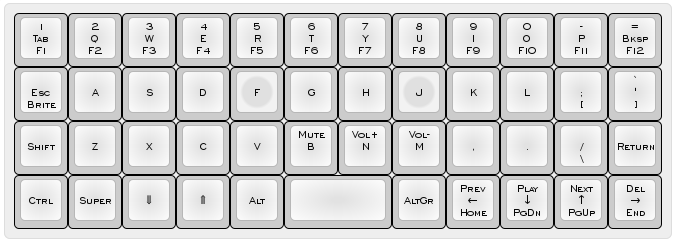

# Dbroqua Layout



* Online keyboard layout editor: http://www.keyboard-layout-editor.com/#/gists/e77306f9d14cc93fa26123b93b106474

# Programming Instructions:
Enter into programming mode and run the following command.
```
$ sudo KEYMAP=dbroqua make dfu
```
