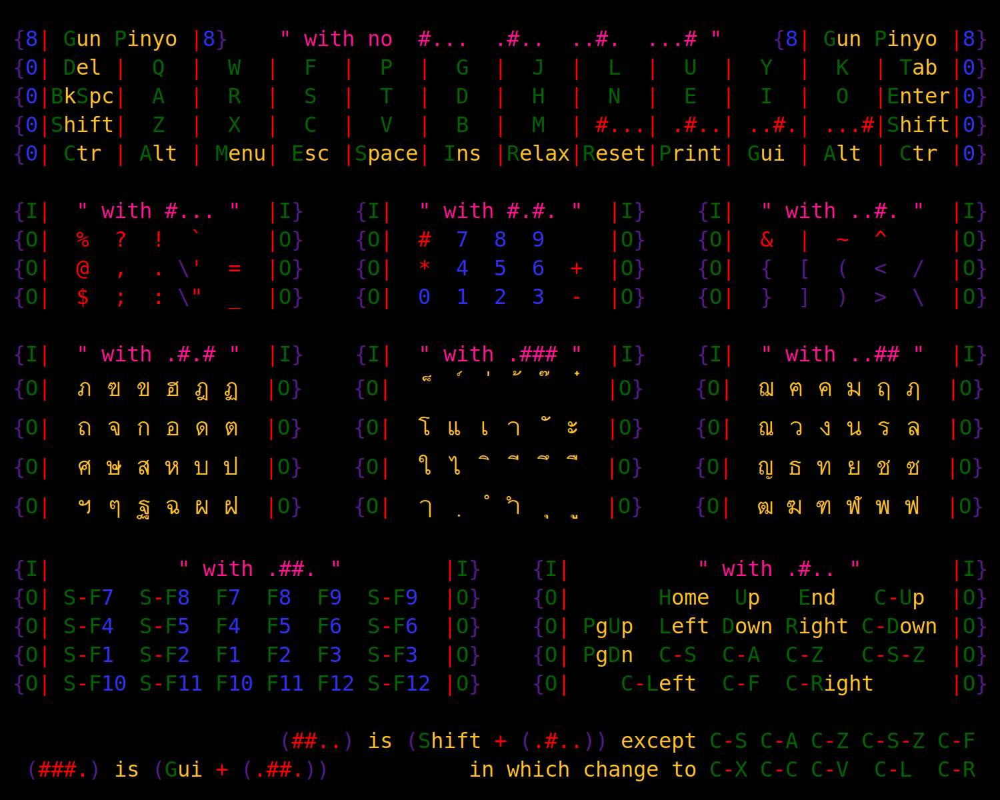

# GunP Planck Layout



```

  {8| Gun Pinyo |8}    " with no  #...  .#..  ..#.  ...# "    {8| Gun Pinyo |8}
  {0| Del |  Q  |  W  |  F  |  P  |  G  |  J  |  L  |  U  |  Y  |  K  | Tab |0}
  {0|BkSpc|  A  |  R  |  S  |  T  |  D  |  H  |  N  |  E  |  I  |  O  |Enter|0}
  {0|Shift|  Z  |  X  |  C  |  V  |  B  |  M  | #...| .#..| ..#.| ...#|Shift|0}
  {0| Ctr | Alt | Menu| Esc |Space| Ins |Relax|Reset|Print| Gui | Alt | Ctr |0}

  {I|  " with #... "  |I}    {I|  " with #.#. "  |I}    {I|  " with ..#. "  |I}
  {O|  %  ?  !  `     |O}    {O|  #  7  8  9     |O}    {O|  &  |  ~  ^     |O}
  {O|  @  ,  . \'  =  |O}    {O|  *  4  5  6  +  |O}    {O|  {  [  (  <  /  |O}
  {O|  $  ;  : \"  _  |O}    {O|  0  1  2  3  -  |O}    {O|  }  ]  )  >  \  |O}

  {I|  " with .#.# "  |I}    {I|  " with .### "  |I}    {I|  " with ..## "  |I}
  {O|  ภ ฃ ข ฮ ฎ ฏ  |O}    {O|  ็ ์ ่ ้ ๊ ๋  |O}    {O|  ฌ ฅ ค ม ฤ ฦ  |O}
  {O|  ถ จ ก อ ด ต  |O}    {O|  โ แ เ า ั ะ  |O}    {O|  ณ ว ง น ร ล  |O}
  {O|  ศ ษ ส ห บ ป  |O}    {O|  ใ ไ ิ ี ึ ื  |O}    {O|  ญ ธ ท ย ช ซ  |O}
  {O|  ฯ ๆ ฐ ฉ ผ ฝ  |O}    {O|  ๅ ฺ ํ ำ ุ ู  |O}    {O|  ฒ ฆ ฑ ฬ พ ฟ  |O}

  {I|          " with .##. "        |I}    {I|          " with .#.. "       |I}
  {O| S-F7  S-F8  F7  F8  F9  S-F9  |I}    {O|       Home  Up   End   C-Up  |I}
  {O| S-F4  S-F5  F4  F5  F6  S-F6  |I}    {O| PgUp  Left Down Right C-Down |I}
  {O| S-F1  S-F2  F1  F2  F3  S-F3  |I}    {O| PgDn  C-S  C-A  C-Z   C-S-Z  |I}
  {O| S-F10 S-F11 F10 F11 F12 S-F12 |I}    {O|    C-Left  C-F  C-Right      |I}
  
                       (##..) is (Shift + (.#..)) except C-S C-A C-Z C-S-Z C-F
   (###.) is (Gui + (.##.))              which change to C-X C-C C-V  C-L  C-R

```
