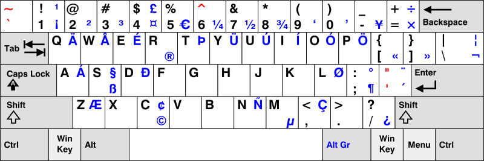

# ANSI_QWERTZ

This keymap was specifically designed to support keycaps with ANSI layout and legends, while retaining the possibility of inputting characters 
with diacritics that are normally not used in the english language.

It currently relies on the US-International keyboard layout, which can be installed in any current operating system without the use of third party hardware.

##Features

* Input of letters with diacritics on familiar QWERTZ layout
* Support for ANSI-legend keycaps
* Option to "revive" all dead keys
* SpaceFN for easy access to Function keys and diacritic input
* Locking "Gaming Mode" that disables SpaceFN and allows to bind GUI key in Games
* Reset key binding, no need to press hardware reset button to program
* Microphone Mute key (requires 3rd-party software, see below)

###Languages

The US-International Layout is currently required for the support of non-english languages. This keymap swaps Y and Z to provide the familiar QWERTZ position for characters.
All diacritic characters are input by either holding the Spacebar or the Fn key and pressing the corresponding key. For languages that aren't yet supported explicitly, 
one can also use AltGr to input the characters as intended by the US-Intl layout or the dead keys, if they're kept from being [revived](#Revive-Dead-Keys).

The illustration below shows the "US International" layout available in the Language settings of Windows, Linux and Mac OS.



Not all languages are supported by this layout. Linux also offers the "US International Alternative" layout, 
which contains more dead keys to input pretty much every diacritic character in a language using latin letters.


####Explicitly Supported Languages

* German

####Implicitly Supported Languages

This list only applys to Windows. Linux systems support all languages, see above.

This list might be incomplete! Please add your language if you find it's supported.

* French

###SpaceFN

SpaceFN basically means that Space acts as a normal spacebar when tapped, but acts as a layer-key when held down. 
This means that you can't hold space to output multiple spaces consecutively and that space only registers once released.
The advantage is that the spacebar is easier to reach than any other Fn-key could be.

###"Gaming Mode"

To alleviate the problems SpaceFN would cause when gaming, the Gaming Mode is pretty much a layer that can be turned on by pressing Fn+RShift.
This will turn the double-role Spacebar into a normal one, so the Fn-layer (and thus function and media keys) can only be accessed with the Fn-key.
It also turns the GUI-key (aka Win-key aka Super-key) into Right Shift, so it can be bound in Games. This is especially useful when playing with ESDF instead of WASD.

###Mute Microphone

The function layer has a "Mute Microphone"-key. As this is not an existing media key and you can't normally set a shortcut to this function, 
you need to set this up in software before using it, see below. This key is bound to `Right Control` + `Left Control`, a keycombination that 
no other program in existence uses for anything, at least to my knowledge. It also can't be pressed with this keymap in any other way.

####Linux

Follow [these instructions](http://askubuntu.com/a/13364).

#####Windows (Requires 3rd Party Software)

*DISCLAIMER: I take no responsibility for any potential harm caused by third party applications!*

You'll need a utility called "MicMute". It is available on [Sourceforge](https://sourceforge.net/projects/micmute/).
After installing and running the tool, you only need to use the "Setup Shortcut" option to bind the key to muting the microphone
and check whether your microphone is selected under "Devices".

###Revive Dead Keys

Some diacritics that are commonly used are dead keys on the international layouts, for example `` ` ``,  `'`, or `"`. 
The dead keys on the regular international layout (shown in red [here](#Languages)) are revived with this keymap by automatically inserting a space if one of those characters is typed.
If you don't want this to be the case, uncomment the following line in `keymap.c` prior to compiling:

```
//#define DONT_REVIVE_DEADKEYS 1
```

##Layers

###Base Layer

The base layer is shown here for ANSI keys and an HHKB-style right shift.
Again, the Y and Z keys are swapped, so you get the QWERTZ-positions of Y and Z when using the US-International layout.


###Gaming layer

To turn this layer on, please use the combination Fn+RShift, not Space+Rshift. If you do the latter, the Function layer 


###Function Layer

This is the function layer for German diacritics. It can be accessed via the Fn-key or by holding space on the base layer.


