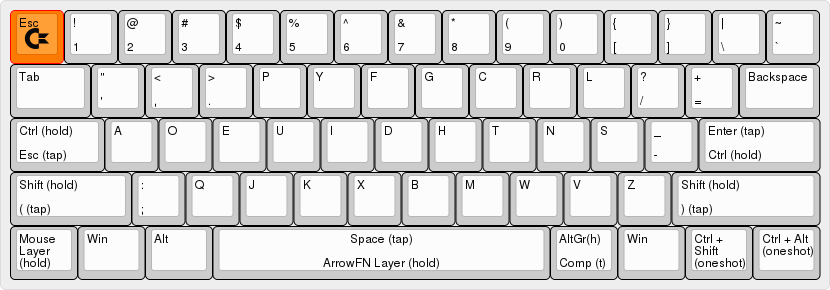
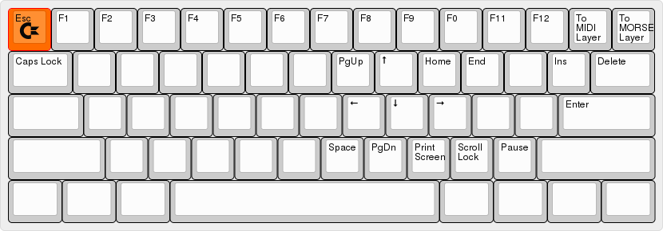
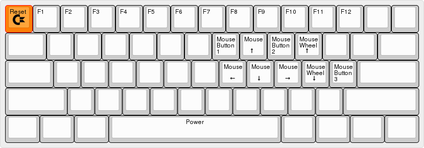
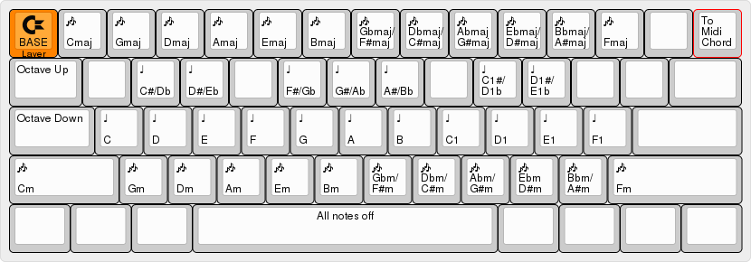
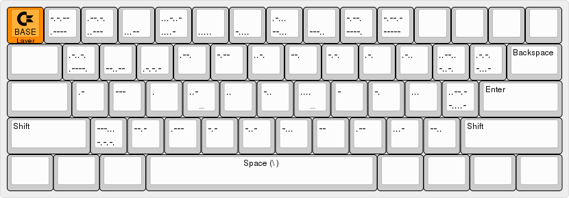

# Bluebear’s custom S60X layout

Custom keyboard layout for my S60X, my first ever custom mechanical keyboard kit.

This layout was inspired in part by the HHKB line of keyboards and a quest to find the perfect ergonomic, logical layout for what I do. If you like this layout, please feel free to use it, modify it and share it.

## BASE Layer

-Dvorak keyboard layout
-Hold left control key for LCTL, and tap it for ESC
-Hold enter key for RCTL and tap for ENT
-Hold the space key to momentarily switch to ARROWFN layer
-Left bottom key acts as momentary switch to the MOUSE layer
-Hold right alt key for AltGr and tap for APP(which I have mapped to Compose in OS)
-Hold left shift key for LSFT and tap for ( (Space Cadet style)
-Hold right shift key for RSFT and tap for ) (Space Cadet style)
-Tap key on bottom row, second from the right (where APP usually is) to get CTL-Shift (one shot modifier - next key pressed will be modified by ctl-shift)
-Tap key on bottom right to get CTL-Alt (one shot modifier - next key pressed will be modified by ctl-alt)

## ARROWFN Layer

-Number row becomes F1 to F12
-C, T, H, N keys become Up, Down, Left, Right
-Access to various other keys normally found on a full sized keyboard
-Top right button toggles MORSE layer
-Second from right, top row, toggles MIDI_BASE layer

## MOUSE Layer

-Move the mouse with mouse keys
-Hitting the escape key in this layer will give RESET, which puts the controller into dfu mode for flashing firmware onto it
-Hitting the space key in this layer is like hitting power button on computer
-Hitting the tab button toggles caps lock
-Number row becomes F13 to F24

## MIDI_BASE Layer

This layer was inspired by the Satan Midi layout (https://github.com/qmk/qmk_firmware/tree/master/keyboards/satan/keymaps/midi) and gives access to basic MIDI notes. What I added were two layers of MIDI chords (major and minor triads) arranged in a circle of fifths pattern. Thanks to @fredizzimo for helping me with the code for these chords.

-Top right button toggles MORSE_CHORDS layer
-Escape brings you back to the BASE layer

## MIDI_CHORDS Layer

After figuring out how to code my MIDI chord function, I decided to dedicate a full layer to these chords. This chord layout was inspired by the Stradella Base system (https://en.wikipedia.org/wiki/Stradella_bass_system) found on accordions. This layer is a tool for musical composition and songwriting.

-Second from right, top row, toggles MIDI_BASE layer
-Escape brings you back to the BASE layer

## MORSE LAYER

This layer is really just for fun, and because I am a ham radio operator and morse code enthusiast. Hitting the alphanumerical keys in this layer will send a series of dits (.) and dahs (-) representing that character in morse code.

-Escape brings you back to the BASE layer

### THIS IS STILL A WORK IN PROGRESS

This keyboard layout is still a work in progress and there are a couple of kinks left to iron out. But it is still very usable and the midi and morse code layers are lots of fun to use. Please feel free to use, share and improve all, or part of this layout.

