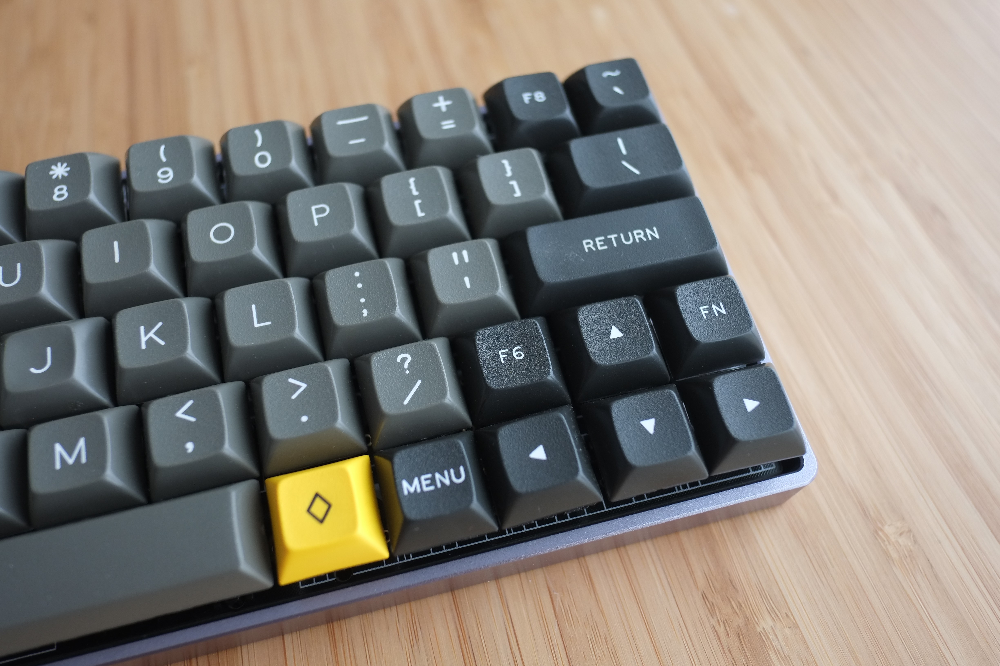

# QMK Firmware for XIUDI's 60% XD60 PCB

## Quantum MK Firmware
For the full Quantum feature list, see [the parent readme.md](/readme.md).

## Additional Notes
The XD60 is essentially a GH60 rev. C, with support for a right-hand arrow cluster. Includes full compatibility with GH60 expansion boards. Board also supports in-switch LEDs (two-pin, single colour), as well as WS2182 LED strips for underglow lighting. Default keymap included, matching configuration on sale page.

## Build
To build the default keymap, simply run `make xd60-default`.
