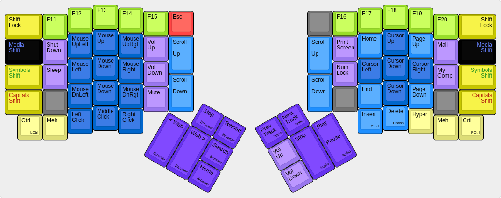
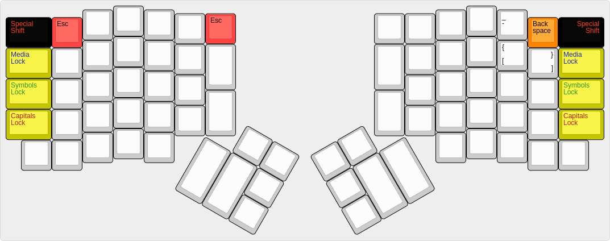

# The Ordinary Layout, a familiar and powerful layout #

The Ordinary Layout is intended to be unremarkably mundane and remarkably useful. This layout maintains most key positions from common QWERTY keyboards, and it features enhanced Symbol and Media layers compared to the default Ergodox EZ layout.

The Ordinary Layout is supposed to look mostly like a normal keyboard, except in the ways that the Ergodox key arrangement is unique. The thumbs are responsible for space, enter, plus both forward and backward delete; with only a couple exceptions, all other keys are in the same place they are found on traditional keyboards.

Nicholas Keene
ordinarylayout@nicholaskeene.com
no rights reserved, use for any purposes, credit me if you are a nice person

## The Base Layout ##

* *White Keys* are all the normal characters and symbols in all the normal locations (except for the brackets).
* *Modifier Keys* are light yellow and in the traditional location: Control, Option, Command, plus Hyper and Meh.
* *Shift Keys* are dark yellow, found on the outsides of the keyboard. Capitals Shift (traditional shift) is found in the usual place and above that is found Symbol Shift, Media Shift, and Special Shift (Shift Lock).
* Several of the shift keys double for entry of characters which would typically be in those locations.
* *Thumb Keys* shown in orange are for text navigation and manipulation.
* *Escape* is red and it is always found in that location no matter what.

The four big orange keys are arranged differently than in the default Ergodox EZ layout. The Ordinary Layout here copies the design of the old Fingerworks TouchStream keyboard, but also reflects the natural presumptions of the author -- me! I type the space character with my right hand, and to me it makes sense for the two delete keys to be next to one another.

The Forward Tab and Backward Tab keys are in their locations mostly because I ended up with two extra buttons and needed something to do with them. My muscle memory from using the Truly Ergonomic Keyboard makes me look for the Tab key with my right index finger, so it is handy to have this redundant Tab, and the idea with the Backward Tab key is that it becomes easy to navigate text fields in forms, or to indent/unindent code.

## The Symbols Layer ##

* *Symbols* shown in light green. All kinds of brackets are available on this layer. Ampersand and Pipe justapose each other. Pipe, slash, and backslash are arranged in a column.
* *F-Keys* are bright green and overlay the row of numerals.
* *Number pad* in dark green under the right hand includes all four arithmetic operations in the same order found on most number pads and features an Enter key. The keycodes emitted here are normal numeric keycodes, not the number-pad specific keycodes emitted by most number pads so that NumLock is not needed.
* *Thumb keys* on this layer are the *reverse* of the orange keys on the base layer, with the keys either mirrored or shifted. This is powerful! Often I find myself using the mouse with my right hand, and the left hand needs to press Enter. Instead of reaching the left hand over to the right side of the keyboard, now I simply tap Symbols to reverse the turquoise keys, and Enter is right where it should be.

The Symbols Layer is based on the Coder Layer from the default Ergodox EZ layout. I slightly rearranged the symbols, added some symbols, expanded the number pad, and straightened out the F-Keys. It's very handy to have the symbols directly underneath the normal typing keys.

## The Media Layer ##

* *Mouse Cursor Keys* are under the left hand, shown in dark blue. Diagonal keys won't automatically repeat unless combined with other keys. Buttons to left- middle- and right-click the mouse are also featured.
* *Text Cursor Keys* are under the right hand, shown in dark blue. They overlay the numberpad from the Symbols Layer, such that in the Media Layer the same keys can be used as if they were a number pad in navigational mode (Num Lock off). For instance, in traditional number pads the '3' key became 'Page Down', and so it is here. This means a user can do text navigation without moving either hand.
* *Scrolling and Paging* keys are shown in light blue and have some useful redundancy across the layout.
* Higher-order *F-Keys* are shown in bright green overylaying the numerals.
* *Application Keys* to control web browsers and audio players are dark purple but don't get too excited because these have weak support on operating systems I've looked at. Good luck.
* The light purple keys are various operating system keys such as NumLock and Mute and a button to navigate to My Computer (usually your home dir).
* The dark gray keys do nothing in case you bump them by accident

This layer is a substantial extension of the Media layer on the Ergodox EZ default layout. The Fingerworks TouchStream keyboard had a very useful feature for controlling the text cursor easily and this layer does something similar. The left hand can move the mouse, the right hand moves the text cursor, in all four directions, in small or large increments. This greatly enhances navigation in text documents.

Keys to directly interact with the operating system are also found on this layer, such as volume and shutdown.

## Switching Between Layers ##

In addition to Symbols and Media there is the Capitals layer which is exactly the same as pressing the shift key. Each layer is accessed by a shift key on each edge of the keyboard and corresponds to one of the three LEDs on the keyboard: Capitals (red), Symbols (green), Media (blue). The color of a layer illuminates when the layer is active.

Shift buttons work in the expected way: press them and all of the keys switch to that layer; release them and the keys switch back to the base layer. Lock the shift keys using the Shift Lock button, which is the same as the Special Shift button.

Multiple layers can be turned on at once. The Capitals layer will affect characters on other layers to capitalize. Other layers, however, don't 'mix': Symbols blankets the base layout; Media blankets Symbols.

## Special Sequences ##

The Special Shift layer is mostly used to lock the shift keys but in order to make this layout more _ordinary_ there are a few special sequences which put some keys near their most common traditional locations.

### Escape ###

The One True Location for the Escape key is segregated way up on the top left of the keyboard. The Ergodox does not have a physical button in such a location and the nearest one is home to the tilde (er, grave) which is commonly found there. In the Ordinary layout the Escape key is found on all layers in the prominent location in the corner next to the 5, which is easy to remember, and yet it isn't natural for those of us with muscle memory flicking our wrists up and to the left looking for Escape.

The Ordinary layout offers as a consolation prize a Special sequence for Escape: Special Shift + 1. This is natural so you can tap the top left button, then the button next to it and get Escape. This gesture works in all layers.

### Backspace ###

At the top right corner of the Ergodox EZ you can a gesture similar to the special Escape sequence using the 0 key to produce a Backspace. Users of this keyboard and this layout are well advised to learn to use their thumbs for deleting text, but sometimes you are doing other computery things and just want to flick your digits up to the right and press backspace a bunch times.

### Other Characters ###

The Escape and Backspace special sequences are so useful why not have a few more? You can find dash under 9, left bracket under o, and right bracket under p. That's pretty much all the characters from the top right corner of the keyboard which moved to make room for the columnar layout.

****

The Ordinary Layout for the Ergodox EZ keyboard, v4.20

Modifications from default by Nicholas Keene ergodoxez@nicholaskeene.com

No rights reserved. This software is in the public domain. Credit me if you are friendly but if you're a jerk don't bother.

Details: readme.md
         https://github.com/nrrkeene/qmk_firmware/tree/master/keyboards/ergodox/keymaps/ordinary
