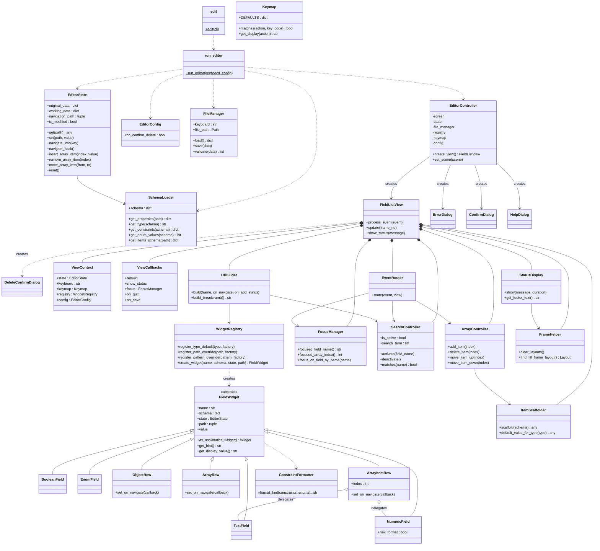

# Edit TUI Architecture

```mermaid
classDiagram
    direction TB

    %% ── Entry & Orchestration ──────────────────────────
    class edit {
        +edit(cli)$
    }
    class run_editor {
        +run_editor(keyboard, config)$
    }
    class EditorController {
        -screen
        -state
        -file_manager
        -registry
        -keymap
        -config
        +create_view() FieldListView
        +set_scene(scene)
    }
    class EditorConfig {
        +no_confirm_delete : bool
    }

    edit ..> run_editor
    run_editor ..> EditorController
    run_editor ..> SchemaLoader
    run_editor ..> FileManager
    run_editor ..> EditorState
    run_editor ..> EditorConfig
    EditorController --> FieldListView : creates
    EditorController --> ErrorDialog : creates
    EditorController --> ConfirmDialog : creates
    EditorController --> HelpDialog : creates

    %% ── Data Layer ─────────────────────────────────────
    class EditorState {
        +original_data : dict
        +working_data : dict
        +navigation_path : tuple
        +is_modified : bool
        +get(path) any
        +set(path, value)
        +navigate_into(key)
        +navigate_back()
        +insert_array_item(index, value)
        +remove_array_item(index)
        +move_array_item(from, to)
        +reset()
    }
    class SchemaLoader {
        +schema : dict
        +get_properties(path) dict
        +get_type(schema) str
        +get_constraints(schema) dict
        +get_enum_values(schema) list
        +get_items_schema(path) dict
    }
    class FileManager {
        +keyboard : str
        +file_path : Path
        +load() dict
        +save(data)
        +validate(data) list
    }
    class Keymap {
        +DEFAULTS : dict
        +matches(action, key_code) bool
        +get_display(action) str
    }

    EditorState --> SchemaLoader

    %% ── Widget System ──────────────────────────────────
    class FieldWidget {
        <<abstract>>
        +name : str
        +schema : dict
        +state : EditorState
        +path : tuple
        +as_asciimatics_widget()* Widget
        +get_hint() str
        +get_display_value() str
        +value
    }
    class TextField
    class NumericField {
        +hex_format : bool
    }
    class BooleanField
    class EnumField
    class ObjectRow {
        +set_on_navigate(callback)
    }
    class ArrayRow {
        +set_on_navigate(callback)
    }
    class ArrayItemRow {
        +index : int
        +set_on_navigate(callback)
    }

    FieldWidget <|-- TextField
    FieldWidget <|-- NumericField
    FieldWidget <|-- BooleanField
    FieldWidget <|-- EnumField
    FieldWidget <|-- ObjectRow
    FieldWidget <|-- ArrayRow
    FieldWidget <|-- ArrayItemRow
    ArrayItemRow o-- NumericField : delegates
    ArrayItemRow o-- TextField : delegates

    class WidgetRegistry {
        +register_type_default(type, factory)
        +register_path_override(path, factory)
        +register_pattern_override(pattern, factory)
        +create_widget(name, schema, state, path) FieldWidget
    }
    WidgetRegistry ..> FieldWidget : creates

    %% ── View Layer ─────────────────────────────────────
    class FieldListView {
        +process_event(event)
        +update(frame_no)
        +show_status(message)
    }
    class ErrorDialog
    class ConfirmDialog
    class HelpDialog
    class DeleteConfirmDialog

    %% ── View Collaborators ─────────────────────────────
    class ViewContext {
        +state : EditorState
        +keyboard : str
        +keymap : Keymap
        +registry : WidgetRegistry
        +config : EditorConfig
    }
    class ViewCallbacks {
        +rebuild
        +show_status
        +focus : FocusManager
        +on_quit
        +on_save
    }
    class UIBuilder {
        +build(frame, on_navigate, on_add, status)
        +build_breadcrumb() str
    }
    class EventRouter {
        +route(event, view)
    }
    class FocusManager {
        +focused_field_name() str
        +focused_array_index() int
        +focus_on_field_by_name(name)
    }
    class SearchController {
        +is_active : bool
        +search_term : str
        +activate(field_name)
        +deactivate()
        +matches(name) bool
    }
    class ArrayController {
        +add_item(index)
        +delete_item(index)
        +move_item_up(index)
        +move_item_down(index)
    }
    class StatusDisplay {
        +show(message, duration)
        +get_footer_text() str
    }
    class FrameHelper {
        +clear_layouts()
        +find_fill_frame_layout() Layout
    }
    class ItemScaffolder {
        +scaffold(schema) any
        +default_value_for_type(type) any
    }
    class ConstraintFormatter {
        +format_hint(constraints, enums)$ str
    }

    FieldListView *-- ViewContext
    FieldListView *-- ViewCallbacks
    FieldListView *-- UIBuilder
    FieldListView *-- EventRouter
    FieldListView *-- FocusManager
    FieldListView *-- SearchController
    FieldListView *-- ArrayController
    FieldListView *-- StatusDisplay
    FieldListView *-- FrameHelper
    FieldListView *-- ItemScaffolder
    FieldListView ..> DeleteConfirmDialog : creates

    EventRouter --> SearchController
    EventRouter --> ArrayController
    EventRouter --> FocusManager
    UIBuilder --> SearchController
    UIBuilder --> WidgetRegistry
    ArrayController --> ItemScaffolder
    StatusDisplay --> FrameHelper
    FieldWidget ..> ConstraintFormatter
```
