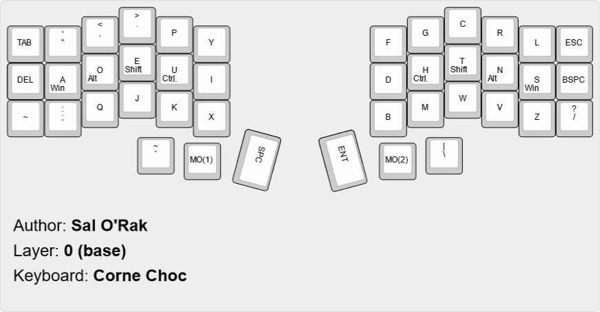
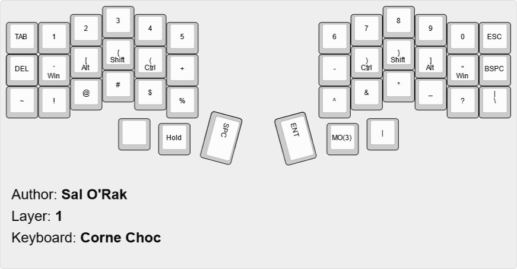
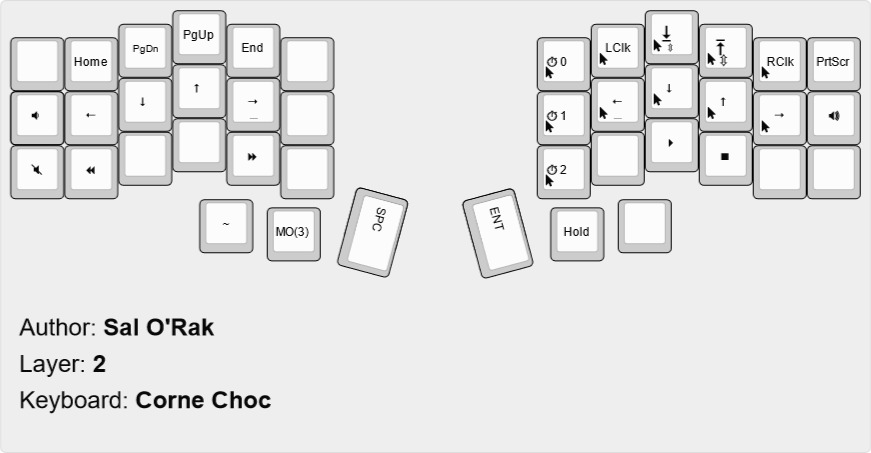

# Corne Choc 

I've recently built a Corne Choc 3x6 with Kailh Hotswaps using Silver switches.

This is a forked repository from  public GitHub repository.
QMK is a keyboard firmware based on the [tmk\_keyboard firmware](https://github.com/tmk/tmk_keyboard) with some useful features for Atmel AVR and ARM controllers, and more specifically, the [OLKB product line](https://olkb.com), the [ErgoDox EZ](https://ergodox-ez.com) keyboard, and the [Clueboard product line](https://clueboard.co).


## Layout

I've used [Keyboard Layout Editor](www.keyboard-layout-editor.com) to create an image of my keyboard layout. 

I'm currently using Dvorak and I added some custom keymaps.
### Layer 0 

Layer 0 is my base layer and it is where all my alpha keys are mapped.


### Layer 1 

Layer 1 is the **symbols** and **numbers** layout.


### Layer 2
Layer 2 is the **misc*** and **movement** layout. It include the ability to fully use the mouse without a mouse!



## Build
If you have a Corne Choc 3x6 keyboard and you want to use the same layout run 
```bash
make crkbd:dvorak
# or make crkbd:qwerty
```
